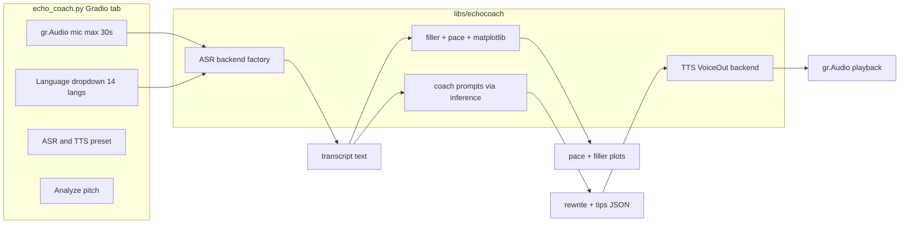

# EchoCoach — Real-Time Voice Practice Coach

## Goal

Ship a new **EchoCoach** tab in [`apps/gradio-space/src/gradio_space/app.py`](apps/gradio-space/src/gradio_space/app.py) that runs the hackathon demo end-to-end **locally**:

> Record up to 30s pitch → transcript with **filler words highlighted** → **pace score** chart → **rewrite suggestion** from a small text LLM → **VoiceOut** audio reply in the selected language.

Per your direction: **no SmolLM3 LoRA**. Voice I/O is config-driven; coaching stays on the existing text preset (`minicpm5-1b`).

## Architecture



## Voice model strategy (configurable)

Add a dedicated registry — [`voice_models.yaml`](voice_models.yaml) at repo root (parallel to [`models.yaml`](models.yaml)) — so ASR/TTS are swappable without touching the text LLM presets.

| Preset key | Role | Stack | When to use |
|------------|------|-------|-------------|
| `cohere-transcribe` (default ASR) | Speech → text | `CohereLabs/cohere-transcribe-03-2026` via `transformers>=5.4` | 14 languages, edge-friendly 2B ASR, best accuracy |
| `whisper-cpp-tiny` | Speech → text fallback | `pywhispercpp` (preferred over stale `whisper-cpp-python`) | CPU-only, fast, English-focused demos |
| `whisper-cpp-base` | Speech → text fallback | same | Better WER, still lightweight |
| `piper-multilingual` (default TTS) | Text → speech VoiceOut | Piper voices mapped per language code | Local TTS for all 14 Cohere langs |
| `minicpm-o-4.5` (optional, stretch) | Speech in + speech out | `openbmb/MiniCPM-o-4_5` with `init_audio=True, init_tts=True` | GPU workstation only (~9B); EN/ZH TTS |

**MVP ships:** `cohere-transcribe` + `piper-multilingual` + `minicpm5-1b` coach.

**Evaluate MiniCPM-o 4.5** as an alternate preset behind `ECHOCOACH_VOICE_PROFILE=omni` — do not block MVP on its heavier deps / GPU requirements.

Env vars (add to [`.env.example`](.env.example)):

- `ECHOCOACH_ASR_PRESET` — default `cohere-transcribe`
- `ECHOCOACH_TTS_PRESET` — default `piper-multilingual`
- `ECHOCOACH_COACH_MODEL` — default `minicpm5-1b` (reuses [`libs/inference`](libs/inference))
- `ECHOCOACH_MAX_SECONDS` — default `30`

## New package: `libs/echocoach`

Mirror the inference factory pattern in a focused library.

### Layout

```
libs/echocoach/
  pyproject.toml
  src/echocoach/
    config.py          # load voice_models.yaml + env overrides
    asr/
      base.py
      cohere.py        # CohereAsrForConditionalGeneration wrapper
      whisper_cpp.py   # pywhispercpp tiny/base
      factory.py
    tts/
      base.py
      piper.py         # language → voice map, WAV output
      factory.py
    analysis/
      fillers.py       # detect um/uh/like/you know/… + highlight HTML
      pace.py          # WPM, target band 120–160, 0–100 score
      charts.py        # matplotlib → PNG paths for Gradio Image
    coach.py           # structured JSON coach via get_backend()
    pipeline.py        # orchestrate: audio path → EchoCoachResult
```

### ASR: Cohere Transcribe (primary)

Follow the official HF quick start (`AutoProcessor`, `CohereAsrForConditionalGeneration`, `language="en"` etc.). Notes for implementation:

- Model is **gated** on Hugging Face — document `huggingface-cli login` + accept terms in USAGE.
- Requires `transformers>=5.4.0`, `soundfile`, `librosa`.
- Pass explicit `language` from the UI dropdown (`en`, `fr`, `de`, `es`, `it`, `pt`, `nl`, `pl`, `el`, `ar`, `ja`, `zh`, `vi`, `ko`).
- Resample incoming audio to 16 kHz mono (Gradio uploads may vary).

### ASR: Whisper.cpp fallback

Use **`pywhispercpp`** (actively maintained; same whisper.cpp backend you specified). Wrap `Model('tiny'|'base').transcribe(wav_path)` for offline file transcription. Skip `pyaudio` in MVP — Gradio `gr.Audio(sources=["microphone"], type="filepath")` captures mic without PortAudio in the server process.

### Analysis (no LLM)

Rule-based, fast, deterministic:

- **Fillers:** configurable word list + regex; return spans for HTML highlight in transcript panel.
- **Pace:** `words / (duration_minutes)`; score vs target band; flag too fast/slow.
- **Charts** ([`matplotlib`](https://matplotlib.org/) Agg backend):
  - Bar chart: filler counts
  - Line chart: words-per-30s-window over recording duration

### Coach (text LLM)

Reuse [`get_backend(model_key).chat()`](libs/inference/src/inference/factory.py) with a tight system prompt asking for JSON:

```json
{
  "summary": "...",
  "filler_feedback": "...",
  "pace_feedback": "...",
  "rewrite": "...",
  "one_tip": "..."
}
```

Parse with existing JSON repair patterns from [`libs/agent/src/agent/runner.py`](libs/agent/src/agent/runner.py) (reuse `_parse_json` style, don't duplicate agent runner).

### TTS VoiceOut

- **Piper:** map language code → voice model; synthesize coach `summary + one_tip` (or full rewrite on toggle) to WAV under `AGENT_OUTPUTS_DIR`.
- Return filepath to `gr.Audio` for playback.
- If Piper voice missing for a language, fall back to English voice + show UI warning.

## Gradio tab: `echo_coach.py`

New file [`apps/gradio-space/src/gradio_space/tabs/echo_coach.py`](apps/gradio-space/src/gradio_space/tabs/echo_coach.py).

**UI components:**

| Component | Purpose |
|-----------|---------|
| `gr.Audio` (mic, max 30s) | Record pitch |
| Language dropdown (14 codes) | Cohere ASR + TTS voice selection |
| ASR preset dropdown (dev) | `cohere-transcribe` / `whisper-cpp-tiny` / `whisper-cpp-base` |
| Coach model status | Reuse `model_status()` from [`model_loading.py`](apps/gradio-space/src/gradio_space/model_loading.py) |
| Analyze button | Run full pipeline |
| Transcript HTML | Filler highlights |
| Markdown report | Pace score, filler count, coach JSON fields |
| `gr.Image` × 2 | Matplotlib charts |
| `gr.Audio` output | VoiceOut playback |
| `gr.JSON` | Trace (Sharing is Caring badge) |

Wire into [`app.py`](apps/gradio-space/src/gradio_space/app.py) as a fourth tab and export from [`tabs/__init__.py`](apps/gradio-space/src/gradio_space/tabs/__init__.py).

## Dependencies

Add to workspace:

| Package | Where | Why |
|---------|-------|-----|
| `echocoach` | root `pyproject.toml` workspace member | new lib |
| `matplotlib`, `soundfile`, `librosa` | `libs/echocoach` | charts + audio I/O |
| `pywhispercpp` | `libs/echocoach` optional extra `[whisper]` | whisper fallback |
| `piper-tts` or `piper-phonemize` | `libs/echocoach` optional extra `[piper]` | VoiceOut |
| bump `transformers>=5.4` | `libs/inference` or `echocoach` | Cohere ASR class |

Keep **`pyaudio` out of MVP** (Gradio handles capture). Document optional streaming mode (pyaudio + segment callback) as phase 2.

## Docker / HF Space notes

Current [`Dockerfile`](Dockerfile) copies only gradio-space + agent + inference. EchoCoach requires:

- Copy `libs/echocoach` + `voice_models.yaml`
- `apt-get install` `ffmpeg`, `libsndfile1` (audio deps)
- **Mic access:** HF Space visitors can **upload** audio; live mic is **local dev only**
- **GPU basic** recommended when `cohere-transcribe` is active (2B ASR + 1B coach)

## Testing

Lightweight unit tests in `libs/echocoach/tests/`:

- `test_fillers.py` — highlight spans on sample transcript
- `test_pace.py` — WPM + score for known duration/word count
- `test_coach_parse.py` — JSON extraction from mocked LLM output
- Skip GPU/integration tests in CI; smoke script `scripts/echo_coach_smoke.sh` with a bundled 5s WAV fixture

## Docs

Update [`USAGE.md`](USAGE.md):

- EchoCoach tab walkthrough
- Voice preset config (`voice_models.yaml`, env vars)
- HF gated model login for Cohere Transcribe
- Local-only mic vs Space upload
- Hardware guidance (CPU whisper vs GPU cohere)

## Implementation order

1. **`libs/echocoach` scaffold** — config, types, `EchoCoachResult` dataclass
2. **Analysis module** — fillers, pace, matplotlib (no ML deps)
3. **ASR backends** — Cohere first, whisper fallback second
4. **Coach module** — prompts + inference integration
5. **TTS Piper backend** — language voice map + WAV output
6. **Gradio tab** — wire UI + pipeline
7. **Registry + docs** — `voice_models.yaml`, `.env.example`, USAGE.md, Dockerfile copy paths

## Risks and mitigations

| Risk | Mitigation |
|------|------------|
| Cohere model gated / large download | Document HF auth; allow `whisper-cpp-tiny` preset for offline CPU demo |
| Cohere needs transformers 5.4+ | Pin in `echocoach` pyproject; test alongside existing inference |
| Piper voice coverage gaps | English fallback + visible warning in UI |
| MiniCPM-o 4.5 instability / VRAM | Optional preset only; not MVP blocker |
| Real-time duplex | Deferred; MVP is record-then-analyze (matches demo) |

## Hackathon alignment

- **Backyard track** — teacher/student voice practice for someone you know
- **Tiny Titan** — coach on MiniCPM5 1B; ASR on 2B Cohere (still "small model" stack)
- **All local** — no cloud LLM API; optional HF weight download only
- **Sharing is Caring** — JSON trace per analysis under `outputs/traces/`
