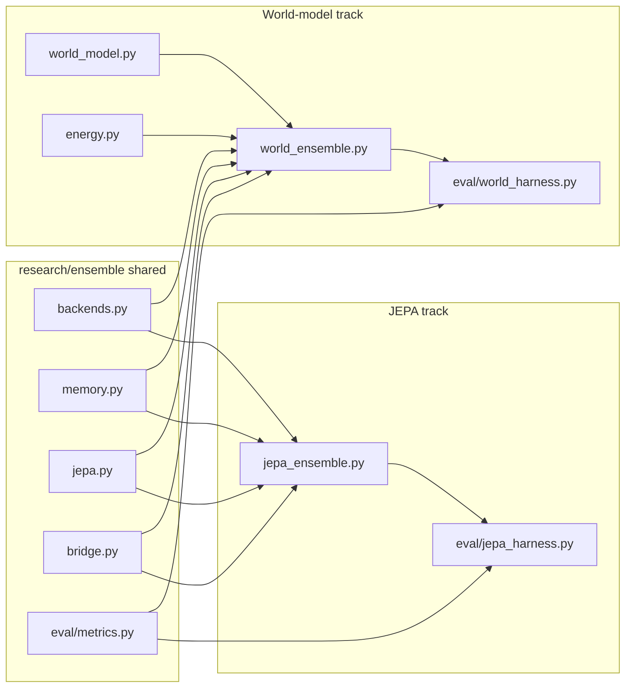

# Ensemble package (Option B) + run/benchmark plan

## Option A vs Option B

| | **Option A** (folder split only) | **Option B** (shared package) |
|---|---|---|
| **Layout** | `research/ensemble/jepa/` + `research/ensemble/world_model/` — move files, fix imports | `research/ensemble/` with shared `backends.py`, `jepa.py`, `memory.py`, etc. |
| **Effort** | ~1 hour | ~3–4 hours |
| **Duplication** | Keeps ~400 lines duplicated (two LLM backends, two JEPAs, two VectorStores) | Single implementation; bugfixes apply to both ensembles |
| **Imports** | Still fragile (`from jepa.ensemble import ...`) | Clean: `from ensemble.jepa_ensemble import Ensemble` |
| **Benchmarking** | Works for JEPA only ([`research/eval_harness.py`](research/eval_harness.py)); world model has no harness | Shared [`research/ensemble/eval/metrics.py`](research/ensemble/eval/metrics.py) + harnesses for both tracks |
| **Future agent hook** | Harder — two divergent codepaths | One package to import from `libs/agent` later if needed |
| **When to pick A** | You only need tidy folders for a demo and will not touch world-model eval | — |
| **When to pick B** | You will run ablations, add world-model benchmarks, or train bridge checkpoints | **Your choice** |

**Recommendation:** Go straight to **Option B under `research/ensemble/`** (experiments stay out of `libs/`). Option A is a reasonable **fallback** if time runs out: do the folder split and defer deduplication.



---

## Target layout

```
research/
  ensemble/
    pyproject.toml              # workspace member, optional deps
    README.md                   # run + benchmark commands
    ensemble/
      __init__.py
      backends.py               # TinyBackend + HFBackend (from jepa file)
      memory.py                   # Embedder, VectorStore, Router
      jepa.py                     # JEPA module
      bridge.py
      jepa_ensemble.py            # Ensemble class (from llm_emb_jepa_ensemble_pluggable.py)
      world_model.py              # WorldModel
      energy.py                   # EnergyModel
      world_ensemble.py           # WorldEnsemble (from world_model_ensemble.py)
      eval/
        __init__.py
        metrics.py                # EM, F1, paired_bootstrap (from eval_harness)
        jepa_harness.py           # ablation ladder + best-of-N (from eval_harness)
        world_harness.py          # NEW: energy vs random vs oracle on shared drafts
    scripts/
      smoke.sh                    # toy CPU checks for both ensembles
  data/
    education-lesson-chat.jsonl   # existing
    benchmark-qa.jsonl            # NEW: short QA for eval (derived from lesson topics)
    benchmark-kb.jsonl            # NEW: 1–2 sentence facts per topic for RAG
  finetune.py                     # unchanged
```

Delete after migration (or leave thin re-export shims for one release):
- [`research/llm_emb_jepa_ensemble_pluggable.py`](research/llm_emb_jepa_ensemble_pluggable.py)
- [`research/eval_harness.py`](research/eval_harness.py)
- [`research/world_model_ensemble.py`](research/world_model_ensemble.py)

---

## Package wiring

1. Add [`research/ensemble/pyproject.toml`](research/ensemble/pyproject.toml) with `name = "ensemble"`, `torch` required, `transformers`/`peft`/`accelerate` optional (same pattern as root [`finetune`](pyproject.toml) group).
2. Extend root [`pyproject.toml`](pyproject.toml):
   - `[tool.uv.workspace] members` → add `"research/ensemble"`
   - `[dependency-groups] ensemble = [...]` mirroring `finetune`
   - Optional root dep: `"ensemble"` for `uv run` convenience
3. Add ensemble env vars to [`.env.example`](.env.example) (model path, QA/KB paths, checkpoint path).

---

## How to try the models (3 tiers)

### Tier 1 — Smoke (CPU, no HF download, ~30s)

Validates imports and inference plumbing after refactor.

```bash
uv sync --group ensemble
uv run --package ensemble python -m ensemble.jepa_ensemble tiny      # train 50 steps + answer
uv run --package ensemble python -m ensemble.world_ensemble tiny     # train 60 steps + answer
bash research/ensemble/scripts/smoke.sh
```

Uses `TinyBackend` / `TinyLLM` — random weights, synthetic segments. Confirms modules load and forward/generate paths work.

### Tier 2 — Micro demo (real small model, ~2–5 min)

Quick “does it run on GPU/CPU with a real tokenizer?”

```bash
uv run --package ensemble python -m ensemble.jepa_ensemble Qwen/Qwen2.5-0.5B-Instruct
uv run --package ensemble python -m ensemble.world_ensemble Qwen/Qwen2.5-0.5B-Instruct
```

Or a local/finetuned path from [`models.yaml`](models.yaml) / `FINETUNE_OUT`:

```bash
uv run --package ensemble python -m ensemble.jepa_ensemble ./models/finetuned/minicpm5-1b-lora-merged
```

### Tier 3 — Benchmark (ablation + significance)

**JEPA ablation ladder** (existing logic, moved to `eval/jepa_harness.py`):

```bash
# Toy benchmark (no download)
uv run --package ensemble python -m ensemble.eval.jepa_harness \
  --llm tiny --toy --limit 20 --n_drafts 8

# Real model + project-aligned QA
uv run --package ensemble python -m ensemble.eval.jepa_harness \
  --llm Qwen/Qwen2.5-0.5B-Instruct \
  --qa research/data/benchmark-qa.jsonl \
  --kb research/data/benchmark-kb.jsonl \
  --limit 50 --n_drafts 8

# With bridge-trained checkpoint (C5)
uv run --package ensemble python -m ensemble.eval.jepa_harness \
  --llm ./models/finetuned/minicpm5-1b-lora-merged \
  --qa research/data/benchmark-qa.jsonl \
  --kb research/data/benchmark-kb.jsonl \
  --ckpt ./checkpoints/ensemble_bridge.pt
```

**World-model benchmark** (new `eval/world_harness.py`, parallel API):

- Same QA/KB inputs
- Compare selectors on shared drafts: `first | random | energy | oracle`
- Report mean energy gap and `P(energy > random)` via shared bootstrap

**Optional continual-forgetting flag** (JEPA only): `--continual` as today.

---

## Benchmark data

Add small files derived from lesson topics in [`research/data/education-lesson-chat.jsonl`](research/data/education-lesson-chat.jsonl):

**`benchmark-qa.jsonl`** (~8–10 rows):

```json
{"question": "What is photosynthesis?", "answer": "Plants make food using sunlight, water, and carbon dioxide.", "domain": "science"}
```

**`benchmark-kb.jsonl`** (~8–10 rows):

```json
{"text": "Photosynthesis: plants use sunlight, water, and CO2 to make glucose and release oxygen."}
```

Keeps eval aligned with the hackathon domain (education) without needing a large external QA set.

---

## What “good” benchmark output looks like

**JEPA harness** (from existing [`eval_harness.py`](research/eval_harness.py)):

```
config              EM      F1   lat(s)
C1_base           0.120   0.180    0.05
C2_rag            0.240   0.310    0.06
C3_rag_router     0.260   0.330    0.06
C4_full_jepa      0.320   0.400    0.45

best-of-N selector comparison:
  first    EM=0.28
  random   EM=0.31
  jepa     EM=0.38
  oracle   EM=0.52
  P(jepa > random) = 0.97   JEPA critic WORKS
```

On **toy + untrained weights**, deltas will be noise — smoke tier only checks the pipeline runs. Meaningful numbers need Tier 2/3 with a real LLM and/or a trained bridge checkpoint.

**World harness** (new): same table shape but selectors `first | random | energy | oracle`.

---

## Implementation notes (minimal scope)

- Preserve existing public classes: `Ensemble`, `WorldEnsemble`, same `answer_ids` / `answer` APIs.
- `HFBackend` in JEPA track keeps LoRA adapter bank + router; world track keeps simpler `HFLLM` (no router) — unify only where behavior matches.
- Add `if __name__ == "__main__"` entrypoints on `jepa_ensemble.py` and `world_ensemble.py` (move demos from current files).
- No integration with Gradio/`libs/agent` in this pass — research-only per your choice.
- No new pytest suite unless requested; `smoke.sh` + toy harness are the acceptance check.

---

## If time is short (Option A fallback)

Skip deduplication; only:

```
research/ensemble/jepa/{ensemble.py, eval_harness.py}
research/ensemble/world_model/{ensemble.py}
```

Fix imports, add `README.md` with Tier 1–3 commands. Revisit shared modules post-hackathon.
