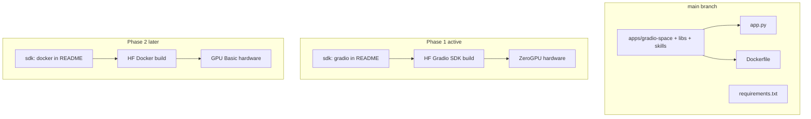

# Gradio SDK + ZeroGPU deployment (same branch as Docker)

## Goal

Ship the **full app** (Studio at `/`, Classic at `/classic`, all tabs) via **Gradio SDK** on Hugging Face with **ZeroGPU**, while keeping [`Dockerfile`](Dockerfile) on `main` untouched for a later Docker Space phase.

## Same-branch constraint (important)

HF reads **one** `sdk:` value from root [`README.md`](README.md). Both deploy paths can live on the same branch as files, but **only one SDK is active per branch at a time**:

| Files on `main` | Active when README says |
|-----------------|-------------------------|
| `app.py`, `requirements.txt`, `packages.txt` | `sdk: gradio` |
| [`Dockerfile`](Dockerfile) | `sdk: docker` + `app_port: 7860` |

**Phase 1 (now):** set `sdk: gradio` — Gradio Space builds from `app.py`.  
**Phase 2 (later):** flip README to `sdk: docker` for Docker Space, or use a **second HF Space on a second branch** if you need both live at once.



---

## Phase 1 — Add Gradio SDK root files

### 1. Root [`app.py`](app.py)

Thin entry point that reuses the existing server (no UI rewrite):

```python
from gradio_space.server import main

if __name__ == "__main__":
    main()
```

HF Gradio SDK executes `app.py`; [`server.py`](apps/gradio-space/src/gradio_space/server.py) already calls `server.launch()` on port 7860 with Studio + `/classic`.

### 2. Root [`requirements.txt`](requirements.txt)

Pip-install workspace packages via editable paths (HF clones the full repo):

```text
-e ./libs/inference
-e ./libs/researchmind
-e ./libs/agent
-e ./libs/echocoach[piper,whisper]
-e ./apps/gradio-space
# plus transitive deps from libs/*/pyproject.toml (torch, transformers, sentence-transformers, python-pptx, etc.)
```

Rules (per [HF Spaces dependencies](https://huggingface.co/docs/hub/spaces-dependencies)):

- **Do not pin** `gradio`, `spaces`, or `huggingface_hub` — HF preinstalls them.
- Pin heavy libs that matter for reproducibility: `torch`, `transformers`, `accelerate`, `sentence-transformers`, etc.
- Keep `llama-cpp-python` for preset parity (HF image has `cmake`; build may be slow).

Optional: add [`scripts/sync-requirements.sh`](scripts/sync-requirements.sh) later to regenerate from `pyproject.toml` files — not required for v1.

### 3. Root [`packages.txt`](packages.txt)

Debian deps beyond HF defaults (mirror [`Dockerfile`](Dockerfile) apt lines):

```text
ffmpeg
libsndfile1
```

### 4. Fix + switch README frontmatter

Current [`README.md`](README.md) has a blank line after `---` and still declares Docker. Update to:

```yaml
---
title: Lesson Agent
emoji: 📚
colorFrom: blue
colorTo: green
sdk: gradio
sdk_version: "6.16.0"
app_file: app.py
python_version: "3.12"
pinned: false
license: apache-2.0
---
```

Remove `app_port` (Docker-only). Keep [`Dockerfile`](Dockerfile) in repo for phase 2.

---

## Phase 2 — ZeroGPU runtime hooks

ZeroGPU requires all CUDA work inside `@spaces.GPU`. The decorator is a **no-op** locally and on dedicated GPU Spaces, so it is safe to apply everywhere.

### New module: [`apps/gradio-space/src/gradio_space/spaces_runtime.py`](apps/gradio-space/src/gradio_space/spaces_runtime.py)

```python
def gpu_task(*, duration: int = 180, size: str = "large"):
    """Apply @spaces.GPU when the HF spaces runtime is present."""
    ...

def is_hf_gradio_runtime() -> bool:
    """True on HF Gradio SDK Spaces (skip startup model preload)."""
    ...
```

Use `duration=180`–`300` for agent/slide flows; `duration=60` for simple chat.

### Skip startup preload on HF Gradio runtime

[`server.py`](apps/gradio-space/src/gradio_space/server.py) currently calls `preload_active_model()` before launch — this fails on ZeroGPU (no GPU at process start):

```69:69:apps/gradio-space/src/gradio_space/server.py
    preload_active_model()
```

Change to:

```python
if not is_hf_gradio_runtime():
    preload_active_model()
```

First user request lazy-loads inside a `@spaces.GPU`-decorated handler.

### Decorate LLM entry points (not every `backend.chat` call)

Wrap **top-level handlers** so multi-step agent loops run inside one GPU allocation:

| Module | Functions to decorate |
|--------|----------------------|
| [`model_loading.py`](apps/gradio-space/src/gradio_space/model_loading.py) | `chat`, `reload_model` |
| [`research_helpers.py`](apps/gradio-space/src/gradio_space/research_helpers.py) | `run_research_question`, `rag_aware_chat` |
| [`tabs/education_pptx.py`](apps/gradio-space/src/gradio_space/tabs/education_pptx.py) | `generate_lesson_slides`, `discover_lesson_sources` |
| [`tabs/research_mind.py`](apps/gradio-space/src/gradio_space/tabs/research_mind.py) | `discover_sources`, `ask_question`, `auto_search_ingest` |
| [`tabs/echo_coach.py`](apps/gradio-space/src/gradio_space/tabs/echo_coach.py) | `analyze_pitch` |
| [`tabs/teacher_voice.py`](apps/gradio-space/src/gradio_space/tabs/teacher_voice.py) | text/audio turn handlers |

Studio APIs in [`api/studio.py`](apps/gradio-space/src/gradio_space/api/studio.py) call these helpers — decorating the tab/helper layer avoids duplicating decorators on ~20 API wrappers.

**Generator caveat:** `generate_lesson_slides` uses `yield` for progress. If ZeroGPU rejects generator handlers, extract GPU work into a plain `@gpu_task` function and keep the outer generator for UI progress only (test on Space Logs after first deploy).

**Embeddings (ResearchMind ingest):** sentence-transformers can stay on CPU for v1; only LLM paths need `@spaces.GPU` initially.

---

## Phase 3 — Space configuration

Create Space under [build-small-hackathon](https://huggingface.co/build-small-hackathon):

| Setting | Value |
|---------|-------|
| SDK | **Gradio** (Blank template) |
| Hardware | **ZeroGPU** (creator needs PRO/Team) |
| Repo | GitHub `main` (or push to Space git) |

**Environment variables** (Settings → Variables):

| Variable | Value |
|----------|-------|
| `ACTIVE_MODEL` | `minicpm5-1b` |
| `ALLOW_MODEL_SWITCH` | `false` |
| `RESEARCHMIND_DATA_DIR` | `/tmp/researchmind` |

Default preset in [`models.yaml`](models.yaml) is already `minicpm5-1b` (transformers) — good fit for ZeroGPU.

---

## Phase 4 — Docs and local smoke test

Update [`USAGE.md`](USAGE.md):

- New **Gradio SDK deployment** section (primary path): `app.py`, `requirements.txt`, ZeroGPU, env vars.
- Move existing Docker section to **"Docker SDK (later)"** — note README must switch to `sdk: docker` + `app_port: 7860`.
- Local Gradio SDK smoke test:

```bash
python -m venv .venv && source .venv/bin/activate
pip install -r requirements.txt
ACTIVE_MODEL=minicpm5-1b ALLOW_MODEL_SWITCH=false python app.py
```

Keep existing `uv run` workflow for day-to-day dev unchanged.

Update [`.cursor/plans/hf_space_publish_e8a57bab.plan.md`](.cursor/plans/hf_space_publish_e8a57bab.plan.md) todos to reflect Gradio-first ordering.

---

## Phase 5 — Verify on Space

1. **Logs** — pip install succeeds; app starts on `0.0.0.0:7860`.
2. **`/` Studio** — loads static UI.
3. **`/classic`** — all tabs render.
4. **Smoke flows** — slides generation, research chat, EchoCoach sample clip, teacher voice text turn.
5. **ZeroGPU** — first LLM request allocates GPU (may be slow on cold start); watch for "No CUDA GPUs" (means handler is outside `@spaces.GPU`).

---

## Phase 6 — Docker later (no code removal)

When ready for Docker Space:

1. Change README to `sdk: docker`, `app_port: 7860` (remove `sdk_version` / `app_file`).
2. Create a **second Space** (or reuse after README flip) with **GPU Basic** hardware.
3. Existing [`Dockerfile`](Dockerfile) + `uv sync` path unchanged; no `@spaces.GPU` needed on dedicated GPU.

Both file sets remain on `main`; only README `sdk:` toggles which build HF runs.

---

## Risk notes

| Risk | Mitigation |
|------|------------|
| `pip install llama-cpp-python` slow/fails on HF | Accept slow build; default `minicpm5-1b` avoids GGUF at runtime |
| EchoCoach deps (piper, whisper) heavy | Full scope requested; pin versions; fix from Space Logs if needed |
| ZeroGPU + generator slide progress | Refactor GPU block to non-generator helper if build succeeds but inference fails |
| Two live Spaces same branch | Not supported with different SDKs — use README flip or second branch for concurrent Docker + Gradio |
