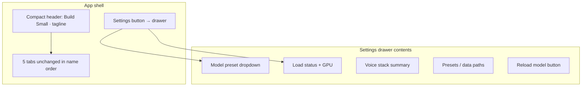
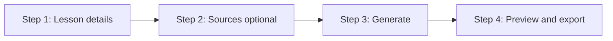
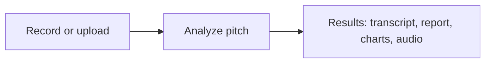

# Gradio App UI/UX Redesign

## Current problems (from screenshots + code audit)

| Issue | Where | Root cause |
|-------|-------|------------|
| Wall of config at top | [`app.py`](apps/gradio-space/src/gradio_space/app.py) L31-42 | Global `gr.Markdown` dumps model key, backend, presets path |
| Repeated model status | Every tab calls `model_status()` | No shared settings; same info 5× |
| No visual hierarchy | All tabs | Default Gradio 5 theme, no `css=` / `theme=` |
| Unclear user path | Lesson slides, ResearchMind, voice tabs | Many controls visible at once; instructions as markdown paragraphs |
| Dev noise in main flow | Trace JSON, file paths, ASR presets | Exposed inline instead of Advanced |
| Fragmented voice UX | EchoCoach + TeacherVoice | Dual recording paths, duplicate copy, inconsistent max seconds (30 vs 15) |

**Recommendation:** Stay on **Gradio Blocks** as the server and layout engine. Use **Gradio theme + global CSS** for 80% of polish, **`gr.HTML`** for step indicators and mode cards, and **collapsed Accordions** for Advanced/Debug — no separate HTML app unless a specific widget proves impossible in Gradio (unlikely for this scope).

---

## Target information architecture



**Tab bar (keep order, improve labels/icons via CSS):**

1. **Lesson slides** — Create teaching decks
2. **ResearchMind** — Build a source library + ask questions
3. **EchoCoach** — Analyze a recorded pitch
4. **TeacherVoice** — Talk to a local teacher
5. **Chat (debug)** — Plain model + optional RAG test

For hackathon jury: polish the first four tabs heavily; style Chat (debug) with a subtle “dev” badge but keep it in the bar.

---

## Phase 1 — Global shell + design system

### New files

- [`apps/gradio-space/src/gradio_space/ui/theme.py`](apps/gradio-space/src/gradio_space/ui/theme.py) — `get_theme()` (Gradio `Soft` or custom primary color aligned with hackathon orange)
- [`apps/gradio-space/src/gradio_space/ui/styles.css`](apps/gradio-space/src/gradio_space/ui/styles.css) — app-wide rules: compact header, step pills, `.advanced-panel`, tab subtitle styling
- [`apps/gradio-space/src/gradio_space/ui/settings_panel.py`](apps/gradio-space/src/gradio_space/ui/settings_panel.py) — reusable settings accordion
- [`apps/gradio-space/src/gradio_space/ui/components.py`](apps/gradio-space/src/gradio_space/ui/components.py) — step indicator HTML, recording widget, session picker

### Refactor [`app.py`](apps/gradio-space/src/gradio_space/app.py)

Replace the large markdown header with:

```python
with gr.Blocks(title="Build Small", theme=get_theme(), css=load_css()) as demo:
    with gr.Row(elem_classes=["app-header"]):
        gr.HTML('<div class="brand">...</div>')  # title + one-line tagline
        settings_btn = gr.Button("Settings", size="sm", variant="secondary")
    with gr.Accordion("Settings", open=False, visible=True) as settings_acc:
        build_settings_panel()  # model dropdown, status, paths, voice summary
    with gr.Tabs():
        ...
```

**Settings panel contents:**
- **Model preset** — always show dropdown when `allow_model_switch`, else read-only badge with active preset
- **Status** — single `model_status()` + device hint (moved from per-tab)
- **Voice stack** — read-only summary from `get_echo_coach_config()` (ASR/TTS presets path, not raw env vars)
- **Paths** — presets file, ResearchMind data dir (collapsed sub-section)
- **Actions** — “Reload model” (calls existing `ensure_model_loaded` / `reset_backend`)

Wire `settings_btn.click` → toggle accordion open state.

Remove per-tab `gr.Markdown(model_status(...))` calls once centralized.

---

## Phase 2 — Shared UX patterns

### A. Step indicator (`gr.HTML`)

Reusable 3–4 step strip rendered as HTML/CSS (not Gradio-native, but lightweight):

```
[1 Topic] → [2 Sources] → [3 Generate] → [4 Preview]
```

Active step highlighted; future steps muted. Update via small Python helper returning HTML string on state changes.

### B. Unified recording block (`components.py`)

Extract duplicated logic from [`echo_coach.py`](apps/gradio-space/src/gradio_space/tabs/echo_coach.py) and [`teacher_voice.py`](apps/gradio-space/src/gradio_space/tabs/teacher_voice.py):

- **Primary path:** browser mic on `gr.Audio` (label: “Record or upload”)
- **Secondary:** accordion “Server microphone (Linux)” with Start/Stop — collapsed by default unless `recording_backend_status()` reports server mic as only option
- **One status line** instead of two markdown blocks
- **Advanced accordion:** language, ASR preset, max seconds

Align max turn length: use `_config.max_seconds` everywhere; TeacherVoice caps via backend, not a separate 15s UI default unless intentional (document in Advanced).

### C. Session + doc scope (`components.py`)

Shared widget used by ResearchMind, Lesson slides (RAG mode), TeacherVoice (RAG), Chat:

- Session dropdown + compact refresh icon button (not full-width button)
- Doc checkboxes inside accordion “Limit to documents”

### D. Advanced / Debug panel (every feature tab)

Standard accordion at bottom:

```
▸ Advanced & debug
   - Agent trace (JSON)
   - Trace summary
   - Export paths
```

Hidden by default; satisfies jury “show capability” without cluttering main flow.

### E. Loading feedback

Add `gr.Progress()` to long handlers:
- `generate_lesson_slides`
- `discover_sources` / `ingest_selected`
- `analyze_pitch` / `send_turn`
- `ask_question`

Show staged labels: “Loading model…”, “Searching…”, “Generating slides…”, etc.

---

## Phase 3 — Per-tab redesigns

### Lesson slides ([`education_pptx.py`](apps/gradio-space/src/gradio_space/tabs/education_pptx.py))

**User story:** *Topic + grade → (optional sources) → Generate → Preview & download*



| Zone | Content |
|------|---------|
| Hero | One sentence + step indicator |
| Step 1 row | Topic, grade, slide count (always visible) |
| Step 2 accordion | “Add research sources (optional)” — source mode as **radio** (None / Web / RAG), not nested dropdowns |
| Web sub-flow | If two-step: show Discover → URL checkboxes; if auto: hide Discover, label Generate as “Search web & generate” |
| Primary CTA | Full-width **Generate lesson slides** |
| Results | Tabs: **Preview** (default) \| Outline; download row below |
| Footer | Google Docs tip in collapsed “Export help” |
| Advanced | trace JSON, trace summary |

Remove tab-level model status markdown. Move Google Docs paragraph to accordion.

---

### ResearchMind ([`research_mind.py`](apps/gradio-space/src/gradio_space/tabs/research_mind.py))

**User story:** *Add sources to a session → Ask questions about them*

Restructure from “3 inner tabs + chat below fold” to **two-column layout**:

```
┌─────────────────────────────┬──────────────────────────┐
│  BUILD LIBRARY (left)       │  ASK (right)             │
│  Session picker             │  Chatbot (sticky height) │
│  Ingest mode radio          │  Question input          │
│  Topic / URLs / Upload      │  Doc scope (accordion)   │
│  [Discover] [Ingest]        │  Citations hint in reply │
│  Status                     │                          │
│  Memory summary (compact)   │                          │
└─────────────────────────────┴──────────────────────────┘
```

Key UX fixes:
- Split **Discover sources** vs **Auto search & ingest** into **two distinct buttons** (no shared button + mode dropdown confusion)
- Keep Memory/Trace as **tabs inside left column** or accordions, not top-level competing tabs
- Show **citation snippet** under assistant messages (parse from trace or extend `run_research_question` to return formatted citations markdown — small backend tweak in [`research_helpers.py`](apps/gradio-space/src/gradio_space/research_helpers.py))
- Remove memory store path from main view → Settings panel
- Clear question box after successful Ask

---

### EchoCoach ([`echo_coach.py`](apps/gradio-space/src/gradio_space/tabs/echo_coach.py))

**User story:** *Record pitch → Analyze → Read feedback + hear VoiceOut*



| Zone | Content |
|------|---------|
| Step strip | Record → Analyze → Results |
| Left (narrow) | Recording block + **Analyze pitch** (primary, large) |
| Right (wide) | Empty state: “Record up to 30s and click Analyze” until results |
| Results layout | Transcript HTML top → Coach report → Charts row → VoiceOut player |
| Cross-link | One line: “Want live tips? → TeacherVoice (Pitch practice)” |
| Advanced | language, ASR preset, VoiceOut checkbox, trace |

Replace opening markdown wall with 2-line subtitle + step indicator. Move localhost/Cursor mic warning to tooltip-style callout (`gr.Info` or small HTML banner, dismissible via accordion “Recording help”).

---

### TeacherVoice ([`teacher_voice.py`](apps/gradio-space/src/gradio_space/tabs/teacher_voice.py))

**User story:** *Pick mode → Record turn → Send → Hear reply → Continue*

| Zone | Content |
|------|---------|
| Mode selector | **Three mode cards** via `gr.Radio` styled as cards (Explain / Lesson coach / Pitch practice) — show topic field only for Explain + Lesson |
| Step strip | Mode → Record → Send → Listen |
| Left | Recording block + **Send turn** (primary) + Clear |
| Right | Chatbot + autoplay VoiceOut (hide redundant Speak buttons in Advanced unless autoplay fails) |
| RAG | Promote to visible checkbox “Use my ResearchMind sources” with inline session picker (not buried accordion) when mode supports RAG |
| Advanced | ASR, trace, Speak buttons, omni status |

Clarify turn flow in UI copy: numbered pills update on each action (idle → recording → ready to send → thinking → reply).

---

### Chat (debug) ([`chat.py`](apps/gradio-space/src/gradio_space/tabs/chat.py))

Minimal polish (per your choice to keep tab):
- Add subtle `gr.Markdown("*Developer surface — test raw model + RAG*")` with CSS class `.dev-tab`
- Group RAG controls in one bordered `gr.Group`
- Optionally surface trace when RAG is on (currently discarded in `rag_aware_chat`) — small enhancement for jury demo

---

## Phase 4 — Visual design tokens

Light theme, education-friendly, consistent with existing lesson deck serif preview:

| Token | Value | Usage |
|-------|-------|-------|
| Primary | `#e86c00` (hackathon orange) | CTAs, active step |
| Surface | `#fafafa` | Panel backgrounds |
| Text muted | `#666` | Subtitles, Advanced labels |
| Font UI | system sans | Gradio controls |
| Font content | Georgia (already in preview) | Slide preview only |

Apply via `gr.themes.Soft(primary_hue="orange", ...)` + CSS overrides for header height, button sizing, and step pills.

---

## Implementation order (recommended)

1. **Shell + theme + settings panel** — immediate visual win, removes duplicate headers
2. **Shared components** (recording, session picker, advanced accordion, progress)
3. **EchoCoach + TeacherVoice** — highest confusion today; shared recording widget
4. **Lesson slides** — wizard + source mode simplification
5. **ResearchMind** — two-column layout + split discover buttons
6. **Chat debug** — light grouping + optional RAG trace

Each phase is independently shippable; tabs keep working between phases.

---

## What we are NOT doing (scope guard)

- No rewrite to a separate FastAPI + React frontend (Gradio remains the server)
- No real-time duplex TeacherVoice (backend limitation; UI will set expectations clearly)
- No redesign of slide HTML generator in [`preview.py`](libs/agent/src/agent/preview.py) beyond minor spacing tweaks
- No new features (lesson ↔ TeacherVoice link, etc.) unless trivial during layout refactor

---

## Files touched (summary)

| File | Change |
|------|--------|
| [`app.py`](apps/gradio-space/src/gradio_space/app.py) | Theme, CSS, compact header, settings accordion |
| `ui/theme.py`, `ui/styles.css`, `ui/settings_panel.py`, `ui/components.py` | **New** shared UI layer |
| [`tabs/education_pptx.py`](apps/gradio-space/src/gradio_space/tabs/education_pptx.py) | Wizard layout, source radio, Advanced panel |
| [`tabs/research_mind.py`](apps/gradio-space/src/gradio_space/tabs/research_mind.py) | Two-column layout, split buttons |
| [`tabs/echo_coach.py`](apps/gradio-space/src/gradio_space/tabs/echo_coach.py) | Step flow, shared recording |
| [`tabs/teacher_voice.py`](apps/gradio-space/src/gradio_space/tabs/teacher_voice.py) | Mode cards, promoted RAG |
| [`tabs/chat.py`](apps/gradio-space/src/gradio_space/tabs/chat.py) | Dev styling, grouped RAG |
| [`research_helpers.py`](apps/gradio-space/src/gradio_space/research_helpers.py) | Optional citation formatting for chat |
| [`model_loading.py`](apps/gradio-space/src/gradio_space/model_loading.py) | Settings-panel reload hook |

---

## Success criteria (for hackathon demo)

- First screen shows **product name + tabs**, not YAML paths
- Each tab has an obvious **1-2-3 path** visible without scrolling past config
- Model/settings accessible in **one place** (Settings)
- Long operations show **progress**, not frozen UI
- Jury can expand **Advanced** to see traces, ASR, and paths on demand
