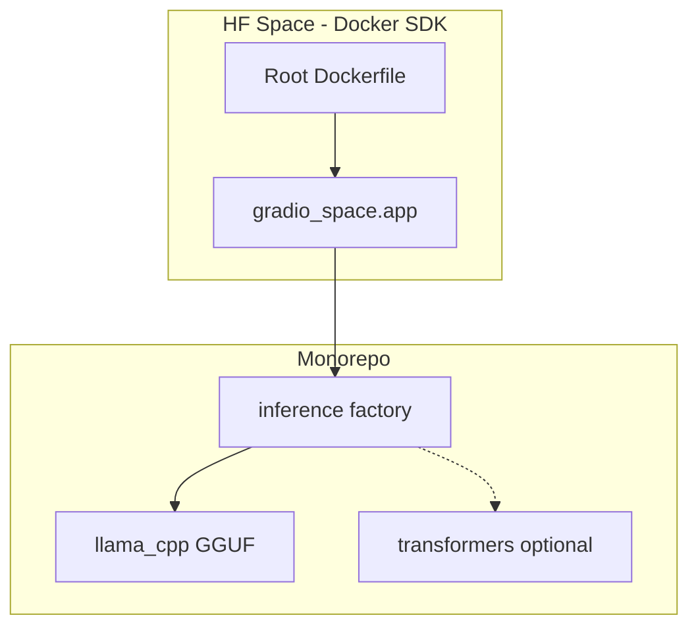

# HF Space Deploy Review

## Verdict: the plan is already good — and it *is* a simple Gradio deploy

Your plan in [`.cursor/plans/uv_monorepo_init_d9207227.plan.md`](.cursor/plans/uv_monorepo_init_d9207227.plan.md) does **not** over-engineer relative to hackathon requirements. The hackathon only requires:

- A **Gradio app** hosted as a **Hugging Face Space** under [build-small-hackathon](https://huggingface.co/build-small-hackathon)
- Model **≤ 32B**
- Submission by **June 15, 2026**: Space link + demo video + social post

The plan delivers exactly that: `gr.ChatInterface` in [`apps/gradio-space/src/gradio_space/app.py`](apps/gradio-space/src/gradio_space/app.py), exposed on port **7860**. The uv workspace and `libs/inference` are scaffolding so the UI stays thin and backends stay swappable — not extra product scope.



## Gradio SDK vs Docker SDK — why not "just Gradio SDK"?

| Approach | Good for | Problem for this repo |
|----------|----------|------------------------|
| **Gradio SDK** (`app.py` + `requirements.txt` at repo root) | Single-file demos, fastest hello-world | No clean way to use `libs/inference` workspace package; `llama-cpp-python` needs compile/CMAKE control that Gradio SDK handles poorly |
| **Docker SDK** (root `Dockerfile`, still runs Gradio) | Monorepos, native deps, env control | ~30 extra lines of Dockerfile — already in your plan |

**Recommendation:** Keep **Docker SDK + Gradio UI**. You get the same user-facing Gradio app; Docker is just the shipping container. This is the standard monorepo pattern HF documents for custom runtimes.

A "simpler" alternative (Gradio SDK + `transformers` only, no llama-cpp) would boot faster to write but:

- Drops **Off-the-Grid** / **Llama Champion** badge paths
- Heavier default install (`torch`) on CPU Spaces
- Forces you to flatten or duplicate inference code later

Given balanced priority, Docker + llama-cpp default is the better baseline.

## One fix to the existing plan

**Space card YAML must live in the repo-root [`README.md`](README.md), not only in `apps/gradio-space/README.md`.**

HF reads the YAML frontmatter from the **repository root** `README.md` when the Space is linked to this repo. Merge:

```yaml
---
title: <Your App Name>
emoji: ...
sdk: docker
app_port: 7860
---
```

into root `README.md`, then add dev/hackathon docs below the closing `---`. Keep `apps/gradio-space/README.md` as an optional short package note, or drop it to avoid duplication.

## Balanced execution (your choice): two phases

### Phase 1 — Minimal live Space (ship this first)

Goal: working Space under `build-small-hackathon` with a chat demo, even if rough.

1. **Bootstrap uv workspace** (plan sections 1–3): root + `apps/gradio-space` + `libs/inference`
2. **Minimal inference**: `llama_cpp` backend only; `get_backend().load()` lazy singleton; `chat()` wired to `gr.ChatInterface`
3. **Default model**: `Qwen/Qwen2.5-3B-Instruct-GGUF` + `qwen2.5-3b-instruct-q4_k_m.gguf` (small, under 32B, CPU-viable)
4. **Root Dockerfile** + fixed root README YAML (`sdk: docker`, `app_port: 7860`)
5. **Create Space**: Docker SDK, CPU basic hardware, env vars `MODEL_REPO`, `MODEL_FILE`, `N_CTX=4096`, `N_GPU_LAYERS=0`
6. **Smoke test**: `uv sync`, local Gradio on `:7860`, push, confirm Space builds

Defer: `transformers` extra, custom UI (`gr.Server`), `scripts/download_model.py`, ruff/pytest, badge-specific polish.

### Phase 2 — Polish before June 15

- Track-specific product logic (Backyard AI vs Thousand Token Wood)
- Better loading UX (progress/status while GGUF downloads on cold start)
- Optional GPU Space + `N_GPU_LAYERS` if latency is bad on CPU
- Custom UI / agent traces if chasing **Off-Brand** or **Sharing is Caring** badges
- `scripts/download_model.py` for offline dev
- Demo video + social post

## What stays out of scope (correctly)

The plan already defers fine-tuning, CI, and badge-specific features. Keep those deferred until Phase 1 Space is green.

## Risk notes (small, actionable)

- **Cold start**: first request downloads GGUF from Hub — show a Gradio status message; consider HF Storage Bucket only if downloads are painfully slow on every restart
- **CPU latency**: 3B Q4 on CPU basic is acceptable for a demo; upgrade hardware only if needed
- **Docker build**: do not run GPU checks (`torch.cuda.is_available()`) at image build time — only at runtime (HF docs constraint)
- **UID 1000**: keep `USER 1000` in Dockerfile (HF requirement)

## Summary

| Question | Answer |
|----------|--------|
| Is the plan good for HF Space deploy? | **Yes** — it already targets Gradio on Spaces |
| Simpler Gradio-only deploy instead? | **No** — Gradio SDK is simpler to *author* but worse for monorepo + llama-cpp; you'd rework later |
| What to do now? | Execute the plan **Phase 1** with the root README YAML fix; polish in Phase 2 |
