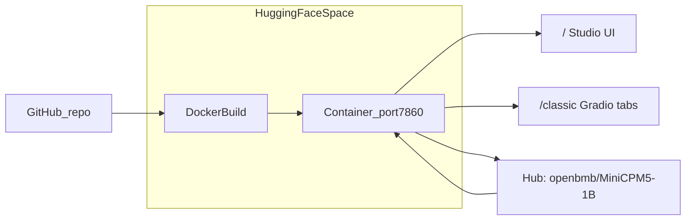

# Publish Gradio app to Hugging Face Space

## Current state

Your repo is **mostly ready** for a Docker Space:

- Root [`Dockerfile`](Dockerfile) exposes port **7860** and runs `python -m gradio_space.app`
- Root [`README.md`](README.md) has Space metadata (`sdk: docker`, `app_port: 7860`)
- Default model in [`models.yaml`](models.yaml) is **`minicpm5-1b`** (transformers, `openbmb/MiniCPM5-1B`)

Two issues will likely **break the Space build or card** until fixed:

### Blocker 1 — README YAML is malformed

The Space card frontmatter must use `title:`, not a markdown heading:

```yaml
# Current (wrong)
## title: Lesson Agent

# Required (correct)
title: Lesson Agent
```

HF reads YAML from the **root** [`README.md`](README.md) only. Keep [`apps/gradio-space/README.md`](apps/gradio-space/README.md) as dev docs.

### Blocker 2 — Dockerfile missing `researchmind`

[`libs/agent`](libs/agent/pyproject.toml) depends on `researchmind`, but the Dockerfile only copies `inference`, `agent`, and `echocoach`. `uv sync` inside the image will fail without:

```dockerfile
COPY libs/researchmind/pyproject.toml libs/researchmind/README.md libs/researchmind/
COPY libs/researchmind/src libs/researchmind/src
```

Add these lines alongside the other `libs/*` COPY blocks in [`Dockerfile`](Dockerfile).

---

## Architecture (what gets deployed)



Entrypoint (unchanged):

```44:44:Dockerfile
CMD ["uv", "run", "--package", "gradio-space", "python", "-m", "gradio_space.app"]
```

This launches [`gradio_space.server`](apps/gradio-space/src/gradio_space/server.py): Studio at `/`, Classic tabs at `/classic`.

---

## Phase 1 — Fix repo files (before push)

| File | Change |
|------|--------|
| [`README.md`](README.md) | Fix frontmatter: `title: Lesson Agent` (remove `##`); keep `sdk: docker`, `app_port: 7860` |
| [`Dockerfile`](Dockerfile) | Add `libs/researchmind` pyproject + src COPY lines |

Optional but recommended in README frontmatter (already present except title):

```yaml
---
title: Lesson Agent
emoji: 📚
colorFrom: blue
colorTo: green
sdk: docker
app_port: 7860
pinned: false
license: apache-2.0
---
```

---

## Phase 2 — Validate locally with Docker

From repo root:

```bash
docker build -t hackathon-space .
docker run --rm -p 7860:7860 \
  -e ACTIVE_MODEL=minicpm5-1b \
  -e ALLOW_MODEL_SWITCH=false \
  hackathon-space
```

Open [http://localhost:7860](http://localhost:7860) (`/` Studio, `/classic` tabs). First model load downloads weights from Hub — expect several minutes on first run.

If build fails, check Logs for `researchmind` or `uv sync` errors (confirms Blocker 2 fix).

---

## Phase 3 — Push to GitHub

1. Create a GitHub repo (if not already linked)
2. Push `main` with at minimum:
   - `Dockerfile`, `README.md`, `pyproject.toml`, `uv.lock`
   - `apps/gradio-space/`, `libs/`, `skills/`, `models.yaml`, `voice_models.yaml`

Do **not** commit `.env`, local `models/*.gguf`, or large artifacts (`.dockerignore` already excludes these).

---

## Phase 4 — Create and link the Space

1. Go to [build-small-hackathon](https://huggingface.co/build-small-hackathon) → **New Space**
2. Settings:
   - **Name:** e.g. `lesson-agent` or `small-model-hackathon`
   - **SDK:** **Docker** (not Gradio SDK — monorepo needs root Dockerfile)
   - **Hardware:** **GPU basic** (required for transformers `minicpm5-1b`)
3. Under **Repository** → connect your GitHub repo and branch (`main`)
4. HF will auto-build from root `Dockerfile` on each push

---

## Phase 5 — Space environment variables

In Space **Settings → Variables and secrets** (Repository secrets, not `.env` in git):

| Variable | Value | Why |
|----------|-------|-----|
| `ACTIVE_MODEL` | `minicpm5-1b` | Pins model for visitors |
| `ALLOW_MODEL_SWITCH` | `false` | Hides dev model dropdown |
| `AGENT_OUTPUTS_DIR` | `/tmp/agent_outputs` | Already set in Dockerfile; optional override |
| `RESEARCHMIND_DATA_DIR` | `/tmp/researchmind` | Ephemeral RAG store on Space (recommended) |

No secrets required for the default MiniCPM5 preset unless you switch to a gated model.

---

## Phase 6 — Verify publish

1. Open Space **Logs** — wait for `Running on local URL: 0.0.0.0:7860`
2. Open the Space URL
3. Smoke test:
   - `/` — Studio loads
   - Generate slides with a simple topic (e.g. "Photosynthesis, grade 8, 5 slides")
   - `/classic` — tabs render
4. First inference may be slow while `openbmb/MiniCPM5-1B` downloads

### Optional: faster restarts

If cold starts are painful, add a **Storage Bucket** in Space settings so Hub model cache persists across restarts.

---

## Troubleshooting

| Symptom | Fix |
|---------|-----|
| Space card shows wrong title / no Docker | Fix README YAML (`title:` not `## title:`) |
| Docker build fails at `uv sync` | Add `researchmind` to Dockerfile |
| Build OK but app crashes on Research tab | Confirm `researchmind` src is copied |
| First request very slow | Normal — model download; use Storage Bucket |
| OOM on GPU | Try smaller batch or switch preset to GGUF on CPU |

Full reference: [`USAGE.md`](USAGE.md) sections "Docker smoke test" and "Hugging Face Space deployment".

---

## What you do NOT need

- Plain Gradio SDK (`app.py` + `requirements.txt` at root) — wrong fit for this monorepo
- Committing GGUF files — models download from Hub at runtime via `ACTIVE_MODEL` / `models.yaml`
- Changing the CMD — current entrypoint already serves Studio + Classic
