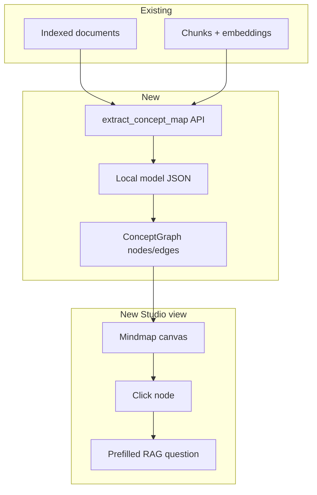

# Knowledge mindmap view

## Why sprint 2 (not sprint 1)

You chose **teaching loop first**: slides-from-chat + quiz. Mindmap has **no prior plan or code** in the repo (grep finds zero matches). ResearchMind stores chunk `edges` in SQLite ([`store.py`](libs/researchmind/src/researchmind/store.py)) but only for RAG neighbor expansion — not a concept graph UI.

**Wahou moment:** After ingesting sources, the teacher sees their **library as a living map** — click a node → ask a focused RAG question. Complements citations in chat with spatial memory.



---

## Scope choices (recommended MVP)

| Approach | Pros | Cons |
|----------|------|------|
| **A. LLM concept tree from session** (recommended) | Teacher-friendly hierarchy; works with any ingest | Extra LLM call; needs JSON repair |
| B. Chunk adjacency graph only | No LLM | Linear doc chains, not a mindmap |
| C. Full entity extraction pipeline | Rich graph | Too heavy for hackathon scope |

**MVP = Approach A:** 1-level tree + optional 2nd-level children (15–30 nodes max).

---

## Part 1 — Data model + backend

### 1.1 Concept graph schema

New in [`libs/researchmind/src/researchmind/models.py`](libs/researchmind/src/researchmind/models.py) (or `libs/agent/models.py`):

```python
class ConceptNode(BaseModel):
    id: str
    label: str
    summary: str = ""
    chunk_ids: list[str] = []  # grounding refs

class ConceptEdge(BaseModel):
    source: str
    target: str
    rel: str = "contains"  # contains | related

class ConceptMap(BaseModel):
    title: str
    nodes: list[ConceptNode]
    edges: list[ConceptEdge]
```

### 1.2 Extraction API

New module [`libs/researchmind/src/researchmind/concept_map.py`](libs/researchmind/src/researchmind/concept_map.py):

1. Load session docs + top chunks per doc (cap ~20 chunks, ~8k chars)
2. Prompt local model: emit `ConceptMap` JSON (topic = workspace topic or session title)
3. Repair/retry/fallback: single root + 5 bullet children from doc titles if JSON fails
4. Cache result in SQLite table `concept_maps(session_id, updated_at, json)` to avoid re-running on every page load

### 1.3 Studio endpoint

In [`api/studio.py`](apps/gradio-space/src/gradio_space/api/studio.py):

```python
@server.api(name="build_concept_map")
def api_build_concept_map(session_id, topic="", force_refresh=False)
```

Returns: `map_json`, `preview_svg` or `graph_html`, `status`, optional `trace_json`.

Optional: `api_concept_map_from_slides(outline_json)` — derive map from last generated slide titles (no extra ingest).

---

## Part 2 — Visualization (Studio)

### 2.1 New sidebar view

[`index.html`](apps/gradio-space/static/studio/index.html):

- Nav item **Map** (`data-view="map"`, icon `hub` or `account_tree`)
- Place after **Research** in sidebar (natural flow: ingest → map → ask)

### 2.2 Renderer (prefer zero build step)

**Option 1 (recommended):** Inline **Mermaid** `mindmap` or `flowchart TB` generated server-side from `ConceptMap` — no npm bundle, works in static Studio.

**Option 2:** Lightweight **D3** force graph in `studio.js` if Mermaid layout is too rigid (~200 lines).

UI elements:

- **Build map** button (disabled if no indexed docs)
- Loading state with honest GPU/CPU hint (reuse slide overlay pattern)
- Zoom/pan container
- Node click → side panel: label, summary, linked chunk excerpts, **Ask about this** button

### 2.3 Click-to-chat integration

On node click:

- Prefill Research chat input: `Explain "{label}" in the context of {topic}`
- Set RAG doc scope to node's `chunk_ids` parent docs if available
- Switch to Research view (or open inline mini-chat drawer on Map view — pick one for v1)

### 2.4 Regeneration triggers

- Auto-offer **Refresh map** after new ingest completes
- Stale badge if ingest timestamp > map `updated_at`

---

## Part 3 — Classic parity (optional)

Small section in ResearchMind tab: "Concept map" HTML component calling same `build_concept_map` — lower priority than Studio.

---

## Part 4 — Tests + docs

- Unit: JSON repair, fallback map from doc titles, cache hit/miss
- Integration: ingest fixture session → `build_concept_map` returns ≥3 nodes
- README: Map view in judge demo script (step 1b after ingest)

---

## Risks

| Risk | Mitigation |
|------|------------|
| Model invents concepts not in sources | Require `chunk_ids` in prompt; validate IDs against store |
| Mermaid mindmap syntax limits | Cap nodes; fall back to flowchart |
| Large libraries | Sample top-K chunks by embedding centrality or doc order |
| Performance | Cache in SQLite; show cached map instantly, refresh in background |

---

## Relationship to other sprint plans

| Feature | Interaction |
|---------|-------------|
| Slides from chat | Optional `concept_map_from_slides` shortcut |
| Quiz | Future: "Quiz this branch" on node click (defer) |
| Research RAG | Map nodes link back to same `session_id` store |

---

## Files

**Create:** `concept_map.py`, `concept_maps` DB migration in `store.py`, Studio Map view markup/JS/CSS, tests

**Modify:** `api/studio.py`, `store.py`, `index.html`, `studio.js`, `studio.css`, README

## Estimated effort

| Block | Time |
|-------|------|
| Schema + extraction + cache | 4–5h |
| Studio API + Build map UX | 2h |
| Mermaid/D3 renderer + click-to-chat | 4–6h |
| Tests + docs | 2h |
| **Total** | **~2 days** |

Ship after quiz + slides-from-chat presenter are stable.
