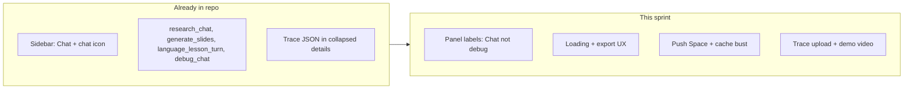

# Last sprint: Chat rename + demo polish

Submission is **today (June 15)**. You chose **demo & submission polish** over the larger slides-from-chat / quiz feature plan ([`.cursor/plans/slides_from_chat_+_quiz_f53701a3.plan.md`](.cursor/plans/slides_from_chat_+_quiz_f53701a3.plan.md)).

## Current state

Studio at `/` is feature-complete for the hackathon narrative: Research ingest + RAG Q&A, Slides generation with exports, Language lessons (voice + RAG), Settings, Classic UI fallback. Classic parity work is marked completed in [`.cursor/plans/studio_classic_parity_48cdd684.plan.md`](.cursor/plans/studio_classic_parity_48cdd684.plan.md).

Your screenshots still show sidebar **Debug** with a bug icon, but the working tree already has **Chat** + `chat` icon in [`apps/gradio-space/static/studio/index.html`](apps/gradio-space/static/studio/index.html) line 40. Likely causes: **HF Space not redeployed** or **browser cache** on `/static/studio/*` (no cache-bust query param on CSS/JS).



---

## Part 1 — Debug → Chat (user-facing labels)

**Scope:** HTML/CSS string changes only. Keep internal `data-view="debug"`, `debug_chat` API, and JS function names — no risky refactor.

| Location | Current | Target |
|----------|---------|--------|
| Sidebar nav | Already `Chat` + chat icon | Verify after deploy |
| Chat panel header | `Chat (debug)` | `Chat` |
| Chat empty state | "test the active local model" | "Ask the local model — turn on RAG to ground answers in your library" |
| Trace collapsibles (all views) | `Debug trace` | `Agent trace` (better for **Sharing is Caring** jury story) |
| Classic tab | `Chat (debug)` in [`app.py`](apps/gradio-space/src/gradio_space/app.py) | `Chat` (optional `Developer` badge via existing CSS in Classic) |

Files: [`index.html`](apps/gradio-space/static/studio/index.html), optionally [`app.py`](apps/gradio-space/src/gradio_space/app.py).

---

## Part 2 — UI/UX polish (no new APIs)

### 2a. Static asset cache bust

Add a build/version suffix to CSS/JS in `index.html` (e.g. `?v=20260615` or read from a single `STUDIO_ASSET_VERSION` constant in [`server.py`](apps/gradio-space/src/gradio_space/server.py) injected into the HTML route). Ensures judges see Chat label after one deploy.

### 2b. Export button clarity

[`studio.js`](apps/gradio-space/static/studio/studio.js) `btn-export` only opens PPTX. Options (pick one, ~15 min):

- Change label to **Download PPTX** when slides exist, or
- Small export menu: PPTX / DOCX / HTML (links already rendered in `#downloads`)

### 2c. Loading expectations (slides bottleneck)

Your screenshot shows **~451s** for outline on CPU. Code already caps tokens via [`outline_max_tokens`](libs/agent/src/agent/prompts.py) and shows overlay hint *"30–90 seconds"* — misleading on CPU.

- Update overlay hint to: *"First run may take several minutes on CPU; use GPU Space or fewer slides for a quick demo."*
- Add a one-line tip under **Generate slides**: *"Demo tip: 3 slides, GPU hardware."*

No model changes required for submission; avoids over-promising speed.

### 2d. Research chat parity with Language lessons

Language lessons render `rag_references` under assistant bubbles ([`studio.js`](apps/gradio-space/static/studio/studio.js) ~407). Research chat only renders `msg.content` — citations are inline in text today, which is acceptable for demo. **Optional quick win:** if `ask_question` history includes a references field, mirror the lessons pattern (check [`research_mind.py`](apps/gradio-space/src/gradio_space/tabs/research_mind.py) return shape first).

### 2e. Chat full-page view polish

[`studio.css`](apps/gradio-space/static/studio/studio.css) already hides other columns on `data-view="debug"`. Minor CSS: center the chat card, slightly wider max-width on desktop so the dedicated Chat view feels intentional (not a leftover debug panel).

---

## Part 3 — Bug fixes (small, high-impact)

| Issue | Fix |
|-------|-----|
| Stale "Debug" in production | Deploy + cache bust (Part 2a) |
| Misleading slide timing hint | Part 2c |
| New session clears research history but not debug chat | In `btn-new-session` handler, also clear `state.debugChatHistory` + `renderDebugChat()` |
| Export disabled until slides generated | Expected; document in demo script |

Run existing test suite before push: `uv run pytest` (100 tests).

---

## Part 4 — Submission checklist (non-code, same day)

From [README hackathon checklist](README.md):

1. **Space live** — push branch, confirm `/` loads Studio with Chat sidebar
2. **Demo video** (2–3 min): Research ingest → Ask with citations → Slides (3 slides, GPU if possible) → Language lesson voice turn → expand **Agent trace** → download PPTX
3. **Sharing is Caring** — generate one slide run, then:
   ```bash
   uv run python scripts/upload_trace.py --repo-id YOUR_USER/build-small-agent-traces
   ```
4. **Social post** + formal submission on hackathon page

Badge targets already mapped in README: Best Agent, Tiny Titan, OpenBMB, Off-the-Grid, Sharing is Caring.

---

## Explicitly deferred (post-submission or next hackathon)

- Generate slides from chat + Quiz maker ([slides/quiz plan](.cursor/plans/slides_from_chat_+_quiz_f53701a3.plan.md))
- EchoCoach charts in Studio (Classic only today)
- Outline speed optimizations (separate outline-only smaller model, streaming tokens)

---

## Estimated effort

| Block | Time |
|-------|------|
| Chat / trace labels | ~30 min |
| Cache bust + deploy | ~30 min |
| Export + loading hints + new-session bug | ~45 min |
| Chat view CSS + optional research refs | ~45 min |
| Demo video + trace upload | ~1–2 hr |

**Total:** ~3–4 hours to a polished submission.
