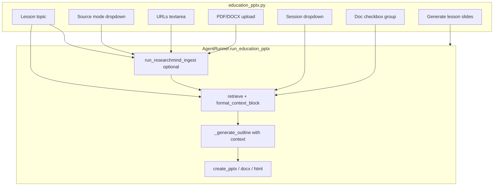

# Lesson Slides — Web Search + RAG Integration

## Goal

Extend the **Lesson slides** tab so teachers can ground slide outlines on external sources, with a **Source mode** dropdown:

| Mode | Behavior |
|------|----------|
| **None** | Current flow — local model only (no ingest/retrieve) |
| **Web search** | Auto-discover URLs for the lesson topic, ingest, retrieve relevant chunks, then draft outline |
| **RAG** | Use **existing ResearchMind session** and/or **URLs/files entered on this tab** — ingest if needed, retrieve, then draft outline |

All modes still produce the same outputs (preview, `.pptx`, `.docx`, `.html`, trace).

## Architecture



Reuse existing ResearchMind primitives — no new search/RAG library code required:

- [`run_researchmind_ingest`](libs/agent/src/agent/runner.py) — web auto-search + URL/file ingest
- [`retrieve`](libs/researchmind/src/researchmind/retrieve.py) + [`format_context_block`](libs/researchmind/src/researchmind/citations.py) — context for LLM
- [`research_helpers.py`](apps/gradio-space/src/gradio_space/research_helpers.py) — session/doc dropdown helpers

## 1. UI changes — [`education_pptx.py`](apps/gradio-space/src/gradio_space/tabs/education_pptx.py)

Add a **Research sources** block between the topic row and **Generate lesson slides**:

```python
SOURCE_MODES = [
    ("None (model only)", "none"),
    ("Web search", "web"),
    ("RAG (indexed sources)", "rag"),
]
```

**Controls:**

- `source_mode` — `gr.Dropdown` (default: `none`)
- `urls_text` — `gr.Textbox` (one URL per line); visible when mode is `web` or `rag`
- `upload_files` — `gr.File` (`.pdf`, `.docx`, multiple); visible when mode is `web` or `rag`
- `session_dd` — `gr.Dropdown` from `list_session_choices()`; visible when mode is `rag`
- `doc_dd` — `gr.CheckboxGroup` from `refresh_doc_choices()`; visible when mode is `rag`
- `source_status` — `gr.Markdown` — ingest/retrieve summary shown before outline (e.g. "Ingested 3 sources; retrieved 6 passages")

**Visibility:** use `source_mode.change(...)` to show/hide URL/file/session/doc fields (None hides all source inputs).

**Generate handler** — extend `generate_lesson_slides()` signature and pass new inputs to the runner; prepend `source_status` to outline markdown or show in a small status line above previews.

**Allowed paths:** extend `gradio_allowed_paths()` to include ResearchMind data dir (mirror [`research_mind.py`](apps/gradio-space/src/gradio_space/tabs/research_mind.py) `researchmind_allowed_paths()`), merged in [`app.py`](apps/gradio-space/src/gradio_space/app.py) if not already.

## 2. Agent model — [`models.py`](libs/agent/src/agent/models.py)

Extend `EducationPptxInput`:

```python
class EducationPptxInput(BaseModel):
    topic: str
    grade: str
    slide_count: int = Field(ge=3, le=8)
    source_mode: Literal["none", "web", "rag"] = "none"
    urls: list[str] = Field(default_factory=list)
    files: list[Path] = Field(default_factory=list)  # or str paths
    session_id: str | None = None
    doc_ids: list[str] = Field(default_factory=list)
```

Optional: add `source_context: str | None` and `source_summary: str` on `AgentResult` for trace/UI.

## 3. Runner orchestration — [`runner.py`](libs/agent/src/agent/runner.py)

Extend `run_education_pptx()`:

**Phase A — Gather sources (when `source_mode != "none"`):**

- **`web`:** call `run_researchmind_ingest(topic=topic, urls=parsed_urls, files=files, auto_search=True, session_id=session_id or None, ...)`. Creates/uses a lesson session keyed to topic.
- **`rag`:** if URLs/files provided, call `run_researchmind_ingest(..., auto_search=False)`. Resolve `session_id` via `_ensure_session()` when empty. If no URLs/files and no session with docs, return a clear user error before LLM call.

**Phase B — Retrieve context:**

```python
from researchmind.retrieve import retrieve
from researchmind.citations import format_context_block

chunks = retrieve(
    req.topic,
    store,
    session_id=session_id if not doc_ids else None,
    doc_ids=doc_ids or None,
)
context, citations = format_context_block(chunks)
```

Log retrieve + citation count in `TraceRecorder` (mirror research chat notes).

**Phase C — Outline with context:**

Pass `context` into `_generate_outline()` when non-empty.

**Graceful fallback:** if web search finds nothing or retrieve returns 0 chunks, log a trace note and continue with model-only outline (plus UI warning in `source_status`) — avoids hard failure on sparse topics.

## 4. Prompt changes — [`prompts.py`](libs/agent/src/agent/prompts.py)

Add optional context block to user prompt:

```python
def education_outline_user(req: EducationPptxInput, *, source_context: str = "") -> str:
    base = f"Topic: {req.topic}\nGrade level: {req.grade}\n..."
    if source_context.strip():
        base += (
            "\n\nUse the following retrieved source excerpts as factual grounding. "
            "Prefer these over general knowledge when they apply. "
            "Do not invent citations in the JSON output.\n\n"
            f"{source_context}\n"
        )
    return base + "\nReturn JSON only."
```

Update `education_outline_system()` rules: bullets must be age-appropriate and consistent with provided sources when context is present.

## 5. Helper extraction (minimal)

To avoid duplicating ResearchMind tab logic, add thin helpers in [`research_helpers.py`](apps/gradio-space/src/gradio_space/research_helpers.py):

- `parse_urls_text(text: str) -> list[str]`
- `gather_lesson_sources(topic, mode, urls_text, files, session_id, doc_ids) -> tuple[str, str | None, list[str]]` — returns `(status_md, session_id, doc_ids)`; wraps ingest for web/rag modes

Or keep ingest inside `run_education_pptx` and only use helpers for Gradio session/doc refresh (already exist).

## 6. Tests

Add [`libs/agent/tests/test_education_sources.py`](libs/agent/tests/test_education_sources.py):

- Mock `search_urls` / `retrieve` / ingest pipeline
- Assert `web` mode calls ingest with `auto_search=True`
- Assert `rag` mode uses provided session + doc_ids without auto-search
- Assert `none` mode skips ingest/retrieve
- Assert context appears in outline user prompt when chunks exist

Follow patterns in [`test_research_runner.py`](libs/agent/tests/test_research_runner.py).

## 7. Docs

Update [`USAGE.md`](USAGE.md) Lesson slides section: describe the three source modes, that Web search needs network on first generate, and RAG can combine ResearchMind sessions with pasted URLs/uploads.

## Key files to change

| File | Change |
|------|--------|
| [`education_pptx.py`](apps/gradio-space/src/gradio_space/tabs/education_pptx.py) | UI + handler wiring |
| [`runner.py`](libs/agent/src/agent/runner.py) | Ingest → retrieve → grounded outline |
| [`models.py`](libs/agent/src/agent/models.py) | `EducationPptxInput` source fields |
| [`prompts.py`](libs/agent/src/agent/prompts.py) | Context-aware user prompt |
| [`research_helpers.py`](apps/gradio-space/src/gradio_space/research_helpers.py) | Optional small parse/helper |
| [`app.py`](apps/gradio-space/src/gradio_space/app.py) | Merge ResearchMind allowed paths if needed |
| [`USAGE.md`](USAGE.md) | User-facing docs |

## UX summary (matches your screenshot)

```
[Lesson topic] [Grade] [Content slides]
[Source mode ▼]  None | Web search | RAG
  (when web/rag) [URLs textarea]
  (when web/rag) [Upload PDF/DOCX]
  (when rag)     [Session ▼] [Documents ☑]
[Generate lesson slides]
Source status: "Ingested 2 URLs; 4 passages used for outline"
[Slide preview | Outline] ...
```

No separate Discover button — **Generate** runs the full pipeline in one click for a simpler teacher workflow.
