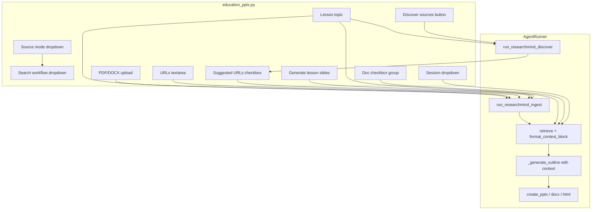

# Lesson Slides — Web Search + RAG Integration

## Goal

Extend the **Lesson slides** tab so teachers can ground slide outlines on external sources.

### Source mode dropdown

| Mode | Behavior |
|------|----------|
| **None** | Current flow — local model only (no ingest/retrieve) |
| **Web search** | Discover and ingest web sources for the lesson topic, then retrieve chunks and draft outline |
| **RAG** | Use **existing ResearchMind session** and/or **URLs/files entered on this tab** — ingest if needed, retrieve, then draft outline |

### Search workflow dropdown (Web search only)

Mirrors ResearchMind [`INGEST_MODES`](apps/gradio-space/src/gradio_space/tabs/research_mind.py):

| Workflow | Label in UI | Behavior |
|----------|-------------|----------|
| **Two-step** | `Two-step search (suggest & confirm)` | **Step 1:** **Discover sources** runs `run_researchmind_discover` → verified URLs in checkbox list. **Step 2:** User selects URLs → **Generate lesson slides** ingests selection, retrieves, builds outline. |
| **Auto search** | `Auto search & ingest` | **Generate lesson slides** alone runs `run_researchmind_ingest(auto_search=True)` → retrieve → outline in one click. |

All modes still produce the same outputs (preview, `.pptx`, `.docx`, `.html`, trace).

## Architecture



Reuse existing ResearchMind primitives — no new search/RAG library code required:

- [`run_researchmind_discover`](libs/agent/src/agent/runner.py) — web search → verified URL list (two-step step 1)
- [`run_researchmind_ingest`](libs/agent/src/agent/runner.py) — ingest URLs/files; `auto_search=True` for auto workflow
- [`retrieve`](libs/researchmind/src/researchmind/retrieve.py) + [`format_context_block`](libs/researchmind/src/researchmind/citations.py) — context for LLM
- [`research_helpers.py`](apps/gradio-space/src/gradio_space/research_helpers.py) — session/doc dropdown helpers

## 1. UI changes — [`education_pptx.py`](apps/gradio-space/src/gradio_space/tabs/education_pptx.py)

Add a **Research sources** block between the topic row and **Generate lesson slides**:

```python
SOURCE_MODES = [
    ("None (model only)", "none"),
    ("Web search", "web"),
    ("RAG (indexed sources)", "rag"),
]

SEARCH_WORKFLOWS = [
    ("Two-step search (suggest & confirm)", "two_step"),
    ("Auto search & ingest", "auto"),
]
```

**Controls:**

| Control | When visible | Purpose |
|---------|--------------|---------|
| `source_mode` | always | None / Web search / RAG |
| `search_workflow` | `source_mode == web` | Two-step vs Auto search |
| `discover_btn` | `source_mode == web` and `search_workflow == two_step` | Runs discover only |
| `url_choices` | `source_mode == web` and `search_workflow == two_step` | CheckboxGroup of suggested URLs |
| `urls_text` | `source_mode` is `web` or `rag` | Manual URLs (merged with selected checkboxes on generate) |
| `upload_files` | `source_mode` is `web` or `rag` | PDF/DOCX upload |
| `session_dd` | `source_mode == rag` | Existing ResearchMind session |
| `doc_dd` | `source_mode == rag` | Limit retrieve to specific docs |
| `source_status` | always (below generate) | Discover / ingest / retrieve summary |

**Visibility rules** (`source_mode.change` + `search_workflow.change`):

- **None:** hide all source controls except `source_status`
- **Web + Two-step:** show `search_workflow`, `discover_btn`, `url_choices`, `urls_text`, `upload_files`; hide session/doc
- **Web + Auto:** show `search_workflow`, `urls_text`, `upload_files`; hide `discover_btn`, `url_choices`, session/doc
- **RAG:** show `urls_text`, `upload_files`, `session_dd`, `doc_dd`; hide `search_workflow`, discover, url_choices

**Handlers:**

1. **`discover_lesson_sources(topic, session_id)`** — mirrors ResearchMind `discover_sources` with `ingest_mode="suggest"`:
   - `run_researchmind_discover(topic, auto_search=False, ...)`
   - Updates `url_choices`, `source_status`, `session_dd` (lesson session id)
2. **`generate_lesson_slides(...)`** — extended signature; behavior by mode:
   - **none:** current path
   - **web + two_step:** ingest merged URLs (selected checkboxes + pasted lines + files), `auto_search=False`; error if nothing selected and no files
   - **web + auto:** ingest with `auto_search=True` (+ optional pasted URLs/files)
   - **rag:** ingest pasted URLs/files if any; use session + doc scope; error if no indexed docs after ingest

**Allowed paths:** extend `gradio_allowed_paths()` to include ResearchMind data dir (mirror [`research_mind.py`](apps/gradio-space/src/gradio_space/tabs/research_mind.py)), merged in [`app.py`](apps/gradio-space/src/gradio_space/app.py) if not already.

## 2. Agent model — [`models.py`](libs/agent/src/agent/models.py)

Extend `EducationPptxInput`:

```python
class EducationPptxInput(BaseModel):
    topic: str
    grade: str
    slide_count: int = Field(ge=3, le=8)
    source_mode: Literal["none", "web", "rag"] = "none"
    search_workflow: Literal["two_step", "auto"] = "two_step"  # only used when source_mode == "web"
    urls: list[str] = Field(default_factory=list)
    files: list[Path] = Field(default_factory=list)
    session_id: str | None = None
    doc_ids: list[str] = Field(default_factory=list)
```

Add `source_summary: str` on `AgentResult` for UI status line.

## 3. Runner orchestration — [`runner.py`](libs/agent/src/agent/runner.py)

Extend `run_education_pptx()`:

**Phase A — Gather sources (when `source_mode != "none"`):**

- **`web` + `auto`:** `run_researchmind_ingest(topic, urls, files, auto_search=True, session_id=...)`
- **`web` + `two_step`:** `run_researchmind_ingest(topic, urls, files, auto_search=False, ...)` — caller must pass URLs from discover selection + manual paste; runner does not auto-discover on generate
- **`rag`:** if URLs/files provided → `run_researchmind_ingest(..., auto_search=False)`. Resolve `session_id` via `_ensure_session()`. Validate session has docs (or ingest succeeded) before retrieve

Optional: add `discover_lesson_urls()` thin wrapper on runner that only calls `run_researchmind_discover` (used by Discover button, not by generate in two-step mode).

**Phase B — Retrieve context:**

```python
chunks = retrieve(req.topic, store, session_id=..., doc_ids=...)
context, citations = format_context_block(chunks)
```

Log retrieve + citation count in `TraceRecorder`.

**Phase C — Outline with context:**

Pass `context` into `_generate_outline()` when non-empty.

**Graceful fallback:** if discover/ingest finds nothing or retrieve returns 0 chunks, log trace note and continue with model-only outline plus UI warning in `source_status`.

## 4. Prompt changes — [`prompts.py`](libs/agent/src/agent/prompts.py)

Add optional context block to user prompt:

```python
def education_outline_user(req: EducationPptxInput, *, source_context: str = "") -> str:
    ...
    if source_context.strip():
        base += (
            "\n\nUse the following retrieved source excerpts as factual grounding. "
            "Prefer these over general knowledge when they apply. "
            "Do not invent citations in the JSON output.\n\n"
            f"{source_context}\n"
        )
    return base + "\nReturn JSON only."
```

Update `education_outline_system()` rules for age-appropriate bullets consistent with sources when context is present.

## 5. Helper extraction (minimal)

Add thin helpers in [`research_helpers.py`](apps/gradio-space/src/gradio_space/research_helpers.py):

- `parse_urls_text(text: str) -> list[str]`
- `merge_lesson_urls(pasted: str, selected: list[str]) -> list[str]` — dedupe like ResearchMind `ingest_selected`

Reuse existing `list_session_choices`, `refresh_doc_choices`, `format_ingest_status`, `memory_summary`.

## 6. Tests

Add [`libs/agent/tests/test_education_sources.py`](libs/agent/tests/test_education_sources.py):

- `none` — skips ingest/retrieve
- `web` + `auto` — ingest with `auto_search=True`
- `web` + `two_step` — ingest with `auto_search=False`, URLs from caller only
- `rag` — session + doc_ids, no auto-search
- Context injected into outline prompt when chunks exist
- Two-step generate with empty URL selection returns clear error (no silent auto-search)

Follow patterns in [`test_research_runner.py`](libs/agent/tests/test_research_runner.py).

## 7. Docs

Update [`USAGE.md`](USAGE.md) Lesson slides section:

- Three source modes
- **Web search:** Two-step (Discover → select → Generate) vs Auto (Generate only)
- Network required for discover/auto web search
- RAG combines ResearchMind sessions with pasted URLs/uploads

## Key files to change

| File | Change |
|------|--------|
| [`education_pptx.py`](apps/gradio-space/src/gradio_space/tabs/education_pptx.py) | Source mode + search workflow UI, Discover handler, generate wiring |
| [`runner.py`](libs/agent/src/agent/runner.py) | Branch on `search_workflow`; ingest → retrieve → grounded outline |
| [`models.py`](libs/agent/src/agent/models.py) | `search_workflow` + source fields on `EducationPptxInput` |
| [`prompts.py`](libs/agent/src/agent/prompts.py) | Context-aware user prompt |
| [`research_helpers.py`](apps/gradio-space/src/gradio_space/research_helpers.py) | URL parse/merge helpers |
| [`app.py`](apps/gradio-space/src/gradio_space/app.py) | Merge ResearchMind allowed paths if needed |
| [`USAGE.md`](USAGE.md) | User-facing docs |

## UX summary

```
[Lesson topic] [Grade] [Content slides]

[Source mode ▼]  None | Web search | RAG

  (when Web search)
  [Search workflow ▼]  Two-step search | Auto search & ingest

  (when Web + Two-step)
  [Discover sources]  → populates checkbox list
  [☑ Suggested URLs]

  (when Web or RAG)
  [URLs textarea]
  [Upload PDF/DOCX]

  (when RAG)
  [Session ▼] [Documents ☑]

[Generate lesson slides]
Source status: "Found 5 URLs" / "Ingested 2 sources; 4 passages used"
[Slide preview | Outline] ...
```

**Two-step** gives teachers control over which sources feed the lesson (same UX as ResearchMind Suggest mode). **Auto search** optimizes for speed when confirmation is not needed.
