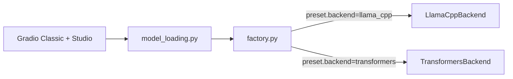
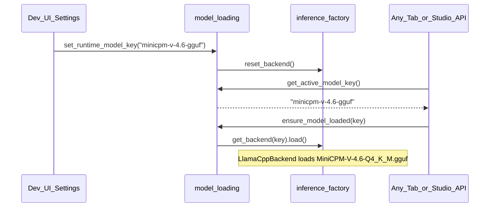

# Llama backend + runtime model switching (local dev)

## What already exists

Your repo already has **two inference backends** behind one factory — no new backend code is required for **text** inference:



- Presets live in [`models.yaml`](models.yaml); backend is chosen **per preset**, not via a separate toggle.
- Switching transformers → llama.cpp means switching preset, e.g. `minicpm-v-4.6` → `minicpm-v-4.6-gguf` (to be added).
- [`libs/inference/src/inference/llama_cpp.py`](libs/inference/src/inference/llama_cpp.py) downloads GGUF from Hub and runs `create_chat_completion`.
- [`ALLOW_MODEL_SWITCH`](libs/inference/src/inference/config.py) gates dropdowns in Settings, Chat, and Studio debug — but **only Chat/Debug actually pass the selected key to inference**.

### Current gap (why switching feels broken)

[`get_active_model_key()`](apps/gradio-space/src/gradio_space/model_loading.py) always returns the **startup** preset from env/`models.yaml`:

```12:13:apps/gradio-space/src/gradio_space/model_loading.py
def get_active_model_key() -> str:
    return _app_config.active_model
```

Lesson slides, ResearchMind, EchoCoach, TeacherVoice, and Studio Research/Slides all call `get_active_model_key()` — so changing the Settings dropdown only updates the status panel, not the model used by those tabs.

---

## Step 1 — Add MiniCPM-V-4.6 GGUF preset (OpenBMB + llama.cpp)

Official GGUF is published at [`openbmb/MiniCPM-V-4.6-gguf`](https://huggingface.co/openbmb/MiniCPM-V-4.6-gguf). This is the **quantized llama.cpp build** of the same ~0.8B multimodal model already registered as `minicpm-v-4.6` (transformers). Recommended quant for local dev: **Q4_K_M** (~529 MB).

Add to [`models.yaml`](models.yaml):

```yaml
  minicpm-v-4.6-gguf:
    label: MiniCPM-V 4.6 (GGUF / llama.cpp)
    backend: llama_cpp
    model_repo: openbmb/MiniCPM-V-4.6-gguf
    model_file: MiniCPM-V-4.6-Q4_K_M.gguf
    multimodal: true
    n_ctx: 8192
    n_gpu_layers: 0
```

Pair with the existing transformers preset for A/B comparison:

| Preset key | Backend | Hub source | Use case |
|------------|---------|------------|----------|
| `minicpm-v-4.6` | transformers | `openbmb/MiniCPM-V-4.6` | Full multimodal (image/video) via HF processor |
| `minicpm-v-4.6-gguf` | llama_cpp | `openbmb/MiniCPM-V-4.6-gguf` | Llama Champion / Off-the-Grid; text chat + future image via llama.cpp |

Also update [`.env.example`](.env.example) with a commented dev block:

```bash
ALLOW_MODEL_SWITCH=true
ACTIVE_MODEL=minicpm-v-4.6          # transformers default (or minicpm5-1b)
# switch in UI to minicpm-v-4.6-gguf for llama.cpp
```

Prefetch locally (optional, speeds first load):

```bash
uv run python scripts/download_model.py --preset minicpm-v-4.6-gguf
```

Per the [model card](https://huggingface.co/openbmb/MiniCPM-V-4.6-gguf), llama.cpp loads it directly — no custom fork:

```bash
llama-cli -hf openbmb/MiniCPM-V-4.6-gguf:Q4_K_M
```

This satisfies the **Llama Champion** badge (llama.cpp runtime) while keeping the **OpenBMB / Tiny Titan** story (same MiniCPM-V 4.6 model family). LoRA/merged lesson presets on MiniCPM5-1B remain **transformers-only**.

### Multimodal caveat (text vs image)

- **Text-only tabs** (Lesson slides, ResearchMind, Chat, EchoCoach) work immediately — `LlamaCppBackend.chat()` passes string messages to `create_chat_completion`.
- **Image input via llama.cpp** requires OpenAI-style message content arrays (`type: image_url`). Current `LlamaCppBackend.chat()` types messages as `list[dict[str, str]]` and does not forward images. Defer image support to a follow-up unless a tab needs it now; keep `minicpm-v-4.6` (transformers) for full VLM demos.

---

## Step 2 — Shared runtime model state

Extend [`model_loading.py`](apps/gradio-space/src/gradio_space/model_loading.py):

| Function | Behavior |
|----------|----------|
| `set_runtime_model_key(key: str) -> str` | Validate key exists; if changed, call `reset_backend()` and clear load cache for old key; return label for UI |
| `get_active_model_key()` | Return `_runtime_model_key` if set, else `_app_config.active_model` |
| `reload_model(key)` | Also call `set_runtime_model_key(key)` so reload pins the selection app-wide |

This is a small, centralized change — every tab that already calls `get_active_model_key()` will automatically respect the runtime selection once Settings updates it.

---

## Step 3 — Classic Gradio UI wiring

### Settings panel ([`settings_panel.py`](apps/gradio-space/src/gradio_space/ui/settings_panel.py))

On dropdown `.change`:
1. Call `set_runtime_model_key(selected_key)`
2. Update status markdown (existing `model_status`)
3. Optionally auto-reload weights (or keep explicit "Reload model" button — recommend **reload on change** for dev UX)

Return `model_dropdown` from `build_settings_panel()` (already does) and expose it to [`app.py`](apps/gradio-space/src/gradio_space/app.py) if needed for cross-tab sync.

### Chat tab ([`tabs/chat.py`](apps/gradio-space/src/gradio_space/tabs/chat.py))

When `allow_model_switch` is on:
- On Chat model dropdown change → `set_runtime_model_key(mkey)` so Chat and Settings stay in sync
- Default dropdown value = `get_active_model_key()` (runtime-aware)

### App header badge (small UX win)

When `allow_model_switch` is false, keep current read-only badge. When true, show active preset + backend in Settings accordion header so devs always know which backend is live.

---

## Step 4 — Studio UI wiring

In [`api/studio.py`](apps/gradio-space/src/gradio_space/api/studio.py):

- Add `api_set_active_model(model_key: str)` → calls `set_runtime_model_key`, returns updated `model_status`
- Register as `@server.api(name="set_active_model")`
- `api_model_choices()` should report `active_model=get_active_model_key()` (runtime-aware)
- `api_reload_model()` already accepts `model_key`; ensure it calls `set_runtime_model_key` too

In [`static/studio/studio.js`](apps/gradio-space/static/studio/studio.js) `initSettings()`:
- On `#settings-model-key` change → `callApi("set_active_model", [key])` then refresh status
- Keep debug chat dropdown in sync with settings dropdown

Studio Research + Slides already delegate to helpers that use `get_active_model_key()` — no per-endpoint `model_key` param needed once runtime state exists.

---

## Step 5 — Dev workflow (how you use it)

```bash
# .env
ALLOW_MODEL_SWITCH=true
ACTIVE_MODEL=minicpm-v-4.6
```

```bash
uv sync --all-packages
uv run --package gradio-space python -m gradio_space.server
```

| Goal | Action |
|------|--------|
| Transformers MiniCPM-V 4.6 (full VLM) | Select `minicpm-v-4.6` in Settings (or leave startup default) |
| llama.cpp MiniCPM-V 4.6 (Llama track) | Select `minicpm-v-4.6-gguf` — backend switches automatically |
| Text-only MiniCPM5 | Select `minicpm5-1b` |
| Fine-tuned lesson LoRA | Select `minicpm5-1b-lesson-lora` (transformers only) |
| Compare Qwen GGUF baseline | Select `qwen3b-gguf` |

**There is no separate "backend" dropdown** — backend follows the preset. Dropdown labels already include backend hints; optionally prefix choices with `[llama.cpp]` / `[transformers]` in `model_choices()` for clarity.

### Compatibility notes to surface in Settings status

- `minicpm-v-4.6-gguf` is text-ready on all tabs; image/video input needs transformers `minicpm-v-4.6` until llama.cpp multimodal messages are wired
- LoRA/merged local presets require transformers
- First llama.cpp load downloads ~529 MB GGUF from Hub (subsequent loads use cache)

---

## Step 6 — Tests and docs

- Extend [`libs/inference/tests/test_config.py`](libs/inference/tests/test_config.py) to assert `minicpm-v-4.6-gguf` parses with `backend=llama_cpp` and `multimodal=true`
- Add a small unit test for `set_runtime_model_key` / `get_active_model_key` override in gradio-space tests (or inference tests if kept in `model_loading.py`)
- Add a short "Switching models locally" subsection to [`USAGE.md`](USAGE.md) and [`apps/gradio-space/README.md`](apps/gradio-space/README.md)
- Update [`TODO.md`](TODO.md) Llama Champion checklist to reference `minicpm-v-4.6-gguf` instead of generic MiniCPM5 GGUF

---

## Architecture after changes



---

## Out of scope (per your choices)

- Pinning HF Space to Llama GGUF for judges (deployment config only — set `ACTIVE_MODEL=minicpm-v-4.6-gguf` in Space secrets; keep `ALLOW_MODEL_SWITCH=false`)
- llama.cpp multimodal image message plumbing in `LlamaCppBackend` (defer; transformers preset covers VLM demos)
- Converting fine-tuned LoRA weights to GGUF
- Separate backend-only toggle (preset-based switching is simpler and already matches factory design)
