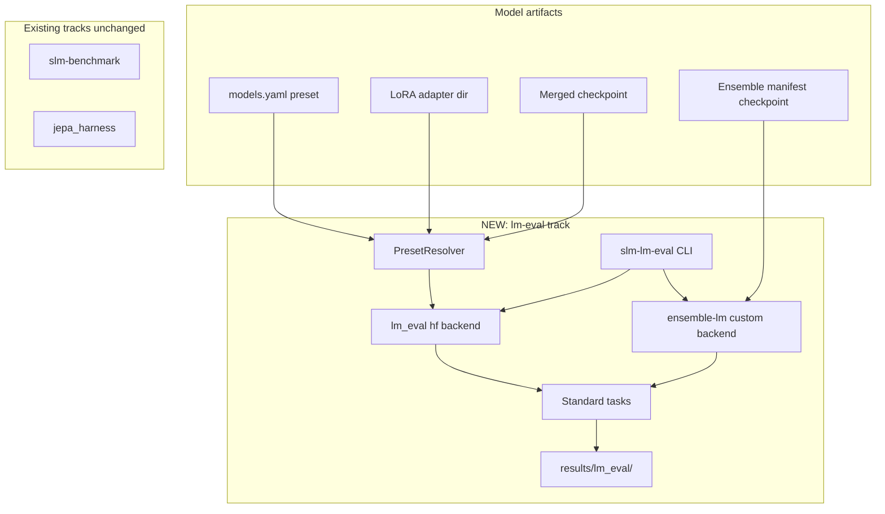

# lm-evaluation-harness Integration for research/ Models

## Context: what you already have

Your repo runs **three eval tracks** today; none use standard academic benchmarks (GSM8K, ARC, HellaSwag):

| Track | Tool | Best for |
|-------|------|----------|
| Agentic | [`slm-benchmark`](research/evals/src/slm_evals/run_benchmark.py) | BFCL, τ-bench, GAIA, SWE |
| Finetune training | [`finetune.py`](research/finetune.py) | eval_loss / perplexity only |
| Ensemble components | [`jepa_harness`](research/ensemble/src/ensemble/eval/jepa_harness.py) | RAG/router/JEPA ablation on custom QA |

The existing [Model Verification Pipeline plan](.cursor/plans/model_verification_pipeline_ed9d35ab.plan.md) defers lm-eval; per your choice, **lm-eval comes first**. `slm-compare` / `education_qa` stay Phase 2.



---

## Benchmark matrix (what to run for each claim)

Match tasks to model size (~1B) and claim type:

| Model | lm-eval tasks (primary) | Existing complement |
|-------|-------------------------|---------------------|
| **Base preset** (`minicpm5-1b`, `gemma4-e2b-mobile`) | `arc_easy`, `arc_challenge`, `hellaswag`, `piqa`, `boolq`, `gsm8k` | `slm-benchmark --benchmarks bfcl,tau_bench` |
| **Finetuned LoRA** (`minicpm5-1b-lesson-lora`) | Same tasks; `pretrained=base,peft=adapter` | Same agentic suite |
| **Merged finetune** (`minicpm5-1b-lesson-merged`, `gemma-merged-local`) | Same tasks; `pretrained=merged_path` | Same |
| **Ensemble checkpoint** | Same generative + MC tasks via custom backend | `jepa_harness` for component ablation; `slm-benchmark --model-type ensemble` for agentic E2E |

**Smoke profile** (CPU/GPU quick check, ~5–15 min): `--tasks arc_easy,hellaswag --num_fewshot 0 --limit 50`

**Full profile** (reportable): `--tasks arc_easy,arc_challenge,hellaswag,piqa,boolq,gsm8k --num_fewshot 5` (gsm8k uses 8-shot per harness default)

**Fair comparison rules** (from your guide, enforced in YAML):
- Identical `tasks`, `num_fewshot`, `limit`, `seed`, `batch_size`
- Same base tokenizer (preset resolution guarantees this for LoRA)
- `temperature=0` / greedy decoding (lm-eval default for MC; gsm8k generative)
- Never compare `training_results.json` `result_score` to lm-eval accuracy

---

## Phase 1 — Dependencies and install surface

**Root [`pyproject.toml`](pyproject.toml)** — add optional group:

```toml
lm-eval = [
    "lm-eval[hf]>=0.4.9",
]
```

Install: `uv sync --group evals --group lm-eval --group finetune`

Keep lm-eval **optional** so agentic-only workflows stay lightweight.

---

## Phase 2 — Preset → lm-eval model_args resolver

New module: `research/evals/src/slm_evals/lm_eval/preset_resolver.py`

Reuse [`inference.config.get_model_config`](libs/inference/src/inference/config.py) (same as [`finetune.py`](research/finetune.py)):

| Preset shape | lm-eval invocation |
|--------------|-------------------|
| `model_id` only (base) | `pretrained={model_id},trust_remote_code=True` |
| `model_id` + `adapter_path` (LoRA) | `pretrained={model_id},peft={adapter_path},trust_remote_code=True` |
| Local merged dir | `pretrained={model_id},trust_remote_code=True` |
| Ensemble (`jepa-ensemble-lesson` or path with `manifest.json`) | `--model ensemble-lm` (custom backend) |

Reject multimodal / llama_cpp presets with a clear error (same rule as finetune).

---

## Phase 3 — CLI wrapper `slm-lm-eval`

New entry: `research/evals/src/slm_evals/run_lm_eval.py`  
Register in [`research/evals/pyproject.toml`](research/evals/pyproject.toml):

```toml
[project.scripts]
slm-lm-eval = "slm_evals.run_lm_eval:main"
```

**Flags:**

```bash
uv run --package slm-evals slm-lm-eval \
  --config research/evals/configs/lm_eval_minicpm5.yaml \
  --preset minicpm5-1b \
  --experiment-name minicpm5-1b__lm-eval-baseline
```

| Flag | Purpose |
|------|---------|
| `--preset` | Resolve from [`models.yaml`](models.yaml) |
| `--model` | Override path/Hub id (merged dir or ensemble ckpt) |
| `--adapter` | Override LoRA path (alternative to preset) |
| `--config` | YAML: tasks, num_fewshot, limit, seed, device, batch_size |
| `--tasks` | CLI override of task list |
| `--compare-to` | Path to prior `results.json` → print delta table (lightweight pre-`slm-compare`) |
| `--experiment-name` / `--output-dir` | Write under `results/lm_eval/{name}/` |

Implementation: subprocess or programmatic call to `lm_eval.simple_evaluate()` (preferred over shelling to `lm_eval` CLI — easier to inject custom model registration).

Output artifacts per run:
- `results.json` (lm-eval native)
- `summary.md` (human-readable table: task → acc/score)
- `run_meta.json` (preset, base_model, adapter_path, tasks, seed, git hash optional)

---

## Phase 4 — Ensemble custom backend

New file: `research/evals/src/slm_evals/lm_eval/ensemble_lm.py`

Register with lm-eval:

```python
@register_model("ensemble-lm")
class EnsembleLM(LM):
    ...
```

Load via existing [`load_ensemble_model`](research/evals/src/slm_evals/utils/model_loader.py) / `ensemble.checkpoint.load_checkpoint`.

| lm-eval method | Implementation |
|----------------|----------------|
| `generate_until` | `ens.generate_text(prompt, max_new_tokens=..., temperature=0)` — full JEPA+RAG+router stack |
| `loglikelihood` | Delegate to underlying `ens.llm` HF model (default adapter index 0) for MC tasks; document that this evaluates **base LLM head**, not selector — pair with `generate_until` scores for full-stack generative tasks |

This split is intentional: MC benchmarks need token logprobs; the ensemble’s value on generative QA shows up in `generate_until` (gsm8k) and in [`jepa_harness`](research/ensemble/src/ensemble/eval/jepa_harness.py).

Import side-effect: ensure `ensemble_lm` is imported before `simple_evaluate()` so registration runs.

---

## Phase 5 — Experiment configs

Add under `research/evals/configs/`:

**`lm_eval_minicpm5.yaml`** — baseline template:

```yaml
tasks:
  - arc_easy
  - arc_challenge
  - hellaswag
  - piqa
  - boolq
  - gsm8k
num_fewshot: 5        # gsm8k harness may override to 8 internally
limit: null           # null = full; 100 for dev
seed: 42
batch_size: auto
device: auto
dtype: bfloat16
trust_remote_code: true
```

**`lm_eval_smoke.yaml`** — `limit: 25`, tasks `[arc_easy, hellaswag]`

**`lm_eval_compare_study.yaml`** — documents baseline + candidate preset names and shared settings

---

## Phase 6 — End-to-end workflows (finetune + ensemble)

### Finetuned model verification

```bash
# 1. Baseline (same config, pinned seed)
uv run --package slm-evals slm-lm-eval \
  --config research/evals/configs/lm_eval_minicpm5.yaml \
  --preset minicpm5-1b \
  --experiment-name minicpm5-1b__baseline

# 2. Train
uv run python research/finetune.py --preset minicpm5-1b --mode lora --epochs 3

# 3. Candidate — LoRA via preset (no merge required)
uv run --package slm-evals slm-lm-eval \
  --config research/evals/configs/lm_eval_minicpm5.yaml \
  --preset minicpm5-1b-lesson-lora \
  --experiment-name minicpm5-1b-lora__v1 \
  --compare-to results/lm_eval/minicpm5-1b__baseline/results.json
```

For Gemma: use `gemma-lora-local` / `gemma-merged-local` presets after notebook or `finetune.py` training.

### Ensemble verification

```bash
# Component ablation (domain QA) — existing
uv run --package ensemble python -m ensemble.eval.jepa_harness \
  --llm openbmb/MiniCPM5-1B \
  --qa research/data/benchmark-qa.jsonl \
  --kb research/data/benchmark-kb.jsonl

# Academic benchmarks on saved ensemble
uv run --package slm-evals slm-lm-eval \
  --config research/evals/configs/lm_eval_minicpm5.yaml \
  --model ./models/ensemble/jepa-lesson-pretrain \
  --experiment-name ensemble-jepa__lm-eval
```

### Optional post-finetune hook (minimal, Phase 1.5)

Add to [`finetune.py`](research/finetune.py) only after CLI stabilizes:

- `--lm-eval-after` + `--lm-eval-config` → subprocess `slm-lm-eval` on output checkpoint
- Append `lm_eval_summary` path to `training_results.json`

Defer `--eval-baseline` auto-compare until Phase 2 `slm-compare` exists; use `--compare-to` on lm-eval outputs in the meantime.

---

## Phase 7 — Documentation

Update:
- [`research/evals/USAGE.md`](research/evals/USAGE.md) — lm-eval section, PEFT notes, task profiles
- [`research/USAGE.md`](research/USAGE.md) — unified “verify finetune / ensemble” checklist
- [`.env.example`](.env.example) — optional `LM_EVAL_TASKS`, `LM_EVAL_SEED` (low priority)

Include the verification checklist from your guide (seeds, fair comparison, no val-set leakage) mapped to concrete commands.

---

## File change summary

| File | Change |
|------|--------|
| [`pyproject.toml`](pyproject.toml) | `lm-eval` dependency group |
| [`research/evals/pyproject.toml`](research/evals/pyproject.toml) | Optional `lm-eval[hf]` extra; `slm-lm-eval` script |
| `research/evals/src/slm_evals/lm_eval/__init__.py` | Package init |
| `research/evals/src/slm_evals/lm_eval/preset_resolver.py` | Preset → model_args |
| `research/evals/src/slm_evals/lm_eval/ensemble_lm.py` | Custom `ensemble-lm` backend |
| `research/evals/src/slm_evals/run_lm_eval.py` | Main CLI |
| `research/evals/configs/lm_eval_*.yaml` | Baseline, smoke, compare templates |
| [`research/finetune.py`](research/finetune.py) | Optional `--lm-eval-after` (after CLI stable) |
| [`research/evals/USAGE.md`](research/evals/USAGE.md), [`research/USAGE.md`](research/USAGE.md) | Workflows |

---

## Testing plan

1. **Import smoke**: `uv run --package slm-evals python -c "import lm_eval; import slm_evals.lm_eval.ensemble_lm"`
2. **HF base**: `slm-lm-eval --config lm_eval_smoke.yaml --preset minicpm5-1b --limit 10`
3. **LoRA**: same with `--preset minicpm5-1b-lesson-lora` (or `--adapter ./models/finetuned/...`)
4. **Ensemble**: `slm-lm-eval --model ./models/ensemble/... --config lm_eval_smoke.yaml`
5. **Compare**: baseline + candidate runs produce `--compare-to` delta without task/seed mismatch warnings
6. **Regression**: existing `slm-benchmark` and `jepa_harness --toy` still pass unchanged

---

## Phase 2 (deferred — existing verification plan)

After lm-eval stabilizes, implement from [model_verification_pipeline plan](.cursor/plans/model_verification_pipeline_ed9d35ab.plan.md):

- `slm-compare` with paired bootstrap across **both** lm-eval and slm-benchmark JSON
- `education_qa` domain benchmark in slm-evals
- PEFT loading in `slm-benchmark` model_loader (reuse `preset_resolver`)
- Harness JSON export (`jepa_harness --output-dir`)

This gives you: **academic generalization** (lm-eval) + **agentic capability** (slm-evals) + **ensemble component proof** (jepa harness) with shared statistical comparison.

---

## Expected limitations (document, don’t hide)

- **1B models** will score low on gsm8k/mmlu — use for **relative** baseline vs finetune deltas, not SOTA claims
- **Ensemble loglikelihood** uses underlying LLM, not full selector stack — report both modes in docs
- **MiniCPM / Gemma** need `trust_remote_code=True`
- **First lm-eval run** downloads datasets; pin `HF_HOME` / cache for reproducibility
- **Multi-seed training** (3–5 seeds) is manual until Phase 2 compare aggregates runs
