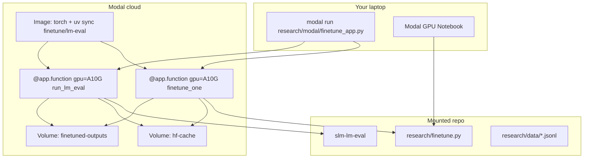

# Modal Finetuning + Benchmark Plan

## Goal

Run GPU fine-tuning and academic benchmarks **without local CUDA**, reusing your existing scripts:

- Training: [`research/finetune.py`](research/finetune.py) (LoRA/QLoRA on `openbmb/MiniCPM5-1B`)
- Benchmarks: `slm-lm-eval` via [`research/evals/`](research/evals/) (ARC, HellaSwag, GSM8K, …)
- Datasets: lesson chat (default), plus Hub sets already documented in finetune docstring

Deliverables for hackathon tracks:

| Track | What judges see |
|-------|-----------------|
| **Modal** | `modal run` job + Modal Volume/Notebook link in README |
| **Well-Tuned / Finetuning** | Before/after `lm-eval` on base vs LoRA adapter, weights in `models/finetuned/` or HF Hub |

## Current state (no Modal yet)

- [`research/finetune.py`](research/finetune.py) is self-contained CLI: resolves `minicpm5-1b` from [`models.yaml`](models.yaml), supports `--dataset`, `--format`, `--mode`, and optional `--lm-eval-after`.
- Eval harness lives in workspace package `slm-evals`; smoke config at [`research/evals/configs/lm_eval_smoke.yaml`](research/evals/configs/lm_eval_smoke.yaml).
- [`research/notebook/gemma-finetune.ipynb`](research/notebook/gemma-finetune.ipynb) has early OpenBMB load cells but no training loop — good skeleton for a Modal Notebook.
- Root [`pyproject.toml`](pyproject.toml) already defines `finetune` and `lm-eval` dependency groups (torch, peft, bitsandbytes, lm-eval).



## Architecture

### 1. New Modal module: `research/modal/`

Create a small Modal package (2–3 files, no refactor of `finetune.py`):

| File | Role |
|------|------|
| `research/modal/finetune_app.py` | Main `modal.App`, image, volumes, `@app.function` workers |
| `research/modal/experiments.yaml` | Dataset sweep matrix (name, hub id, format, max_samples) |
| `research/modal/README.md` | Setup (`modal setup`), secrets, run commands |

**Image** (per [Modal CUDA guide](https://modal.com/docs/guide/cuda)):

```python
image = (
    modal.Image.debian_slim(python_version="3.12")
    .apt_install("git")
    .pip_install("uv")
    .add_local_file("pyproject.toml", "/repo/pyproject.toml", copy=True)
    .add_local_file("uv.lock", "/repo/uv.lock", copy=True)
    # ... copy workspace members needed for finetune + slm-evals
    .run_commands(
        "cd /repo && uv sync --frozen --group finetune --group lm-eval --package slm-evals"
    )
    .add_local_dir("research", remote_path="/repo/research")
    .add_local_dir("libs/inference", remote_path="/repo/libs/inference")
    .add_local_file("models.yaml", "/repo/models.yaml")
)
```

Use `pip_install("torch")` on the image **or** let `uv sync` pull torch — either works on Modal since [driver API is pre-installed](https://modal.com/docs/guide/cuda).

**Volumes** (persist across runs):

- `hf-cache` → mount at `/root/.cache/huggingface` (model + dataset cache)
- `slm-finetune` → mount at `/vol/finetuned` (adapters, `training_results.json`, lm-eval `results/`)

**Secrets**: `modal.Secret.from_name("huggingface")` with `HF_TOKEN` for gated models and faster Hub downloads.

**GPU**: `gpu="A10G"` default (24 GB is plenty for MiniCPM5-1B LoRA at `max_len=1024`). Use `gpu="T4"` for QLoRA smoke tests; bump to `A100` only if you scale `batch_size` or `max_len`.

### 2. Training worker — wrap existing CLI

Do **not** rewrite training logic. Each Modal function shells into your script:

```python
@app.function(gpu="A10G", volumes={...}, secrets=[...], timeout=7200)
def finetune_one(job: dict) -> dict:
    out = f"/vol/finetuned/{job['name']}"
    cmd = [
        "uv", "run", "python", "research/finetune.py",
        "--preset", "minicpm5-1b",
        "--mode", job.get("mode", "lora"),
        "--dataset", job["dataset"],
        "--format", job["format"],
        "--out", out,
        "--trust_remote_code",  # implicit via preset; set TRUST_REMOTE_CODE=1 in env
        *optional_flags(job),
    ]
    subprocess.run(cmd, cwd="/repo", check=True, env={**os.environ, "HF_HOME": "/root/.cache/huggingface"})
    vol_finetune.commit()
    return json.loads(Path(out, "training_results.json").read_text())
```

Key env vars to pass through (already supported by [`finetune.py`](research/finetune.py)):

- `FINETUNE_DATASET_CONFIG`, `FINETUNE_DATASET_SPLIT`, `FINETUNE_MAX_SAMPLES`
- `TRUST_REMOTE_CODE=true` (required for `openbmb/MiniCPM5-1B`)

### 3. Benchmark worker — baseline + per-checkpoint

Separate function so you can re-eval without re-training:

```python
@app.function(gpu="A10G", volumes={...}, timeout=3600)
def run_lm_eval(*, experiment_name: str, preset: str | None = None,
                model_path: str | None = None, adapter_path: str | None = None,
                config: str = "research/evals/configs/lm_eval_smoke.yaml",
                compare_to: str | None = None) -> dict:
    # uv run --package slm-evals slm-lm-eval ...
```

**Suggested experiment matrix** in `experiments.yaml`:

| Job name | Dataset | Format | Notes |
|----------|---------|--------|-------|
| `lesson-lora` | `research/data/education-lesson-chat.jsonl` | `chat` | Primary Well-Tuned story |
| `alpaca-lora` | `tatsu-lab/alpaca` | `alpaca` | General instruction |
| `smoltalk-lora` | `HuggingFaceTB/smoltalk` | `chat` | `dataset_config: all`, `split: train[:500]` |

Smoke flags for hackathon time budget: `--max_steps 100` or `FINETUNE_MAX_SAMPLES=200`, plus lm-eval `limit: 25` from [`lm_eval_smoke.yaml`](research/evals/configs/lm_eval_smoke.yaml).

### 4. Orchestration — `local_entrypoint`

```python
@app.local_entrypoint()
def sweep(train: bool = True, eval_only: bool = False):
  jobs = yaml.safe_load(open("research/modal/experiments.yaml"))
  if not eval_only:
    baseline = run_lm_eval.remote(
      experiment_name="minicpm5-1b__baseline",
      preset="minicpm5-1b",
      config="research/evals/configs/lm_eval_compare_study.yaml",
    )
  for result in finetune_one.map(jobs["finetune"]):
    run_lm_eval.remote(
      experiment_name=f"{result['preset']}__{job_name}",
      model_path="openbmb/MiniCPM5-1B",
      adapter_path=result["output_dir"],
      compare_to=baseline["results_json"],
    )
```

Use `.map()` for parallel dataset runs only if budget allows; otherwise sequential `for job in jobs: finetune_one.remote(job)`.

### 5. Modal GPU Notebook (OpenBMB)

Create [`research/notebook/minicpm5-modal-finetune.ipynb`](research/notebook/minicpm5-modal-finetune.ipynb):

1. **Setup cell** — `pip install` / `uv sync` finetune group; verify `nvidia-smi` (Modal Notebooks have GPU per [Modal intro](https://modal.com/docs/guide)).
2. **Clone or mount repo** — `git clone` your hackathon repo or upload `research/finetune.py` + `models.yaml` + lesson JSONL.
3. **Smoke train** — `%run research/finetune.py --preset minicpm5-1b --mode lora --max_steps 20`
4. **Inline eval** — `%run` or subprocess `slm-lm-eval --profile smoke --preset minicpm5-1b-lesson-lora` (after registering adapter path in a temp preset or passing `--model` + `--adapter`).
5. **Sample generation** — reuse the smoke block at end of `finetune.py`.

Notebook is the **demo video** surface; `finetune_app.py` is the **reproducible** surface for judges.

Optional: use Modal Sandbox [`Sandbox.exec`](https://modal.com/docs/guide/sandbox-spawn) only for one-off shell probes (`nvidia-smi`, `python -c "import torch"`) — not for full training (Functions + Volumes are the right primitive).

### 6. Pulling results back locally

After `modal run`:

```bash
modal volume get slm-finetune minicpm5-1b-lesson-lora ./models/finetuned/minicpm5-1b-lesson-lora
modal volume get slm-finetune results/lm_eval ./results/lm_eval
```

Then wire Space via existing preset [`minicpm5-1b-lesson-lora`](models.yaml) (`adapter_path: ./models/finetuned/minicpm5-1b-lora`).

Optional stretch: push adapter to `build-small-hackathon/<your-space>-lora` with `huggingface_hub` in a post-train Modal function.

## Setup checklist (one-time)

1. `pip install modal && modal setup` ([getting started](https://modal.com/docs/guide))
2. `modal secret create huggingface HF_TOKEN=<token>`
3. `uv sync --group finetune --group lm-eval` locally (validates lockfile before image build)
4. First smoke: `modal run research/modal/finetune_app.py --max-steps 20 --dataset lesson`

## Hackathon submission narrative

Document in root README or `research/modal/README.md`:

1. **Modal track** — link to Modal app name, example `modal run` output, screenshot of Volume or Notebook.
2. **Finetuning track** — table from `comparison.md` / `summary.md` showing base vs lesson-LoRA on same lm-eval config (fair comparison per [`research/USAGE.md`](research/USAGE.md) verification checklist).
3. **Space integration** — `ACTIVE_MODEL=minicpm5-1b-lesson-lora` after downloading adapter.

## Files to add (minimal diff)

- `research/modal/finetune_app.py` — Modal app (~150 lines)
- `research/modal/experiments.yaml` — 3 dataset jobs + eval config pointers
- `research/modal/README.md` — commands only
- `research/notebook/minicpm5-modal-finetune.ipynb` — notebook path
- Root `pyproject.toml` — add optional `modal` dependency group: `modal>=0.73`
- `.env.example` — note `HF_TOKEN` for Modal secret (no token in repo)

## What we intentionally skip

- Refactoring `finetune.py` into importable library (subprocess wrapper is enough)
- Running agentic benchmarks (BFCL/GAIA) on Modal first pass — heavier deps; add later if time
- Modal Sandboxes for training loops — Functions are simpler and support GPU + Volumes

## Risk mitigations

| Risk | Mitigation |
|------|------------|
| OpenBMB `trust_remote_code` | Set `TRUST_REMOTE_CODE=true` in Modal function env |
| Image build slow | Cache `hf-cache` Volume; pin `uv.lock` |
| OOM on small GPU | `--mode qlora`, `max_len=512`, `batch_size=1` (auto in [`_apply_low_vram_defaults`](research/finetune.py)) |
| lm-eval path assumptions | Run from `/repo` cwd; `slm_evals` resolves `_REPO_ROOT` four parents up from its module |
| Volume not persisted | Call `volume.commit()` after train/eval |
