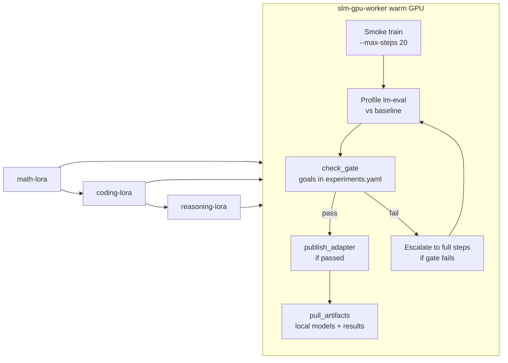
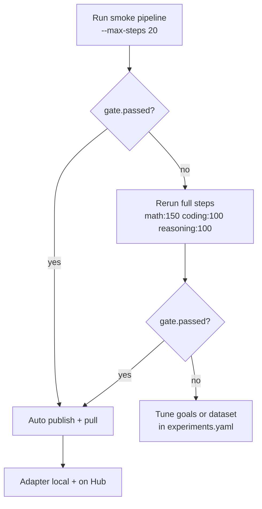

# Modal LoRA Training Loop (Math → Coding → Reasoning)

## Current state (verified on Volume)

The warm worker is **deployed and active** (`slm-gpu-worker`, 1 task). The `slm-finetune` Volume already contains adapters and eval results:

| Job | Volume state | Eval on Volume |
|-----|-------------|----------------|
| `math-lora` | Full train (checkpoints 100 + 150, adapter + README) | `math-lora__math` — gsm8k **0.35** (+0.02 vs baseline 0.33) |
| `coding-lora` | Smoke only (checkpoint-20) | `coding-lora__code` exists |
| `reasoning-lora` | Not trained yet | No baseline/candidate yet |

**Math gate outlook** (from pulled [`comparison.md`](/tmp/slm-check/math-lora__math/comparison.md)):
- Primary `gsm8k`: 0.35 ≥ 0.05 and +0.02 improve — **passes**
- Guards: `arc_challenge` improved; `hellaswag` flat; `piqa` regress exactly 0.03 (at limit) — **likely passes**

Coding needs a proper smoke/full retrain. Reasoning is greenfield.



---

## Phase 0 — Preflight (5 min)

From repo root on `feat/monday_3_sprint` (or current branch):

1. Confirm worker is warm:
   ```bash
   modal app list   # slm-gpu-worker should be deployed
   modal run research/modal/server_app.py --ping
   ```

2. Confirm HF secret exists (required for publish):
   ```bash
   modal secret list   # must include huggingface / HF_TOKEN
   ```

3. Inspect existing Volume artifacts before re-running:
   ```bash
   modal volume ls slm-finetune
   modal volume ls slm-finetune results/lm_eval
   ```

---

## Phase 1 — Math (`math-lora`)

**Strategy:** Smoke first per your preference. Since math already has a full 150-step adapter on Volume, use `--eval-only` first to confirm gate without burning GPU on retrain.

### Step 1a — Re-eval existing adapter (no retrain)

```bash
modal run research/modal/server_app.py --pipeline --eval-only --job math-lora
```

This runs: baseline `minicpm5-1b__baseline__math` (cached if present) → candidate eval on `/vol/finetuned/math-lora` → gate → publish if passed → auto-pull to `./models/finetuned/` and `./results/lm_eval/`.

**Expected publish target:** `MSGEncrypted/minicpm5-1b-math-lora` ([`experiments.yaml`](research/modal/experiments.yaml) lines 71–105)

### Step 1b — Smoke retrain only if gate fails or you want fresh weights

```bash
modal run research/modal/server_app.py --pipeline --job math-lora --max-steps 20
```

### Step 1c — Escalate to full math if smoke gate fails

```bash
modal run research/modal/server_app.py --pipeline --job math-lora --max-steps 150
```

Dataset config (already tuned): MetaMathQA 3000 + alpaca replay 600, `lora_r=32`, NEFTune — see [`experiments.yaml`](research/modal/experiments.yaml).

**Eval profile:** [`research/evals/configs/lm_eval_math.yaml`](research/evals/configs/lm_eval_math.yaml) — gsm8k, arc_challenge, hellaswag, piqa (limit 100).

---

## Phase 2 — Coding (`coding-lora`)

Coding only has checkpoint-20 today. Always smoke-train first.

### Step 2a — Smoke train + eval + gate + publish

```bash
modal run research/modal/server_app.py --pipeline --job coding-lora --max-steps 20
```

**Dataset:** `iamtarun/python_code_instructions_18k_alpaca`, 1000 samples max ([`experiments.yaml`](research/modal/experiments.yaml) lines 108–127).

**Eval profile:** [`research/evals/configs/lm_eval_code.yaml`](research/evals/configs/lm_eval_code.yaml) — humaneval, mbpp + guards (limit 50, unsafe code enabled).

**Gate:** primary `mbpp` min_score 0.05, min_improve 0.01.

### Step 2b — Escalate if gate fails

```bash
modal run research/modal/server_app.py --pipeline --job coding-lora --max-steps 100
```

**Expected publish target:** `MSGEncrypted/minicpm5-1b-coding-lora`

---

## Phase 3 — Reasoning (`reasoning-lora`)

### Step 3a — Smoke train + eval + gate + publish

```bash
modal run research/modal/server_app.py --pipeline --job reasoning-lora --max-steps 20
```

**Dataset:** `HuggingFaceTB/smoltalk` (config `all`, 500 samples).

**Eval profile:** [`research/evals/configs/lm_eval_reasoning.yaml`](research/evals/configs/lm_eval_reasoning.yaml) — gsm8k primary + hellaswag guard.

### Step 3b — Escalate if gate fails

```bash
modal run research/modal/server_app.py --pipeline --job reasoning-lora --max-steps 100
```

**Expected publish target:** `MSGEncrypted/minicpm5-1b-reasoning-lora`

---

## Phase 4 — Review results and decide publish

After each pipeline run, read the JSON summary printed to terminal. Key fields per job row:

- `gate.passed` — whether Hub publish is allowed
- `gate.checks` — per-task scores vs thresholds
- `publish.published` / `publish.url` — Hub link if pushed

**Manual gate + publish** (if eval already done, gate failed earlier, you fixed thresholds):

```bash
modal run research/modal/server_app.py --publish-only --job math-lora
modal run research/modal/server_app.py --publish-only --job coding-lora
modal run research/modal/server_app.py --publish-only --job reasoning-lora
```

**Pull without re-running** (if `--no-pull` was used):

```bash
modal run research/modal/finetune_app.py::pull --job math-lora
modal volume get slm-finetune math-lora ./models/finetuned/
modal volume get slm-finetuned results/lm_eval/math-lora__math ./results/lm_eval/
```

Local paths after pull:
- Adapters: `./models/finetuned/{job}/`
- Eval: `./results/lm_eval/{job}__{profile}/summary.md` + `comparison.md`

---

## Phase 5 — Small code gaps to close (during loop)

These are optional but recommended so published adapters are usable in the Space:

| Gap | File | Change |
|-----|------|--------|
| No `coding-hub` preset | [`models.yaml`](models.yaml) | Add `minicpm5-1b-coding-hub` pointing to `MSGEncrypted/minicpm5-1b-coding-lora` (mirror `minicpm5-1b-math-hub`) |
| No `reasoning-hub` preset | [`models.yaml`](models.yaml) | Add `minicpm5-1b-reasoning-hub` |
| README doc drift | [`research/modal/README.md`](research/modal/README.md) | Update math dataset row: MetaMathQA mix, not MathInstruct |
| No multi-job CLI | [`research/modal/server_app.py`](research/modal/server_app.py) | Add `--jobs math-lora,coding-lora,reasoning-lora` → pass `job_names` list to `run_pipeline` (already supports `job_names: list[str]`) |

**Optional loop script** (new file `research/modal/loop_skills.sh`):
```bash
#!/usr/bin/env bash
set -euo pipefail
JOBS=(math-lora coding-lora reasoning-lora)
SMOKE_STEPS=20
FULL_STEPS=(150 100 100)  # per job in experiments.yaml
for i in "${!JOBS[@]}"; do
  job="${JOBS[$i]}"
  modal run research/modal/server_app.py --pipeline --job "$job" --max-steps "$SMOKE_STEPS" || true
  # inspect gate in output; if failed, rerun with FULL_STEPS[i]
done
```

---

## Gate reference (publish thresholds)

From [`research/modal/experiments.yaml`](research/modal/experiments.yaml):

| Job | Primary task | min_score | min_improve | Guards |
|-----|-------------|-----------|-------------|--------|
| math-lora | gsm8k | 0.05 | 0.02 | arc_challenge, hellaswag, piqa (max_regress 0.03) |
| coding-lora | mbpp | 0.05 | 0.01 | hellaswag, piqa |
| reasoning-lora | gsm8k | 0.05 | 0.01 | hellaswag |

Publish logic lives in [`research/modal/_common.py`](research/modal/_common.py) `publish_adapter_files()` — writes model card README, `HfApi.upload_folder` to `publish.hub_repo`.

---

## Escalation decision tree



---

## Time / cost estimate (warm worker)

| Phase | Smoke (~20 steps) | Full escalation |
|-------|-------------------|-----------------|
| math eval-only | ~15–30 min (lm-eval only) | — |
| math retrain | ~30–45 min | ~60–90 min (150 steps) |
| coding | ~30–45 min | ~60 min (100 steps) |
| reasoning | ~30–45 min | ~60 min (100 steps) |

Warm worker avoids cold starts between phases — all three jobs can run sequentially in the same container via separate `modal run` invocations.

---

## Success criteria

1. Each skill has `summary.md` + `comparison.md` under `./results/lm_eval/{job}__{profile}/`
2. Passing adapters in `./models/finetuned/{job}/` with `adapter_config.json`
3. Hub repos live at `https://huggingface.co/MSGEncrypted/minicpm5-1b-{math,coding,reasoning}-lora`
4. `models.yaml` hub presets wired for Space demo (`ACTIVE_MODEL=minicpm5-1b-math-hub`, etc.)
