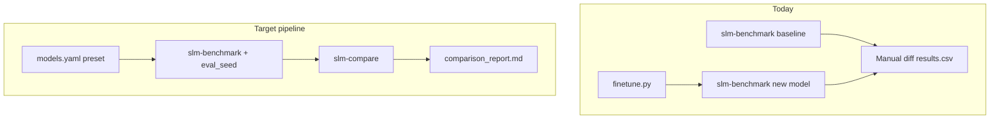

# Model Verification Pipeline for research/

## Current state

Your repo already has **three parallel eval tracks** with no unified comparison:

| Track | Tool | Metrics | Results | Stats |
|-------|------|---------|---------|-------|
| Fine-tuned SLM | [`slm-benchmark`](research/evals/src/slm_evals/run_benchmark.py) | BFCL, τ-bench, GAIA, SWE pass rate | `results/<experiment>/results.json` | None |
| Finetune training | [`finetune.py`](research/finetune.py) | eval_loss, perplexity, `result_score` | `training_results.json` | None |
| Ensemble | [`jepa_harness`](research/ensemble/src/ensemble/eval/jepa_harness.py) / [`world_harness`](research/ensemble/src/ensemble/eval/world_harness.py) | EM, F1, ablation ladder | stdout only | [`paired_bootstrap`](research/ensemble/src/ensemble/eval/metrics.py) |

The manual before/after loop in [`research/evals/USAGE.md`](research/evals/USAGE.md) works but lacks significance testing, preset resolution, and a domain-aligned benchmark for lesson fine-tuning.



---

## Verification strategy (mapped to your repo)

### 1. Fair comparison checklist (enforce via shared eval config)

Create a **single YAML experiment config** per comparison study (copy from [`experiment_001.yaml`](research/evals/configs/experiment_001.yaml)) and reuse it for baseline + candidate runs:

- Same `benchmarks`, `max_samples`, `benchmark_overrides`, `temperature: 0.0`, `max_new_tokens`
- Same `eval_seed` (new field) so sample subsets are identical across models
- Baseline = base preset from [`models.yaml`](models.yaml) (e.g. `minicpm5-1b`); candidate = LoRA/merged preset (e.g. `minicpm5-1b-lesson-lora`)

**Do not** compare `training_results.json` `result_score` against BFCL pass rate — they measure different things.

### 2. Benchmark selection for your use cases

| Claim | Benchmarks in this repo |
|-------|-------------------------|
| Agentic tool use (general) | `bfcl`, `tau_bench` (already in slm-evals) |
| End-to-end assistant | `gaia` (levels 1–2 for small models) |
| Code | `swe_bench` (keep `full_eval: false` unless Docker installed) |
| Lesson/education domain (finetune target) | **New** `education_qa` benchmark on [`research/data/benchmark-qa.jsonl`](research/data/benchmark-qa.jsonl) |
| Ensemble component value | Existing C1→C4 ablation ladder in JEPA harness |
| JEPA critic beats random | Existing selector comparison + `paired_bootstrap` |

Run **in-distribution** (`education_qa`) + **out-of-distribution** (`bfcl`, `tau_bench`) to show generalization, not just lesson memorization.

### 3. Statistical validation

Reuse existing `paired_bootstrap` from [`metrics.py`](research/ensemble/src/ensemble/eval/metrics.py) in a new shared module. For each benchmark:

- Align per-sample `passed` (or `score`) arrays by `samples[].id`
- Report: Δscore, win rate, `P(candidate > baseline)` from bootstrap, 95% CI via bootstrap percentiles
- Flag `p > 0.95` as "significant improvement" (same threshold as JEPA harness)

For multi-seed training runs: run eval once per checkpoint seed, aggregate mean ± std in comparison report (optional `--runs` glob in compare CLI).

---

## Implementation plan

### Phase A — Shared eval infrastructure (`research/evals/`)

**A1. Preset resolution in config loader**

Extend [`config_loader.py`](research/evals/src/slm_evals/utils/config_loader.py) and CLI in [`run_benchmark.py`](research/evals/src/slm_evals/run_benchmark.py):

- Add `--preset` flag and YAML field `preset:` (alternative to `model_path`)
- Resolve via existing [`inference.config.get_model_config`](libs/inference/src/inference/config.py): extract `model_id` + optional `adapter_path`
- Reject non-`transformers` / multimodal presets with clear error (same rule as finetune)

**A2. PEFT adapter loading**

Extend [`model_loader.py`](research/evals/src/slm_evals/utils/model_loader.py):

- If `adapter_path` is set: load base from `model_id`, attach LoRA via `peft.PeftModel.from_pretrained`
- Support merged checkpoints (adapter_path absent) unchanged
- Record `base_model`, `adapter_path`, `param_count` in results metadata

**A3. Reproducible sample subsets**

Extend [`BaseBenchmark`](research/evals/src/slm_evals/benchmarks/base.py):

- Accept `eval_seed` + `max_samples` from config
- After loading dataset: `rng = random.Random(eval_seed); indices = rng.sample(range(len(data)), min(max_samples, len(data)))`
- Persist `eval_seed`, `sample_ids` list in `results.json` so compare can verify identical subsets

**A4. Lesson-domain benchmark**

New file `research/evals/src/slm_evals/benchmarks/education_qa.py`:

- Load [`research/data/benchmark-qa.jsonl`](research/data/benchmark-qa.jsonl)
- Prompt: `"Answer briefly.\nQ: {question}\nA:"`
- Score: token-overlap F1 + normalized substring EM (reuse logic from ensemble `metrics.py` — extract to shared `slm_evals/utils/scoring.py` or import from ensemble if dependency is acceptable)
- Register as `education_qa` in `BENCHMARK_REGISTRY`

**A5. Comparison CLI — `slm-compare`**

New module `research/evals/src/slm_evals/compare_runs.py` + console script in [`pyproject.toml`](research/evals/pyproject.toml):

```bash
uv run --package slm-evals slm-compare \
  --baseline results/minicpm5-1b__baseline/results.json \
  --candidate results/minicpm5-1b-lora__v1/results.json \
  --output results/comparisons/minicpm5-lora-vs-base.md
```

Outputs:
- Per-benchmark delta table (score, passed/total, latency)
- Paired bootstrap p-value per benchmark
- Per-sample win/loss/tie counts (joined on sample `id`)
- Warnings if `eval_seed`, `max_samples`, or benchmark sets differ

**A6. Experiment config templates**

Add two configs under `research/evals/configs/`:

- `baseline_minicpm5.yaml` — preset `minicpm5-1b`, benchmarks `[education_qa, bfcl, tau_bench]`, `max_samples: 100`, `eval_seed: 42`
- `compare_study.yaml` — documents baseline + candidate preset keys, shared eval settings, output naming convention

Update [`research/evals/USAGE.md`](research/evals/USAGE.md) and [`research/USAGE.md`](research/USAGE.md) with the verification checklist from your research guide.

---

### Phase B — Finetune integration (`research/finetune.py`)

**B1. Post-finetune eval hook**

Add optional flags to [`finetune.py`](research/finetune.py):

- `--eval-after` — run slm-benchmark after training completes
- `--eval-config PATH` — YAML with benchmark settings (defaults to `baseline_minicpm5.yaml` structure)
- `--eval-baseline PRESET` — also eval base preset for side-by-side comparison

On completion:
1. Write `training_results.json` (existing)
2. Run eval on output checkpoint
3. If `--eval-baseline` set, run baseline eval + invoke `slm-compare`
4. Append comparison summary path to `training_results.json` under `"post_eval": {...}`

Implementation: subprocess call to `uv run --package slm-evals slm-benchmark` (avoids circular imports).

---

### Phase C — Ensemble track unification (`research/ensemble/`)

**C1. Persist harness results to JSON**

Extend [`jepa_harness.py`](research/ensemble/src/ensemble/eval/jepa_harness.py) and [`world_harness.py`](research/ensemble/src/ensemble/eval/world_harness.py):

- Add `--output-dir` flag
- Write `results.json` matching slm-evals schema where possible:
  - `benchmarks.C4_full_jepa.samples[]` with per-question EM/F1
  - `benchmarks.C1_base` … `C4_full_jepa` aggregate scores
  - `significance[]` with paired bootstrap between ladder steps

**C2. Compare ensemble configs**

`slm-compare` accepts ensemble JSON (detect by presence of ablation config keys) and renders ablation table + bootstrap block.

**C3. Shared metrics module**

Move or re-export `em_score`, `f1_score`, `paired_bootstrap` to `research/evals/src/slm_evals/utils/stats.py` (ensemble imports from there, or duplicate minimally to avoid cross-package coupling — prefer a tiny shared module under `research/` if both packages need it).

---

### Phase D — End-to-end workflow documentation

Add a **Verification Checklist** section to [`research/README.md`](research/README.md):

```bash
# 1. Baseline (preset-aware, pinned seed)
uv run --package slm-evals slm-benchmark \
  --config research/evals/configs/baseline_minicpm5.yaml \
  --preset minicpm5-1b \
  --experiment-name minicpm5-1b__baseline

# 2. Fine-tune
uv run python research/finetune.py --preset minicpm5-1b --mode lora --epochs 3

# 3. Candidate eval (same config, different preset/path)
uv run --package slm-evals slm-benchmark \
  --config research/evals/configs/baseline_minicpm5.yaml \
  --preset minicpm5-1b-lesson-lora \
  --experiment-name minicpm5-1b-lora__v1

# 4. Statistical comparison
uv run --package slm-evals slm-compare \
  --baseline results/minicpm5-1b__baseline/results.json \
  --candidate results/minicpm5-1b-lora__v1/results.json

# 5. Ensemble ablation (domain QA)
uv run --package ensemble python -m ensemble.eval.jepa_harness \
  --llm openbmb/MiniCPM5-1B \
  --qa research/data/benchmark-qa.jsonl \
  --kb research/data/benchmark-kb.jsonl \
  --output-dir results/ensemble/jepa-ablation-v1
```

**Claiming "better than baseline" requires:**
- Δscore > 0 on target benchmarks
- `P(candidate > baseline) > 0.95` on paired per-sample scores (or document inconclusive)
- No regression > 2pp on OOD benchmarks unless tradeoff is explicitly claimed
- Ablation shows which components contribute (ensemble) or which eval split improved (finetune)

---

## File change summary

| File | Change |
|------|--------|
| [`research/evals/src/slm_evals/utils/config_loader.py`](research/evals/src/slm_evals/utils/config_loader.py) | `preset`, `eval_seed`, adapter fields |
| [`research/evals/src/slm_evals/utils/model_loader.py`](research/evals/src/slm_evals/utils/model_loader.py) | PEFT adapter loading |
| [`research/evals/src/slm_evals/benchmarks/base.py`](research/evals/src/slm_evals/benchmarks/base.py) | Seeded sample selection |
| `research/evals/src/slm_evals/benchmarks/education_qa.py` | New lesson-domain benchmark |
| `research/evals/src/slm_evals/compare_runs.py` | New comparison CLI |
| `research/evals/src/slm_evals/utils/stats.py` | Bootstrap + scoring helpers |
| [`research/evals/pyproject.toml`](research/evals/pyproject.toml) | Register `slm-compare` script |
| [`research/finetune.py`](research/finetune.py) | `--eval-after`, `--eval-config`, `--eval-baseline` |
| [`research/ensemble/src/ensemble/eval/jepa_harness.py`](research/ensemble/src/ensemble/eval/jepa_harness.py) | `--output-dir`, JSON persistence |
| [`research/ensemble/src/ensemble/eval/world_harness.py`](research/ensemble/src/ensemble/eval/world_harness.py) | Same |
| [`research/evals/configs/baseline_minicpm5.yaml`](research/evals/configs/baseline_minicpm5.yaml) | New template |
| [`research/USAGE.md`](research/USAGE.md), [`research/evals/USAGE.md`](research/evals/USAGE.md) | Verification workflow docs |

---

## Testing plan

- **Unit**: `paired_bootstrap` on synthetic paired arrays; sample-id alignment in compare; preset resolution for `minicpm5-1b` and `minicpm5-1b-lesson-lora`
- **Smoke**: `slm-benchmark --preset minicpm5-1b --benchmarks education_qa --max-samples 5 --device cpu`
- **Integration**: baseline → finetune (1 epoch) → re-eval → `slm-compare` produces report with no subset mismatch warnings
- **Ensemble**: `jepa_harness --toy --output-dir /tmp/jepa-test` writes valid JSON readable by `slm-compare`

---

## Out of scope (defer)

- W&B / MLflow experiment tracking
- lm-evaluation-harness integration (GSM8K/MMLU — different from agentic suite; add later as separate benchmark group if needed)
- Running ensemble inference through BFCL (requires adapter wrapper, not just raw HF model)
- CI regression gates (can add after compare CLI stabilizes)
