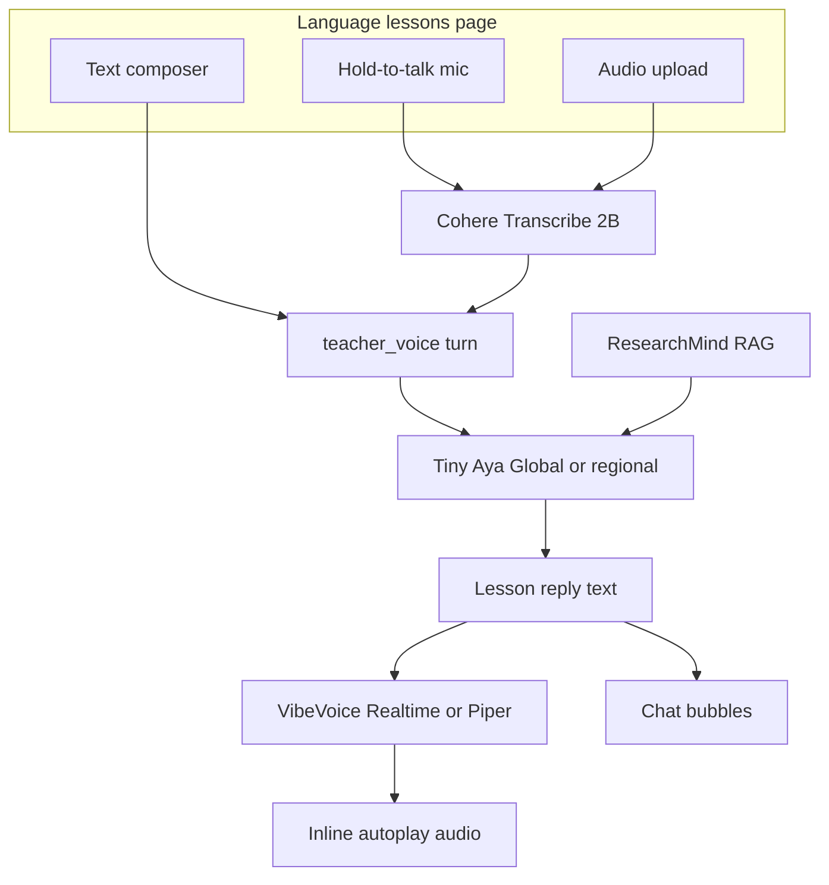

# Language lessons — one tab, text + audio + realtime voice (Cohere stack)

## Goal

Replace the current split **Voice** experience (TeacherVoice chat + buried EchoCoach pitch panel) with **one primary Studio page: Language lessons** — a multilingual learning coach where the user can interact the same way throughout:

| Input | Output |
|-------|--------|
| **Text** — type a question or lesson prompt | **Text** — chat bubbles in target language |
| **Mic** — hold / push-to-talk recording | **Audio** — auto-play teacher reply (realtime TTS when available) |
| **Upload** — `.wav` / `.mp3` clip | **Optional** — replay last reply, toggle auto-speak |

Backend stays **turn-based** (speak → wait → hear reply), but the page should *feel* realtime: mic stops → transcript appears → first audio chunk plays quickly via VibeVoice Realtime, with Piper fallback.

Partner stack ([Cohere Labs guide](https://build-small-hackathon-field-guide.hf.space/partners/cohere)): **Cohere Transcribe** (speech in) + **Tiny Aya** (coach brain, 70 langs) + **Piper / VibeVoice** (speech out).

---

## What you already have (reuse, don’t rewrite)

| Building block | Location | Reuse for Language lessons |
|---|---|---|
| Multi-turn coach pipeline | [`libs/echocoach/src/echocoach/teacher_voice.py`](libs/echocoach/src/echocoach/teacher_voice.py) | Same `run_teacher_voice_turn` / `run_teacher_voice_text_turn` |
| Lesson + explain prompts | [`libs/echocoach/src/echocoach/prompts.py`](libs/echocoach/src/echocoach/prompts.py) | `lesson` + `explain` modes (drop pitch from this page) |
| 14-language ASR/TTS config | [`voice_models.yaml`](voice_models.yaml) | Language dropdown + Cohere ASR + Piper voices |
| Cohere Transcribe backend | [`libs/echocoach/src/echocoach/asr/cohere.py`](libs/echocoach/src/echocoach/asr/cohere.py) | Default ASR on Space |
| Streaming TTS | [`libs/echocoach/src/echocoach/tts/vibevoice.py`](libs/echocoach/src/echocoach/tts/vibevoice.py) + `voiceout.py` | `chunk_first=True` already used for TeacherVoice |
| Studio API | [`apps/gradio-space/src/gradio_space/api/studio.py`](apps/gradio-space/src/gradio_space/api/studio.py) | `teacher_voice_turn`, `teacher_voice_audio_turn`, `voice_presets` |
| RAG grounding | ResearchMind via `teacher_voice.py` | Optional “Answer from my sources” toggle |
| Recording helpers | [`studio.js`](apps/gradio-space/static/studio/studio.js) `recordingTarget`, mic start/stop | Extend for hold-to-talk on Language lessons page |

**Not on this page:** EchoCoach one-shot pitch JSON report → move to **Classic** `/classic` EchoCoach tab only, or a collapsed “Pitch analysis (advanced)” link so Language lessons stays focused on learning.

---

## Page design — Language lessons tab

### Navigation

In [`apps/gradio-space/static/studio/index.html`](apps/gradio-space/static/studio/index.html):

- Add/rename sidebar item: **`Language lessons`** (`data-view="language-lessons"`) with icon `translate` or `school`.
- Demote current **Voice** nav (pitch + mixed modes) → remove from primary nav, or keep **Voice** as alias redirecting to Language lessons for one release cycle.
- Classic `/classic` keeps full TeacherVoice + EchoCoach tabs unchanged.

### Layout (single page)

```text
┌─────────────────────────────────────────────────────────────┐
│ Language lessons                                             │
│ Learn in your language — text, voice, or upload audio        │
├──────────────┬──────────────────────────────────────────────┤
│ LEFT RAIL    │ MAIN — conversation                          │
│              │                                              │
│ Target lang ▼│  [User bubble — text or transcript]         │
│ Coach model  │  [Teacher bubble — text + inline ▶ audio]   │
│  (Aya Global)│  ...                                         │
│              │                                              │
│ Lesson topic │ ── UNIFIED COMPOSER ──────────────────────  │
│              │ [ Text area — always visible ]               │
│ ☑ Use sources│ [ 🎤 Hold to speak ] [ 📎 Upload audio ]     │
│              │ [ Send ]  ☑ Auto-speak replies               │
│ Add sources  │ Status: Listening… / Transcribing… / …       │
│ (details)    │                                              │
└──────────────┴──────────────────────────────────────────────┘
```

**Left rail controls**

- **Target language** — required; populated from `voice_presets.languages` (14 voice langs).
- **Coach variant** (optional Advanced): Auto regional → Tiny Aya Global / Water / Fire / Earth.
- **Lesson topic** — defaults to workspace topic; grounds lesson mode.
- **Use indexed sources** — same as current `#use-rag`; applies to explain + lesson.
- **Add sources** — reuse voice-rail ingest (discover, URLs, PDF) or link to Research view.

**Main conversation**

- Messages format: user shows typed text or “🎤 transcript”; assistant shows reply text + embedded `<audio controls autoplay>` when VoiceOut path returned.
- Empty state copy: “Choose a language, then type, speak, or upload audio to start your lesson.”

**Unified composer (one place for all input modes)**

1. **Text** — textarea + **Send** → `teacher_voice_turn` with `mode=lesson` (default) or toggle **Explain** vs **Lesson coach** (two small pills, not three modes).
2. **Mic** — **Hold to speak** (mousedown/touchstart → record, release → stop → auto `teacher_voice_audio_turn`). Reuse existing `recordingTarget` pattern; set `state.recordingTarget = "language-lessons"`.
3. **Upload** — file input → preview waveform/name → **Send audio** or auto-send on select.
4. **Auto-speak replies** — checkbox default **on**; passes through to API so server always synthesizes TTS (already default in pipeline when `synthesize_voice_reply` runs).

**Realtime voice output behavior**

- Use `ECHOCOACH_REALTIME_TTS_PRESET=vibevoice-realtime-0.5b` for Language lessons page (14 langs experimental on VibeVoice; fallback to Piper per lang).
- Frontend: on response, `autoplay` first audio element; show “Speaking…” while playing.
- Honest scope: **not** full-duplex WebSocket; latency target is “release mic → hear teacher within ~1–3s on GPU” via chunked TTS already in `voiceout.py`.

**70-language text demo (no voice required)**

- Language dropdown includes **“Other (text only)”** free-text ISO/code field OR a second “LLM language” field for codes outside Piper set (e.g. `hi`, `sw`).
- Helper: “Voice in/out: 14 languages · Coach understands 70+ with Tiny Aya.”
- When language has no Piper voice, show text reply only + banner “VoiceOut not available for this language.”

---

## Target architecture



---

## Gaps to close (updated)

1. **No dedicated Language lessons view** — today everything lives under generic **Voice** with pitch mode + EchoCoach panel ([`index.html` L303–419](apps/gradio-space/static/studio/index.html)).
2. **Language not wired in Studio JS** — hardcoded `default_language` in [`studio.js`](apps/gradio-space/static/studio/studio.js) (~L1187).
3. **Split send paths** — “Send text” vs “Send voice turn” should become one flow with auto-routing by input type.
4. **Manual replay buttons** — “Speak full reply” should be default-on for Language lessons; keep replay as secondary.
5. **Coach LLM** — still MiniCPM5 1B; need Tiny Aya presets for multilingual quality.
6. **Default ASR** — Whisper tiny, not Cohere Transcribe.
7. **Pitch/EchoCoach clutter** — remove from primary Language lessons UX.

---

## Implementation plan

### 1. Backend — Tiny Aya + locale prompts (unchanged core)

Add to [`models.yaml`](models.yaml):

| Preset | HF model_id |
|--------|-------------|
| `tiny-aya-global` | `CohereLabs/tiny-aya-global` |
| `tiny-aya-water` | `CohereLabs/tiny-aya-water` |
| `tiny-aya-fire` | `CohereLabs/tiny-aya-fire` |
| `tiny-aya-earth` | `CohereLabs/tiny-aya-earth` |

Set `voice_models.yaml` → `defaults.coach_model: tiny-aya-global`.

In [`prompts.py`](libs/echocoach/src/echocoach/prompts.py):

- Add `LANGUAGE_LESSON_SYSTEM` (or extend `LESSON_SYSTEM` / `EXPLAIN_SYSTEM`) with explicit target-language instruction.
- Add `language_instruction(language: str) -> str` injected in `build_teacher_messages()`.

Optional `resolve_aya_preset(language)` for Water/Fire/Earth when user picks “Auto regional”.

### 2. Backend — Language lessons API surface

In [`studio.py`](apps/gradio-space/src/gradio_space/api/studio.py):

- Add thin wrapper `api_language_lesson_turn(...)` OR alias existing endpoints with fixed `mode` default `lesson`.
- Parameters: `message`, `audio_path`, `language`, `topic`, `use_rag`, `history`, `mode` (`lesson`|`explain`), `auto_voiceout=True`, `coach_model` optional override.
- Ensure `language` is always passed through to ASR + TTS + prompts (no default-only path from frontend).

Register in Studio HTML boot (`initLanguageLessons()` parallel to `initVoicePresets()`).

### 3. Frontend — new Language lessons page

Files: [`studio_html.py`](apps/gradio-space/src/gradio_space/ui/studio_html.py) (fragment), [`index.html`](apps/gradio-space/static/studio/index.html), [`studio.js`](apps/gradio-space/static/studio/studio.js), [`studio.css`](apps/gradio-space/static/studio/studio.css).

- New `<section class="col col-studio" data-view-panel="language-lessons">` with layout above.
- JS module: `state.languageLesson = { language, mode, autoSpeak, history }`.
- Wire nav `data-view="language-lessons"` in existing view switcher.
- **Hold-to-talk**: pointerdown on `#btn-lesson-hold-mic` → start recording; pointerup → stop → `sendLanguageLessonAudioTurn(path)`.
- **Unified send**: if textarea non-empty → text turn; else if pending audio → audio turn.
- **Render**: extend chat renderer to show inline audio on assistant messages (reuse `renderVoiceReply` patterns).
- Remove pitch mode cards and `#voice-pitch-analysis` from this view (Classic EchoCoach tab remains).

### 4. Space defaults (Cohere partner demo)

```bash
ECHOCOACH_ASR_PRESET=cohere-transcribe
ECHOCOACH_COACH_MODEL=tiny-aya-global
ECHOCOACH_TTS_PRESET=piper-multilingual
ECHOCOACH_REALTIME_TTS_PRESET=vibevoice-realtime-0.5b
```

Document in [`USAGE.md`](USAGE.md). GPU Space recommended.

### 5. Polish & demote pitch analysis

- Gate English-only filler metrics in EchoCoach when `language != "en"`.
- Fix Greek Piper mapping (`el`) in `voice_models.yaml`.
- EchoCoach deep analysis: Classic tab only, or footer link “Practice a monologue (pitch metrics)” opening Classic.

### 6. Demo script (single tab)

Update [`README.md`](README.md) / [`apps/gradio-space/README.md`](apps/gradio-space/README.md):

1. Open **Language lessons**.
2. Select **French** → hold mic → ask “Explique le fine-tuning en termes simples.” → hear Piper/VibeVoice reply.
3. Switch to **Spanish**, type a follow-up question (text in, text + audio out).
4. Select **Hindi** (text-only) → show Tiny Aya Fire-quality written lesson snippet.
5. Toggle **Use sources** after ingesting one PDF in Research.

Badge line: **Cohere Labs** — Transcribe + Tiny Aya on one local Language lessons page.

### 7. Tests

[`libs/echocoach/tests/test_teacher_voice.py`](libs/echocoach/tests/test_teacher_voice.py):

- `build_teacher_messages(..., language="fr")` contains French instruction.
- Optional: API contract test that `language` propagates to mock ASR call.

---

## What you do **not** need for hackathon MVP

- Full duplex / interruptible WebSocket conversation
- TTS for all 70 Tiny Aya languages
- Replacing ResearchMind embeddings with multilingual models
- Keeping pitch practice on the same page as Language lessons

---

## Risk notes

| Risk | Mitigation |
|------|------------|
| GPU RAM (Transcribe 2B + Aya 3.3B) | Sequential load on ZeroGPU; dev fallback whisper + Aya |
| VibeVoice lang coverage gaps | Piper fallback per `voice_models.yaml`; text-only banner |
| Hold-to-talk on mobile browsers | Push-to-talk fallback buttons (start/stop) |
| Scope creep from 3-mode Voice tab | Language lessons = **lesson + explain only** |

---

## Suggested execution order

1. Tiny Aya presets + locale prompts (quality foundation)
2. **Language lessons page** HTML/JS/CSS + unified composer
3. Wire language + auto_voiceout through API
4. Space env defaults (Cohere ASR + realtime TTS)
5. Demote EchoCoach pitch from Studio; docs + demo script
