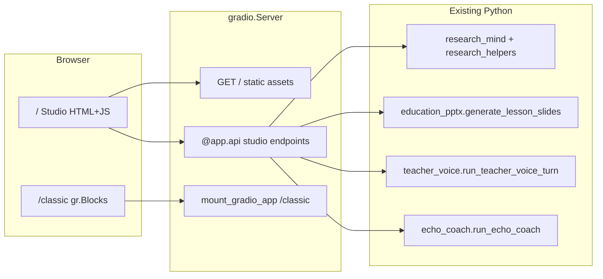

# Off Brand Studio UI (Hybrid gr.Server)

## Goal

Judges for **Off Brand** reward UIs that clearly escape default Gradio chrome. Your mockup is the right vision; the winning implementation is **not** pasting that HTML into `gr.HTML` inside Blocks — it is **`gradio.Server` serving a real custom frontend** with Gradio's queue/API engine underneath ([Gradio Server mode blog](https://huggingface.co/blog/introducing-gradio-server)).

**Strategy:** One polished **Studio demo surface** at `/` + **full feature parity** at `/classic`.

## What to steal from the mockup (and what to skip)

| Keep | Skip (fake SaaS chrome) |
|------|-------------------------|
| Fixed sidebar + top app bar | Publish, notifications, Free Tier profile |
| 3-column workspace (3/6/3 grid) | Global "Search Studio" (unless wired to doc filter) |
| M3 tokens + Hanken Grotesk + Material icons | Live EchoCoach waveform while editing slides |
| Indexed document cards with status chips | Undo/redo on slides (no backend yet) |
| Center hero slide preview canvas | Tailwind CDN in production (bundle CSS instead) |
| Teacher Voice mode cards | "New Project" unless backed by session creation |

Replace decorative chrome with **real actions**: **Export downloads**, **Open Classic**, **Settings** (links to `/classic` settings accordion or a minimal model-status drawer).

## Architecture

### New entrypoint

Replace [`apps/gradio-space/src/gradio_space/app.py`](apps/gradio-space/src/gradio_space/app.py) launch path with a new [`apps/gradio-space/src/gradio_space/server.py`](apps/gradio-space/src/gradio_space/server.py):

1. `server = gradio.Server()`
2. Mount static files: `apps/gradio-space/static/studio/`
3. `@server.get("/")` → `index.html`
4. Register `@server.api(...)` handlers (thin wrappers — no business logic duplication)
5. `mount_gradio_app(server, build_demo(), path="/classic", css=load_css(), theme=get_theme(), allowed_paths=[...])`
6. `server.launch(...)` with same env vars (`PORT`, `GRADIO_SERVER_NAME`, allowed paths)

Keep `build_demo()` unchanged in structure; Classic remains the escape hatch for Chat (debug), Advanced trace, and edge-case flows.

### API layer (reuse existing functions)

Create [`apps/gradio-space/src/gradio_space/api/studio.py`](apps/gradio-space/src/gradio_space/api/studio.py) exposing JSON-friendly endpoints by calling existing tab logic:

| Endpoint | Wraps | Returns |
|----------|-------|---------|
| `list_sessions` | `list_session_choices()` | `{sessions: [{id, label, topic}]}` |
| `list_documents` | `IngestPipeline().store.list_documents` | `{documents: [{id, title, source_type, uri, status}]}` |
| `ingest_url` / `ingest_upload` | `ingest_selected` from [`research_mind.py`](apps/gradio-space/src/gradio_space/tabs/research_mind.py) | `{status, session_id, documents}` |
| `discover_sources` | `discover_sources` | `{urls, session_id, status}` |
| `generate_slides` | `generate_lesson_slides` from [`education_pptx.py`](apps/gradio-space/src/gradio_space/tabs/education_pptx.py) | `{preview_html, gallery_paths, downloads, outline_md, status}` |
| `teacher_voice_turn` | `run_teacher_voice_turn` / text turn | `{history, status, audio_path?}` |
| `analyze_pitch` | `analyze_pitch` from [`echo_coach.py`](apps/gradio-space/src/gradio_space/tabs/echo_coach.py) | `{transcript_html, report_md, charts, voiceout_path, metrics}` |
| `model_status` | existing settings panel helpers | `{model_key, backend, loaded}` |

Add small **response serializers** in [`apps/gradio-space/src/gradio_space/api/serializers.py`](apps/gradio-space/src/gradio_space/api/serializers.py) to convert Gradio-style tuples / `gr.update` outputs into plain dicts.

Add **HTML render helpers** in [`apps/gradio-space/src/gradio_space/ui/studio_html.py`](apps/gradio-space/src/gradio_space/ui/studio_html.py):
- `render_doc_card(doc)` — matches mock indexed-document rows
- `render_slide_canvas(preview_html)` — wraps existing slide preview HTML in canvas chrome
- `render_echo_coach_panel(result)` — dark metrics panel (post-analysis, not fake live listening)

### Custom frontend files

Port mockup into [`apps/gradio-space/static/studio/`](apps/gradio-space/static/studio/):

- `index.html` — structure only (sidebar, header, 3 columns)
- `studio.css` — M3 tokens from mock (`primary: #a83300`, surfaces, typography); **no Tailwind CDN** — extract needed utilities to ~300–400 lines CSS
- `studio.js` — fetch `@app.api` endpoints via Gradio client or direct `/call/{api_name}` routes; handle loading states, errors, file upload (multipart)

**Sidebar navigation:** client-side view modes (Research / Slides / Voice / Coach) that show/hide or emphasize columns — not separate backend routes. Default landing: **Slides** center-focused with left rail visible (matches mock).

**Demo seed:** on load, if a session titled "Photosynthesis" exists, select it; otherwise create/use topic placeholder "Photosynthesis for 6th Grade" to match mock copy.

## Visual design alignment

Update design tokens to align mock + existing CSS:

- Primary CTA: `#a83300` (mock) — update [`styles.css`](apps/gradio-space/src/gradio_space/ui/styles.css) `.primary-cta` from `#e86c00` OR pick one orange and use everywhere
- Font: Hanken Grotesk via Google Fonts in Studio `index.html` `<head>`; Classic can stay Inter
- Icons: Material Symbols Outlined (same as mock)
- Cards: white surface, `border-outline-variant`, `rounded-xl`, subtle shadow — match mock panels

Classic `/classic` gets a **minimal header link** ("Open Studio UI") so judges can compare.

## UX flows (Studio `/`)

### Flow A — Hackathon demo script (2 minutes)

1. Land on Studio → breadcrumb **Projects → Photosynthesis**
2. Left: paste Wikipedia URL → **Ingest** → doc cards populate, **RAG Active** badge
3. Center: topic + grade 6 + slide slider → **Generate Slides** → hero preview fills canvas
4. Right: select **Coach** mode → record/send voice turn about the equation slide
5. Optional: switch sidebar to **Coach** → run EchoCoach analyze → metrics panel populates (real data, not animated placeholder)

### Flow B — Power users

- Sidebar **Settings** → `/classic` (model reload, trace, Chat debug)
- Download PPTX/DOCX from generate response

## Gradio Server specifics (Off Brand differentiator)

Document in [`apps/gradio-space/README.md`](apps/gradio-space/README.md):

- Entry: `python -m gradio_space.server`
- Custom UI at `/`, Gradio Blocks at `/classic`
- List `@app.api` names for programmatic use (shows `gradio_client` compatibility — bonus points)

Use `@server.api(name="...")` for all long-running calls (`generate_slides`, `analyze_pitch`, ingest) so requests get **queuing + progress** automatically.

Set `footer_links=[]` on Studio launch; Classic can keep minimal footer or empty as well.

## File change summary

| File | Action |
|------|--------|
| `server.py` | **New** — Server entry, static mount, API registration, Classic mount |
| `api/studio.py`, `api/serializers.py` | **New** — API wrappers |
| `static/studio/index.html`, `studio.css`, `studio.js` | **New** — Custom frontend |
| `ui/studio_html.py` | **New** — Server-side HTML fragments |
| `ui/design_tokens.css` | **New** — shared token file imported by Studio CSS |
| `app.py` | **Minor** — extract `build_demo()` only; move `main()` to `server.py` |
| `README.md` | **Update** — Studio vs Classic, demo script, Off Brand notes |
| Root `README.md` | **One paragraph** — screenshot of Studio UI for judges |

## Risk controls

- **Scope guard:** Studio implements the 4 sidebar modes as **one page** with column emphasis — do not rewrite Chat (debug) in custom UI
- **Fallback:** if any Studio API fails, show error banner + link to equivalent `/classic` tab
- **HF Space:** static assets served from repo (no CDN dependency); confirm `allowed_paths` for previews/downloads unchanged
- **EchoCoach honesty:** metrics panel shows **after analyze**, label as "Analysis results" — not fake "Listening..." unless mic is actively recording

## Verification checklist

- [ ] `/` loads custom UI with no default Gradio tab bar visible
- [ ] `/classic` still runs all 5 tabs with existing behavior
- [ ] Ingest → document list → generate slides → preview works end-to-end on Photosynthesis topic
- [ ] TeacherVoice turn works from Studio right panel
- [ ] EchoCoach analyze populates real pitch/pace metrics
- [ ] Mobile: sidebar collapses to hamburger; single-column stack below 1024px
- [ ] README documents `gr.Server` architecture for judges

## Implementation order

1. **Server scaffold** — `server.py`, static mount, `/classic` mount, smoke launch
2. **Design tokens + HTML shell** — visual parity with mock (non-functional)
3. **Research APIs + left column** — sessions, ingest, doc cards
4. **Slides API + center column** — generate + preview + downloads
5. **Voice/Coach APIs + right column** — mode cards, recording upload, EchoCoach panel
6. **Polish** — loading skeletons, error states, demo seed, README/screenshot

Estimated effort: **1.5–2 days** for a judge-ready Studio demo with Classic fallback.
