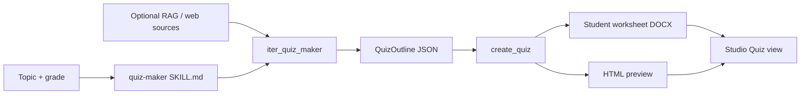

# Quiz maker skill

## Why this sprint

Pairs with **slides-from-chat** in the teaching loop: *research → teach (slides) → assess (quiz)*. Backend design is fully specified in [`slides_from_chat_+_quiz_f53701a3.plan.md`](.cursor/plans/slides_from_chat_+_quiz_f53701a3.plan.md) **Part B** and [`skill_agent_pptx_5413e3c2.plan.md`](.cursor/plans/skill_agent_pptx_5413e3c2.plan.md) Phase 2 — **zero implementation today**.

**Wahou moment:** Same topic the teacher just researched becomes a **printable quiz with answer key** — grounded in their library, trace visible, no cloud API.



## Pattern to copy (do not reinvent)

Mirror [`skills/education-pptx/SKILL.md`](skills/education-pptx/SKILL.md) layering:

| Layer | Slides reference | Quiz equivalent |
|-------|------------------|-----------------|
| Skill | `education-pptx` | `quiz-maker` |
| Pydantic | `SlideOutline` | `QuizOutline` |
| Runner | `iter_education_pptx` | `iter_quiz_maker` |
| Tool | `create_pptx` | `create_quiz` |
| Tab | `education_pptx.py` | `quiz_maker.py` |
| Studio API | `api_generate_slides` | `api_generate_quiz` |

Reuse [`_gather_lesson_source_context()`](libs/agent/src/agent/runner.py) for web/RAG grounding (same as slides).

---

## Part 1 — Skill + agent backend

### 1.1 Skill definition

Create [`skills/quiz-maker/SKILL.md`](skills/quiz-maker/SKILL.md):

```yaml
name: quiz-maker
description: Create a multiple-choice quiz from a topic and grade level
task: education
tools:
  - create_quiz
model_hints:
  - minicpm5-1b
```

Optional [`skills/quiz-maker/references/mcq-format.md`](skills/quiz-maker/references/mcq-format.md): exactly 4 choices, one correct, short explanation.

### 1.2 Models ([`models.py`](libs/agent/src/agent/models.py))

```python
class QuizQuestion(BaseModel):
    prompt: str
    choices: list[str] = Field(min_length=4, max_length=4)
    correct_index: int = Field(ge=0, le=3)
    explanation: str = ""

class QuizOutline(BaseModel):
    title: str
    instructions: str = ""
    questions: list[QuizQuestion] = Field(min_length=3, max_length=12)

class QuizMakerInput(BaseModel):
    topic: str
    grade: str
    question_count: int = Field(ge=5, le=10, default=5)
    # mirror EducationPptxInput source fields: source_mode, urls, session_id, doc_ids, ...
    conversation_context: str = ""  # schema-ready; UI deferred
```

### 1.3 Prompts ([`prompts.py`](libs/agent/src/agent/prompts.py))

Same retry/repair/fallback pattern as slides:

- `quiz_outline_system`, `quiz_outline_user`, `quiz_outline_repair`
- `fallback_quiz(topic, grade, n)` — deterministic MCQ stub if model JSON fails
- `quiz_to_markdown(outline)` — Studio preview

### 1.4 Export tool

New [`libs/agent/src/agent/tools/quiz.py`](libs/agent/src/agent/tools/quiz.py):

- `create_quiz_docx(outline)` — numbered questions, A–D choices; **answer key on final page**
- `create_quiz_html(outline)` — printable worksheet + collapsible answer key section
- Register `create_quiz` in [`tools_registry.py`](libs/agent/src/agent/tools_registry.py)

### 1.5 Runner ([`runner.py`](libs/agent/src/agent/runner.py))

- `QUIZ_MAKER_SKILL = "quiz-maker"`
- `iter_quiz_maker()` — copy `_iter_education_pptx_steps` structure:
  1. load model
  2. `_gather_lesson_source_context()`
  3. `_generate_quiz_outline()`
  4. `create_quiz` tool
  5. markdown preview + trace

Add `QuizGenerationProgress` labels in [`progress.py`](libs/agent/src/agent/progress.py) (small duplicate OK).

### 1.6 Tests

`libs/agent/tests/`:

- JSON parse/repair for quiz outline
- `fallback_quiz` smoke
- docx/html file creation (temp dir)

---

## Part 2 — Classic tab

New [`apps/gradio-space/src/gradio_space/tabs/quiz_maker.py`](apps/gradio-space/src/gradio_space/tabs/quiz_maker.py):

- Inputs: topic, grade, question count (5–10), source mode (reuse `SOURCE_MODES` from [`education_pptx.py`](apps/gradio-space/src/gradio_space/tabs/education_pptx.py))
- Discover URLs / doc scope — copy Slides column patterns
- Outputs: markdown preview, DOCX + HTML downloads, Agent trace accordion

Wire in [`app.py`](apps/gradio-space/src/gradio_space/app.py) as **Quiz maker** tab after Lesson slides.

---

## Part 3 — Studio Quiz view

### 3.1 API ([`api/studio.py`](apps/gradio-space/src/gradio_space/api/studio.py))

```python
@server.api(name="generate_quiz")
def api_generate_quiz(topic, grade, question_count, session_id, source_mode, ...)
```

Return: `outline_md`, `preview_html`, `downloads: {docx, html}`, `trace_json`, `status`.

### 3.2 UI ([`index.html`](apps/gradio-space/static/studio/index.html), [`studio.js`](apps/gradio-space/static/studio/studio.js), [`studio.css`](apps/gradio-space/static/studio/studio.css))

- Sidebar nav: **Quiz** (`data-view="quiz"`, icon `quiz`)
- Single-column workspace (like Language lessons):
  - Topic, grade, question count
  - Source mode + doc scope rail (shared with Slides when session active)
  - **Generate quiz** + progress steps
  - Preview pane (HTML worksheet)
  - Download row: DOCX + HTML
  - Agent trace collapsible

### 3.3 Teaching-loop shortcuts (wahou)

After slides generate successfully, show subtle CTA on Slides view:

- **Create quiz on this topic** → switches to Quiz view, pre-fills topic/grade/session scope

Optional v1.1 (not blocking): **Generate quiz from chat** — same `conversation_helpers.py` as slides plan.

---

## Part 4 — Docs

Update [`apps/gradio-space/README.md`](apps/gradio-space/README.md):

- New API: `generate_quiz`
- Demo step: Research → Slides → Quiz on same topic
- Classic tab list

---

## Risks

| Risk | Mitigation |
|------|------------|
| Small model invalid JSON | repair + retry + `fallback_quiz` (same as slides) |
| Weak distractors | `mcq-format.md` reference + grade-appropriate prompt |
| Scope creep (interactive quiz UI) | v1 = printable exports only; no in-app grading |

---

## Files

**Create:** `skills/quiz-maker/SKILL.md`, `libs/agent/src/agent/tools/quiz.py`, `tabs/quiz_maker.py`, agent tests

**Modify:** `models.py`, `prompts.py`, `runner.py`, `tools_registry.py`, `progress.py`, `api/studio.py`, `app.py`, Studio static assets, README

**Depends on:** `conversation_helpers.py` only if quiz-from-chat shortcut ships in same sprint (optional)

## Estimated effort

| Block | Time |
|-------|------|
| Skill + models + prompts + tool | 3–4h |
| Runner + tests | 2–3h |
| Classic tab | 1–2h |
| Studio Quiz view + API | 3–4h |
| Teaching-loop CTA + docs | 1h |
| **Total** | **~1.5 days** |

Can parallelize with slides-from-chat after `conversation_helpers.py` lands.
