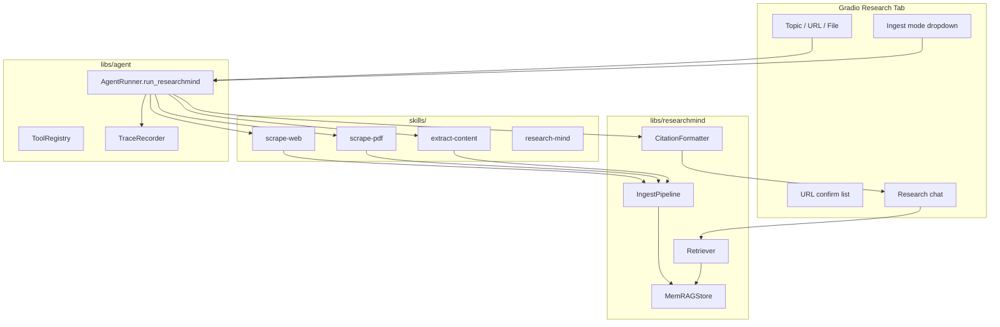

# ResearchMind — Scraper + RAG + MemRAG Plan

## Goal

Ship a **Backyard AI** research agent that:
1. Accepts a **topic**, **URL**, or **PDF/doc** upload
2. **Ingests once** (scrape → extract → chunk → embed → graph persist)
3. Answers questions **offline** across sessions with **citations**
4. Uses the **active local preset** from [`models.yaml`](models.yaml) (no new training in MVP)

## Architecture



**Separation of concerns**
- **Skills** (`skills/*/SKILL.md` + `references/` + `scripts/`) — workflow docs and thin CLIs the agent/humans can invoke
- **`libs/researchmind/`** — real Python library: scrape, extract, chunk, embed, SQLite MemRAG, retrieval
- **`libs/agent/`** — orchestration: `AgentRunner.run_researchmind()`, tool handlers, prompts with citations
- **`apps/gradio-space/`** — third top-level tab wired like [`education_pptx.py`](apps/gradio-space/src/gradio_space/tabs/education_pptx.py)

**Not in MVP scope:** wiring [`research/ensemble/src/ensemble/memory.py`](research/ensemble/src/ensemble/memory.py) toy `Embedder` (token-id bound, research-only). Production path uses **sentence-transformers** (`all-MiniLM-L6-v2`) for arbitrary text, fully offline after first model download.

---

## 1. New package: `libs/researchmind/`

Add workspace member in root [`pyproject.toml`](pyproject.toml) and depend from `agent` + `gradio-space`.

| Module | Responsibility |
|--------|----------------|
| `store.py` | **MemRAGStore** — SQLite at `$RESEARCHMIND_DATA_DIR/memory.db` |
| `ingest.py` | **IngestPipeline** — normalize → chunk → embed → graph edges |
| `scrape_web.py` | `httpx` + `trafilatura` fetch/clean HTML |
| `scrape_pdf.py` | `pypdf` text extraction; optional OCR hook stub |
| `extract.py` | Unified `ExtractedDocument` (title, url, mime, text, metadata) |
| `chunking.py` | Sliding-window chunks (~512 tokens / 128 overlap) with stable IDs |
| `embeddings.py` | Lazy-load `SentenceTransformer`, batch encode, L2-normalize |
| `retrieve.py` | Top-k cosine search + optional graph expansion (same-doc neighbors) |
| `citations.py` | Map chunks → `[1]` footnotes with source title/URL/page |
| `search_urls.py` | Optional DuckDuckGo search (`duckduckgo-search`) when `auto_search=True` |
| `url_suggest.py` | LLM prompt: topic → JSON list of suggested URLs (default path) |

### MemRAG graph schema (SQLite)

```
documents(id, source_type, uri, title, ingested_at, content_hash)
chunks(id, doc_id, ordinal, text, embedding_blob, meta_json)
edges(src_id, dst_id, rel)   -- doc->chunk, chunk->next_chunk, chunk->cites
sessions(id, topic, created_at)
session_messages(session_id, role, content, chunk_ids_json)
```

- **Persistence** enables cross-session memory: chat loads `session_id` or creates new; retrieval searches all ingested docs unless filtered by session/topic tag
- **Dedup**: skip re-ingest when `content_hash` matches
- **Graph expansion (light MemRAG)**: when retrieving chunk `k`, also pull adjacent chunks (`chunk->next_chunk`) from same document for context window assembly

### Dependencies (add to `libs/researchmind/pyproject.toml`)

- `httpx`, `trafilatura` — web scrape
- `pypdf` — PDF
- `python-docx` — already in agent; reuse for `.docx` uploads
- `sentence-transformers` — offline embeddings
- `duckduckgo-search` — optional auto-search mode
- `numpy` — vector ops (or store as bytes in SQLite)

Env vars (extend [`.env.example`](.env.example)):

| Variable | Default | Purpose |
|----------|---------|---------|
| `RESEARCHMIND_DATA_DIR` | `outputs/researchmind` | DB + raw snapshots |
| `RESEARCHMIND_EMBED_MODEL` | `all-MiniLM-L6-v2` | Embedding model |
| `RESEARCHMIND_AUTO_SEARCH` | `false` | Global default for auto-search |
| `RESEARCHMIND_TOP_K` | `5` | Retrieval depth |

---

## 2. Skills layout (with references + scripts)

Create four skill folders under [`skills/`](skills/), mirroring Cursor skill layout but using existing [`SkillRegistry`](libs/agent/src/agent/skills.py) frontmatter (`name`, `description`, `task`, `tools`):

### `skills/scrape-web/`

```
scrape-web/
├── SKILL.md
├── references/
│   ├── allowed-domains.md      # robots.txt / rate-limit notes
│   └── html-cleanup.md         # trafilatura settings
└── scripts/
    └── scrape_url.py           # CLI: python scripts/scrape_url.py <url> --out ...
```

- **tools:** `scrape_web`
- Script calls `researchmind.scrape_web.fetch_and_extract`

### `skills/scrape-pdf/`

```
scrape-pdf/
├── SKILL.md
├── references/
│   └── pdf-limits.md           # max pages, scanned PDF note
└── scripts/
    └── extract_pdf.py
```

- **tools:** `scrape_pdf`

### `skills/extract-content/`

```
extract-content/
├── SKILL.md
├── references/
│   └── chunking-policy.md
└── scripts/
    └── chunk_and_index.py      # ingest into MemRAGStore
```

- **tools:** `extract_and_index`

### `skills/research-mind/` (orchestrator)

```
research-mind/
├── SKILL.md
├── references/
│   ├── ingest-modes.md         # suggest / auto_search / direct_url
│   └── citation-format.md
└── scripts/
    ├── suggest_urls.py
    ├── ingest.py
    └── ask.py                  # CLI Q&A with citations
```

Frontmatter additions (parsed as optional YAML fields in extended `Skill` dataclass):

```yaml
---
name: research-mind
task: research
tools:
  - suggest_urls
  - scrape_web
  - scrape_pdf
  - extract_and_index
  - research_answer
flags:
  auto_search: false   # skill default; overridden by agent + Gradio
---
```

Extend [`libs/agent/src/agent/skills.py`](libs/agent/src/agent/skills.py) to read optional `flags:` dict without breaking existing skills.

---

## 3. Agent orchestration

### New tools in [`libs/agent/src/agent/tools_registry.py`](libs/agent/src/agent/tools_registry.py)

| Tool | Handler |
|------|---------|
| `suggest_urls` | `url_suggest.suggest(topic, backend)` → list[str] |
| `scrape_web` | fetch + return `ExtractedDocument` |
| `scrape_pdf` | extract PDF path/bytes |
| `extract_and_index` | chunk + embed + `MemRAGStore.add_document` |
| `research_answer` | retrieve + RAG prompt + `backend.chat` → answer + citations |

### New runner method in [`libs/agent/src/agent/runner.py`](libs/agent/src/agent/runner.py)

```python
def run_researchmind_ingest(
    *, topic: str | None, urls: list[str], files: list[Path],
    auto_search: bool, session_id: str | None,
    model_key: str, backend: InferenceBackend,
) -> ResearchIngestResult: ...

def run_researchmind_chat(
    *, question: str, session_id: str,
    model_key: str, backend: InferenceBackend,
) -> ResearchChatResult: ...
```

**Ingest flow (default — Option C)**

1. If `topic` and no URLs/files: call `suggest_urls` (local LLM returns JSON URL list)
2. Return suggested URLs to UI for **user confirmation** (Gradio checkbox group)
3. On confirm: scrape each URL / PDF / doc → `extract_and_index`
4. If `auto_search=True`: skip LLM suggest; run DuckDuckGo `search_urls(topic, n=5)` and ingest without confirmation

**Chat flow**

1. `retrieve(question, top_k)` from `MemRAGStore`
2. Build system prompt from `skills/research-mind/SKILL.md` body + `references/citation-format.md`
3. Inject numbered context blocks; instruct model to cite `[n]`
4. `TraceRecorder` logs retrieval chunk IDs + LLM I/O (Sharing is Caring badge)

### Pydantic models in [`libs/agent/src/agent/models.py`](libs/agent/src/agent/models.py)

- `ResearchIngestInput`, `ResearchChatInput`, `Citation`, `ResearchChatResult`

---

## 4. Gradio tab: Research Agent

New file: [`apps/gradio-space/src/gradio_space/tabs/research_mind.py`](apps/gradio-space/src/gradio_space/tabs/research_mind.py)

Register in [`app.py`](apps/gradio-space/src/gradio_space/app.py) and [`tabs/__init__.py`](apps/gradio-space/src/gradio_space/tabs/__init__.py).

### UI layout

```
Research Agent tab
├── Markdown intro (offline-after-ingest, citations)
├── Session: dropdown of past sessions + "New session"
├── Ingest section
│   ├── Textbox: topic (optional)
│   ├── Textbox: URLs (one per line, optional)
│   ├── File: PDF/DOCX upload (optional)
│   ├── Dropdown: ingest mode
│   │   ├── "Suggest URLs (confirm)"  [default]
│   │   └── "Auto search & ingest"
│   ├── Button: "Discover sources" → shows CheckboxGroup of suggested URLs
│   └── Button: "Ingest selected" → status + doc count
├── Chat section
│   ├── Chatbot (history)
│   ├── Textbox: question
│   └── Button: Ask
└── Accordion: trace JSON + ingested sources table
```

**Handler pattern:** mirror `generate_lesson_slides()` — `ensure_model_loaded()`, `AgentRunner()`, try/except with user-visible errors, `gradio_allowed_paths()` extended for `RESEARCHMIND_DATA_DIR`.

Update app header in `app.py` to mention ResearchMind alongside Lesson Agent.

---

## 5. Offline-after-ingest guarantee

| Phase | Network |
|-------|---------|
| Ingest (scrape/search) | May use network |
| Embed model first run | HuggingFace download once |
| Q&A / chat | **No network** — only SQLite + local LLM |

Raw HTML/PDF snapshots saved under `RESEARCHMIND_DATA_DIR/raw/{doc_id}/` for audit and re-chunk without re-scrape.

---

## 6. Tests

| Location | Coverage |
|----------|----------|
| `libs/researchmind/tests/test_store.py` | SQLite CRUD, dedup hash |
| `libs/researchmind/tests/test_chunking.py` | chunk boundaries |
| `libs/researchmind/tests/test_retrieve.py` | top-k with fixture embeddings |
| `libs/agent/tests/test_research_runner.py` | mock backend; ingest + chat happy path |
| `libs/researchmind/tests/fixtures/` | small HTML snippet + 1-page PDF |

Use offline fixtures for CI; mark optional network tests `@pytest.mark.network`.

---

## 7. Docker / Space considerations

- Add `sentence-transformers` + embedding model to Docker image **or** lazy-download on first ingest (document in README)
- `allowed_paths` must include `RESEARCHMIND_DATA_DIR` for any file previews
- GPU not required for embeddings on CPU (MiniLM is small); same GPU preset works for chat

---

## 8. Implementation order

1. **`libs/researchmind`** core: store, chunk, embed, retrieve, citations
2. **Skills** skeleton: four folders with SKILL.md + references + script stubs calling library
3. **Agent tools + runner** methods
4. **Gradio tab** with suggest-confirm flow + auto-search dropdown
5. **Tests + `.env.example` + README** section under Backyard AI track

---

## Key files to modify

| File | Change |
|------|--------|
| [`pyproject.toml`](pyproject.toml) | Add `researchmind` workspace member |
| [`libs/agent/pyproject.toml`](libs/agent/pyproject.toml) | Depend on `researchmind` |
| [`apps/gradio-space/pyproject.toml`](apps/gradio-space/pyproject.toml) | Transitive via `agent` |
| [`libs/agent/src/agent/skills.py`](libs/agent/src/agent/skills.py) | Optional `flags` in frontmatter |
| [`libs/agent/src/agent/runner.py`](libs/agent/src/agent/runner.py) | `run_researchmind_*` |
| [`apps/gradio-space/src/gradio_space/app.py`](apps/gradio-space/src/gradio_space/app.py) | Third tab |
| [`.env.example`](.env.example) | ResearchMind env vars |
| [`README.md`](README.md) | ResearchMind usage blurb |

---

## Future (post-MVP, not in this PR)

- LoRA distillation on ingested corpus via [`research/finetune.py`](research/finetune.py)
- Bridge to [`research/ensemble`](research/ensemble/) for ablation experiments
- Entity extraction edges in MemRAG graph (true knowledge graph)
