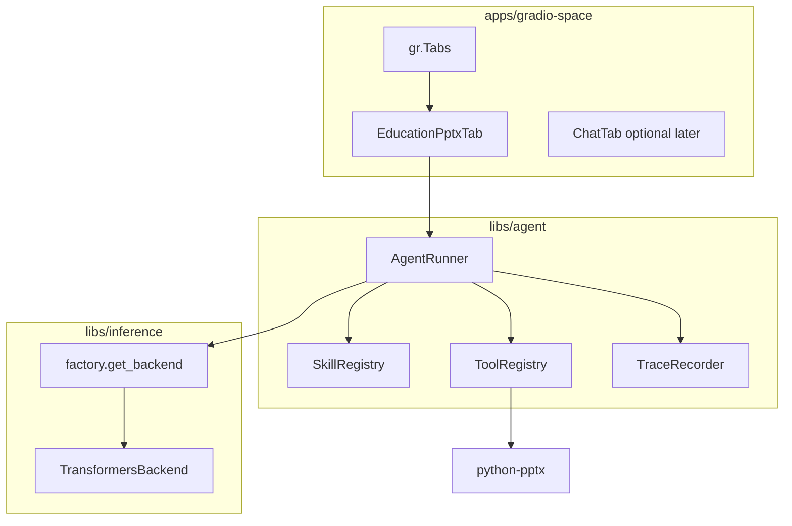

# Skill Agent + Education PowerPoint (Phase 1)

## Goal

Replace the generic chat demo with a **local skill-based agent** that uses your **transformers** presets (default: `minicpm5-1b` or `openbmb/MiniCPM5-1B` from [`models.yaml`](models.yaml)) to run a real workflow: **topic in → slide outline → downloadable `.pptx` out**.

This follows the **agentskills.io / Hermes SKILL.md pattern** without embedding the full Hermes runtime (too heavy for HF Space Docker).

**Hackathon alignment:** Backyard AI (teacher/tutor you know), **Best Agent**, **Tiny Titan** (≤4B), **OpenBMB** (MiniCPM), **Sharing is Caring** (publish trace JSON to Hub), optional **Well-Tuned** if you ship a fine-tuned preset later.

---

## Architecture



**Agent loop (simple, reliable for small models):**

1. Load skill `education-pptx` from `skills/education-pptx/SKILL.md`
2. User provides: topic, grade level, number of slides (3–8)
3. **Step A — LLM:** generate structured slide outline (JSON schema in prompt; parse with fallback regex)
4. **Step B — Tool:** `create_pptx(outline)` writes file via `python-pptx` (deterministic; no LLM needed for file bytes)
5. **Step C — LLM (optional):** one-sentence “teacher notes” per slide
6. Return: trace steps + `gr.File` download + markdown preview

Small models are weak at multi-hop tool JSON — keep the loop **fixed 2-step** (outline → tool) rather than open-ended ReAct for v1.

---

## New package: `libs/agent`

Add workspace member `libs/agent` with:

| Module | Responsibility |
|--------|----------------|
| `skills.py` | Load `SKILL.md` (YAML frontmatter + body), list skills by `task` tag |
| `tools.py` | Register callable tools with name, description, JSON schema |
| `runner.py` | `AgentRunner.run(skill_id, user_input, backend)` — orchestrates LLM + tools |
| `trace.py` | Append-only step log (`thought`, `tool_call`, `tool_result`, `artifact`) |
| `prompts.py` | Skill-specific system prompts and JSON outline template |

**Dependencies:** `inference` (workspace), `python-pptx`, `pydantic` (outline validation)

**Extend [`libs/inference/src/inference/base.py`](libs/inference/src/inference/base.py) usage only** — no changes required to `TransformersBackend` beyond optionally bumping `max_tokens` for outline generation via env or per-call kwargs (already supported in [`transformers.py`](libs/inference/src/inference/transformers.py)).

---

## First skill: `skills/education-pptx/SKILL.md`

```markdown
---
name: education-pptx
description: Create a short lesson PowerPoint from a topic and grade level
task: education
tools:
  - create_pptx
model_hints:
  - minicpm5-1b
  - qwen3b-gguf
---

## Workflow
1. Ask for topic, audience grade, slide count.
2. Produce JSON outline: title, slides[{title, bullets[], speaker_note}].
3. Call create_pptx with validated outline.
4. Return download link and preview.
```

---

## First tool: `create_pptx`

Implement in `libs/agent/src/agent/tools/pptx.py`:

- Input: Pydantic model `SlideOutline` (title, slides list)
- Output: path under `/tmp/agent_outputs/{run_id}.pptx` (HF Space writable temp)
- Simple template: title slide + bullet slides + optional speaker notes in notes field
- No images in v1 (keeps scope shippable by June 15)

---

## Gradio UI changes: [`apps/gradio-space/src/gradio_space/app.py`](apps/gradio-space/src/gradio_space/app.py)

Refactor into:

```
gradio_space/
  app.py              # build_demo(), launch
  tabs/
    __init__.py
    education_pptx.py # first task tab
    chat.py           # move existing ChatInterface here (secondary tab)
```

**Tab 1 — Lesson Slides (primary submission UI):**

- Inputs: Topic, Grade (dropdown), Slides (slider 3–8)
- Button: Generate
- Outputs: Markdown outline preview, File download, Agent trace (accordion)
- Status line: model name + device from existing `warmup()` / `model_status()`

**Tab 2 — Chat (keep for debugging):** existing chat wired to same `ACTIVE_MODEL`

Use `gr.Tabs()` at top level; only Tab 1 needs polish for demo video.

**Model default for Space:** set `active_model: minicpm5-1b` in [`models.yaml`](models.yaml) (OpenBMB + Tiny Titan). Space hardware: GPU basic if transformers on CPU is too slow.

---

## Trace export (Sharing is Caring badge)

After each run, write trace JSON to `outputs/traces/{run_id}.json` and expose a “Copy trace” / optional Hub dataset upload script:

- `scripts/upload_trace.py` — pushes latest trace to a HF dataset repo (manual one-time setup; not required for v1 demo)

Trace schema (minimal):

```json
{
  "skill": "education-pptx",
  "model": "minicpm5-1b",
  "input": {"topic": "...", "grade": "6", "slides": 5},
  "steps": [{"type": "llm", "prompt_hash": "...", "output": "..."}, {"type": "tool", "name": "create_pptx", "result": "..."}],
  "artifact": "lesson_photosynthesis.pptx"
}
```

---

## Docker / workspace updates

- [`pyproject.toml`](pyproject.toml): add `agent` workspace member + root dep
- [`Dockerfile`](Dockerfile): COPY `libs/agent`, `skills/`, update `uv sync`
- [`apps/gradio-space/pyproject.toml`](apps/gradio-space/pyproject.toml): depend on `agent`
- Update root [`README.md`](README.md) hackathon story: “Lesson slide builder for a teacher you know”

---

## Phase 2 (after v1 ships — not in first PR)

- New tabs: `tabs/quiz_maker.py`, `tabs/worksheet.py` — each maps to a new `skills/*/SKILL.md`
- `SkillRegistry` already supports multiple skills; tabs just call `AgentRunner.run(skill_id=...)`
- **Off-Brand:** custom layout via `gr.Blocks` theming or `gr.Server` if time allows
- Fine-tuned Gemma preset from [`notebook/gemma-finetune.ipynb`](notebook/gemma-finetune.ipynb) for **Well-Tuned** badge

---

## Demo video script (for submission)

1. Introduce real user (teacher/tutor) and problem: “building a 5-slide lesson takes 30+ minutes”
2. Enter topic + grade in Tab 1, click Generate (~30–90s on GPU)
3. Show outline preview + download `.pptx`, open in LibreOffice/Google Slides
4. Show agent trace proving local model + tool pipeline (no cloud LLM API)

---

## Risks and mitigations

| Risk | Mitigation |
|------|------------|
| Small model outputs invalid JSON | Pydantic validate + one repair retry with “fix JSON only” prompt |
| CPU Space too slow | Pin `minicpm5-1b`, use GPU basic, or fallback `qwen3b-gguf` + llama.cpp for outline-only step |
| pptx dependency size | `python-pptx` is lightweight (~few MB) |
| Scope creep (many tabs) | Ship Tab 1 only; stub Tab 2 chat for dev |

---

## Files to create / modify (summary)

**Create:**
- `libs/agent/` (package + runner, tools, skills loader, trace)
- `skills/education-pptx/SKILL.md`
- `apps/gradio-space/src/gradio_space/tabs/education_pptx.py`
- `apps/gradio-space/src/gradio_space/tabs/chat.py`

**Modify:**
- [`apps/gradio-space/src/gradio_space/app.py`](apps/gradio-space/src/gradio_space/app.py) — Tabs shell
- [`models.yaml`](models.yaml) — `active_model: minicpm5-1b` for Space
- [`Dockerfile`](Dockerfile), [`pyproject.toml`](pyproject.toml), workspace lockfile
- [`README.md`](README.md) — product story + agent docs
