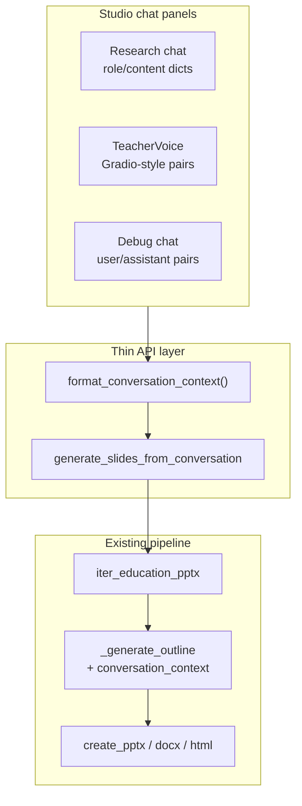
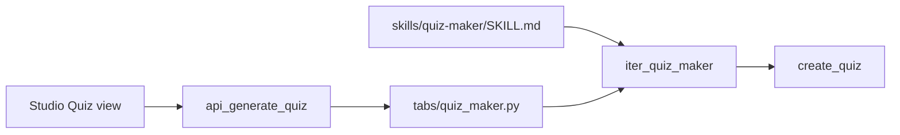

# Slides from conversation + Quiz maker skill

## Context

The slide pipeline is already complete: [`AgentRunner.iter_education_pptx`](libs/agent/src/agent/runner.py) → LLM JSON [`SlideOutline`](libs/agent/src/agent/models.py) → [`create_pptx`](libs/agent/src/agent/tools/pptx.py) / [`create_docx`](libs/agent/src/agent/tools/docx.py) / HTML preview. Studio calls it via [`api_generate_slides`](apps/gradio-space/src/gradio_space/api/studio.py) → [`generate_lesson_slides`](apps/gradio-space/src/gradio_space/tabs/education_pptx.py).

**Gap:** no path from chat history → outline. The TeacherVoice plan explicitly deferred this as Phase 2; [`education_outline_user`](libs/agent/src/agent/prompts.py) already accepts `source_context` for RAG excerpts — conversation text fits the same injection pattern as a separate block (do not mix with RAG chunks).

**Quiz:** planned in [`skill_agent_pptx_5413e3c2.plan.md`](.cursor/plans/skill_agent_pptx_5413e3c2.plan.md) Phase 2 but not implemented. You chose **DOCX + HTML** export, mirroring slides.



---

## Part A — Generate slides from conversation (reuse existing pipeline)

### A1. Normalize chat history (backend)

Add [`apps/gradio-space/src/gradio_space/conversation_helpers.py`](apps/gradio-space/src/gradio_space/conversation_helpers.py):

| `history_kind` | Input shape (already in Studio state) | Format |
|----------------|----------------------------------------|--------|
| `research` | `list[dict]` `{role, content}` | `User: …\nAssistant: …` |
| `gradio` | `list[list[str]]` `[user, assistant]` | same |
| `voice` | `list` from TeacherVoice API | detect dict vs pair; same output |

- Truncate to a safe token budget (~6–8k chars) keeping **most recent** turns.
- Return `(conversation_text, derived_topic)` where `derived_topic` is first non-empty user message (fallback when workspace topic empty).

### A2. Extend agent input + prompt (minimal)

In [`libs/agent/src/agent/models.py`](libs/agent/src/agent/models.py):

```python
conversation_context: str = ""
```

In [`education_outline_user`](libs/agent/src/agent/prompts.py), when `conversation_context` is set, append:

> Base the slide outline on this conversation transcript. Prefer topics and facts discussed over general knowledge.

Pass through [`_generate_outline`](libs/agent/src/agent/runner.py) unchanged except forwarding the new field on `EducationPptxInput`.

### A3. Extend Classic tab + Studio API (one code path)

In [`generate_lesson_slides`](apps/gradio-space/src/gradio_space/tabs/education_pptx.py):

- Add optional params: `conversation_context: str = ""`, `conversation_topic: str = ""`.
- When `conversation_context` is non-empty, use `conversation_topic or resolve_topic(...)` for `EducationPptxInput.topic`.
- Record conversation length in trace notes.

New Studio endpoint in [`api/studio.py`](apps/gradio-space/src/gradio_space/api/studio.py):

```python
api_generate_slides_from_conversation(
    history, history_kind, topic, grade, slide_count,
    session_id, use_rag, doc_ids, source_mode, ...
)
```

- Calls `format_conversation_context`, then delegates to the same finalizer used by `api_generate_slides` (extract shared `_finalize_slide_result()` if helpful — avoid duplicating gallery/canvas HTML assembly).
- Register as `@server.api(name="generate_slides_from_conversation")`.

**Do not** add a second export path — reuse PPTX/DOCX/HTML/gallery rendering already in `generateSlides()`.

### A4. Studio UI — button on all three chats

In [`index.html`](apps/gradio-space/static/studio/index.html), add a secondary button below each chat send button:

- Research: `#btn-research-to-slides` — "Generate slides from chat"
- Voice: `#btn-voice-to-slides`
- Debug: `#btn-debug-to-slides`

In [`studio.js`](apps/gradio-space/static/studio/studio.js):

```javascript
async function generateSlidesFromConversation(kind) {
  const { history, historyKind } = pickHistory(kind); // research | voice | debug
  if (!history?.length) { showError("Start a conversation first."); return; }
  setWorkspaceView("slides"); // existing nav click helper
  startProgressPanel();
  const data = await callApi("generate_slides_from_conversation", [
    history, historyKind, effectiveTopic(...), grade, slideCount, sessionId, ...
  ]);
  finishProgressPanel(data);
  // reuse existing canvas/gallery/download block from generateSlides()
}
```

Refactor: extract shared `renderSlideGenerationResult(data)` from `generateSlides()` so both flows call one renderer.

UX details:

- Disable buttons when history is empty (update in each `render*Chat()`).
- Pre-fill Slides column topic from workspace topic; API falls back to first user message.
- Keep existing source-mode / RAG controls on Slides column — conversation grounds content; RAG still adds indexed excerpts.

### A5. Classic parity (optional, small)

Add matching buttons on Classic [`tabs/chat.py`](apps/gradio-space/src/gradio_space/tabs/chat.py) and [`tabs/teacher_voice.py`](apps/gradio-space/src/gradio_space/tabs/teacher_voice.py) that call the same `generate_lesson_slides(..., conversation_context=...)`. Low effort if time permits; not blocking Studio demo.

---

## Part B — Quiz maker skill (mirror education-pptx)

Follow the exact layering used by [`skills/education-pptx/SKILL.md`](skills/education-pptx/SKILL.md):



### B1. Skill definition

Create [`skills/quiz-maker/SKILL.md`](skills/quiz-maker/SKILL.md):

```yaml
---
name: quiz-maker
description: Create a multiple-choice quiz from a topic and grade level
task: education
tools:
  - create_quiz
model_hints:
  - minicpm5-1b
---
```

Workflow body: ask topic + grade + question count (5–10), output JSON, call `create_quiz`, return preview + downloads.

Optional [`skills/quiz-maker/references/mcq-format.md`](skills/quiz-maker/references/mcq-format.md) — 4 choices, one correct, short explanation (keeps small models on-rails).

### B2. Models + prompts

In [`models.py`](libs/agent/src/agent/models.py):

```python
class QuizQuestion(BaseModel):
    prompt: str
    choices: list[str] = Field(min_length=4, max_length=4)
    correct_index: int = Field(ge=0, le=3)
    explanation: str = ""

class QuizOutline(BaseModel):
    title: str
    instructions: str = ""
    questions: list[QuizQuestion] = Field(min_length=3, max_length=12)

class QuizMakerInput(BaseModel):
    topic: str
    grade: str
    question_count: int = Field(ge=5, le=10, default=5)
    # same source fields as EducationPptxInput: source_mode, urls, session_id, doc_ids, ...
    conversation_context: str = ""  # future-friendly; not wired in v1 UI
```

In [`prompts.py`](libs/agent/src/agent/prompts.py): `quiz_outline_system`, `quiz_outline_user`, `quiz_outline_repair`, `fallback_quiz`, `quiz_to_markdown` — same retry/repair pattern as slides.

### B3. Export tool

New [`libs/agent/src/agent/tools/quiz.py`](libs/agent/src/agent/tools/quiz.py):

- `create_quiz_docx(outline)` — title, instructions, numbered questions, A–D choices; **answer key on final page** (teacher-only section).
- `create_quiz_html(outline)` — printable student worksheet + collapsed answer key.
- Register `create_quiz` in [`tools_registry.py`](libs/agent/src/agent/tools_registry.py) (handler writes both files, returns paths dict or primary path + side effect like docx flow).

### B4. Runner

In [`runner.py`](libs/agent/src/agent/runner.py):

- `QUIZ_MAKER_SKILL = "quiz-maker"`
- `iter_quiz_maker()` — copy structure of `_iter_education_pptx_steps`:
  1. load model
  2. `_gather_lesson_source_context()` (reuse as-is for web/RAG grounding)
  3. `_generate_quiz_outline()`
  4. `create_quiz` tool → docx + html
  5. markdown preview + trace

Add `QuizGenerationProgress` in [`progress.py`](libs/agent/src/agent/progress.py) (or genericize step labels — prefer small duplicate over refactor).

### B5. Classic tab

New [`apps/gradio-space/src/gradio_space/tabs/quiz_maker.py`](apps/gradio-space/src/gradio_space/tabs/quiz_maker.py):

- Inputs: topic, grade, question count, source mode (reuse `SOURCE_MODES` / URL discover from [`education_pptx.py`](apps/gradio-space/src/gradio_space/tabs/education_pptx.py))
- Outputs: markdown preview, DOCX + HTML downloads, trace accordion
- Wire in [`app.py`](apps/gradio-space/src/gradio_space/app.py) + [`tabs/__init__.py`](apps/gradio-space/src/gradio_space/tabs/__init__.py) as **"Quiz maker"** tab after Lesson slides.

### B6. Studio API + UI

In [`api/studio.py`](apps/gradio-space/src/gradio_space/api/studio.py):

- `api_generate_quiz(...)` wrapping tab generator; return `outline_md`, `preview_html`, `downloads: {docx, html}`, `trace_json`, `status`.

In Studio:

- Sidebar nav: **Quiz** (`data-view="quiz"`) in [`index.html`](apps/gradio-space/static/studio/index.html)
- New column/section: topic, grade, question count, source controls (copy Slides column pattern), Generate button, preview + downloads
- [`studio.css`](apps/gradio-space/static/studio/studio.css): `data-view="quiz"` layout (single-column like Voice/Coach)
- [`studio.js`](apps/gradio-space/static/studio/studio.js): `generateQuiz()` + progress steps

### B7. Tests + docs

- Unit tests in `libs/agent/tests/`: JSON parse/repair for quiz outline, docx/html smoke test with `fallback_quiz`.
- Update [`apps/gradio-space/README.md`](apps/gradio-space/README.md): new API names + demo step ("research chat → Generate slides from chat"; "Quiz maker tab").

---

## Implementation order

1. **Conversation helper + agent prompt extension** — unblocks backend for all chat sources
2. **`generate_slides_from_conversation` API** — wire once, test with sample history
3. **Studio buttons + shared render helper** — user-visible slides-from-chat on all three panels
4. **Quiz skill stack** (models → tool → runner → Classic tab)
5. **Studio Quiz view + API**
6. Classic chat/voice slide buttons + README (if time)

---

## Risks

| Risk | Mitigation |
|------|------------|
| Long chat histories exceed model context | Truncate to recent turns; cap chars in `format_conversation_context` |
| Small model emits invalid quiz JSON | Same repair/retry/fallback pattern as slides |
| Three history formats diverge | Single normalizer with unit tests per kind |
| Scope creep (quiz from conversation) | Defer; `conversation_context` on `QuizMakerInput` is ready but UI not in v1 |

---

## Files to create

- [`apps/gradio-space/src/gradio_space/conversation_helpers.py`](apps/gradio-space/src/gradio_space/conversation_helpers.py)
- [`skills/quiz-maker/SKILL.md`](skills/quiz-maker/SKILL.md)
- [`libs/agent/src/agent/tools/quiz.py`](libs/agent/src/agent/tools/quiz.py)
- [`apps/gradio-space/src/gradio_space/tabs/quiz_maker.py`](apps/gradio-space/src/gradio_space/tabs/quiz_maker.py)

## Files to modify

- [`libs/agent/src/agent/models.py`](libs/agent/src/agent/models.py), [`prompts.py`](libs/agent/src/agent/prompts.py), [`runner.py`](libs/agent/src/agent/runner.py), [`tools_registry.py`](libs/agent/src/agent/tools_registry.py)
- [`apps/gradio-space/src/gradio_space/tabs/education_pptx.py`](apps/gradio-space/src/gradio_space/tabs/education_pptx.py), [`api/studio.py`](apps/gradio-space/src/gradio_space/api/studio.py), [`app.py`](apps/gradio-space/src/gradio_space/app.py)
- [`apps/gradio-space/static/studio/index.html`](apps/gradio-space/static/studio/index.html), [`studio.js`](apps/gradio-space/static/studio/studio.js), [`studio.css`](apps/gradio-space/static/studio/studio.css)
