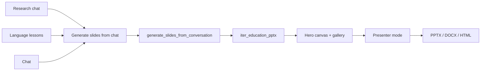

# Slides from chat + presenter mode

## Why this sprint

Last sprint shipped **demo polish** ([`last_sprint_demo_polish_2f148411.plan.md`](.cursor/plans/last_sprint_demo_polish_2f148411.plan.md)) — Chat labels, honest loading hints, export clarity. The deferred backend work lives in [`slides_from_chat_+_quiz_f53701a3.plan.md`](.cursor/plans/slides_from_chat_+_quiz_f53701a3.plan.md) **Part A only**.

**Wahou moment:** A teacher researches a topic → asks questions with citations → taps **Generate slides from this chat** → previews in **presenter mode** (fullscreen, arrow keys) → downloads PPTX. One continuous story on `/`.



## What already exists (reuse, do not rebuild)

| Piece | Location |
|-------|----------|
| Slide agent loop | [`libs/agent/src/agent/runner.py`](libs/agent/src/agent/runner.py) `iter_education_pptx` |
| RAG/source grounding | [`education_pptx.py`](apps/gradio-space/src/gradio_space/tabs/education_pptx.py) + `source_mode` |
| Studio generate + render | [`studio.js`](apps/gradio-space/static/studio/studio.js) `generateSlides()`, canvas/gallery/downloads |
| Static HTML deck cards | [`libs/agent/src/agent/preview.py`](libs/agent/src/agent/preview.py) `.lesson-deck` |
| PNG thumbnail strip | `gallery_html` in slide API response |

**Gap:** No `conversation_context` on [`EducationPptxInput`](libs/agent/src/agent/models.py). No `generate_slides_from_conversation` API. No chat → Slides buttons. No presenter UI (gallery opens raw PNG in new tab; canvas is vertically stacked scroll).

---

## Part 1 — Backend: conversation → outline

### 1.1 `conversation_helpers.py`

Create [`apps/gradio-space/src/gradio_space/conversation_helpers.py`](apps/gradio-space/src/gradio_space/conversation_helpers.py):

- `format_conversation_context(history, history_kind)` normalizes three Studio shapes:
  - `research`: `list[{role, content}]`
  - `gradio` / `voice` / `debug`: `list[[user, assistant]]` or dict variants
- Truncate to ~6–8k chars (keep **recent** turns)
- Return `(conversation_text, derived_topic)` — `derived_topic` = first non-empty user message

Unit tests: one case per `history_kind`.

### 1.2 Agent prompt extension (minimal)

In [`models.py`](libs/agent/src/agent/models.py):

```python
conversation_context: str = ""
```

In [`prompts.py`](libs/agent/src/agent/prompts.py) `education_outline_user`: when set, append instruction to base outline on transcript facts (separate block from RAG `source_context`).

Forward through [`_generate_outline`](libs/agent/src/agent/runner.py).

### 1.3 Tab + API

[`generate_lesson_slides`](apps/gradio-space/src/gradio_space/tabs/education_pptx.py):

- Add `conversation_context: str = ""`, `conversation_topic: str = ""`
- Topic = `conversation_topic or resolve_topic(...)` when context non-empty
- Trace note: conversation char count

[`api/studio.py`](apps/gradio-space/src/gradio_space/api/studio.py):

```python
@server.api(name="generate_slides_from_conversation")
def api_generate_slides_from_conversation(history, history_kind, topic, grade, slide_count, ...)
```

Delegate to shared finalizer with `api_generate_slides` (extract `_finalize_slide_result()` if duplicated).

---

## Part 2 — Studio UI: buttons on all chat surfaces

### 2.1 Buttons ([`index.html`](apps/gradio-space/static/studio/index.html))

Secondary actions below send on each chat panel:

| Panel | ID | Label |
|-------|-----|-------|
| Research | `#btn-research-to-slides` | Generate slides from chat |
| Language lessons | `#btn-lessons-to-slides` | Generate slides from chat |
| Chat | `#btn-chat-to-slides` | Generate slides from chat |

Disable when history empty (update in each `render*Chat()`).

### 2.2 JS flow ([`studio.js`](apps/gradio-space/static/studio/studio.js))

```javascript
async function generateSlidesFromConversation(kind) { ... }
```

- `setWorkspaceView("slides")` — user sees hero canvas fill
- Reuse `startProgressPanel` / `SLIDE_PIPELINE_STEPS`
- **Refactor:** extract `renderSlideGenerationResult(data)` from `generateSlides()` — both paths call it
- Pre-fill topic from workspace; API falls back to `derived_topic`
- RAG/source controls on Slides column still apply (conversation + indexed docs)

### 2.3 Classic parity (optional, ~1h)

Same params on [`tabs/chat.py`](apps/gradio-space/src/gradio_space/tabs/chat.py) and language-lesson tab — not blocking Studio demo.

---

## Part 3 — Presenter mode (frontend-only wow)

No new LLM calls. Wrap existing `canvas_html` / gallery images.

### 3.1 Presenter overlay

Add to Slides view ([`index.html`](apps/gradio-space/static/studio/index.html) + [`studio.css`](apps/gradio-space/static/studio/studio.css)):

- **Present** button in slide toolbar (enabled after generation)
- Fullscreen overlay: one slide at a time, 16:9 card centered
- Controls: Prev / Next, slide counter `3 / 8`, Esc to exit, `←` `→` keyboard
- Optional: speaker notes drawer (data already in outline HTML if exposed; else parse from `.lesson-slide` DOM)

### 3.2 Data source priority

1. If `data.gallery` PNG paths exist → use `` per slide (cleanest presenter)
2. Else parse `.lesson-slide` nodes from injected `canvas_html`
3. Title slide = index 0

### 3.3 UX polish (wahou details)

- Animate slide transition (fade 150ms)
- Topbar **Present** icon (`present_to_all`) mirrors sidebar Slides nav
- After **Generate slides from chat**, auto-scroll to canvas + pulse Present button once
- Bump `STUDIO_ASSET_VERSION` in [`server.py`](apps/gradio-space/src/gradio_space/server.py)

---

## Demo script (2 min add-on)

1. Research ingest on "photosynthesis" → ask 2 RAG questions with citations
2. **Generate slides from chat** → 3 slides on GPU
3. Click **Present** → arrow through deck
4. Download PPTX + expand Agent trace

---

## Risks

| Risk | Mitigation |
|------|------------|
| Long chat blows context | Truncate in `format_conversation_context` |
| CPU still slow | Keep 3-slide demo tip; presenter works on cached result |
| Gallery vs HTML mismatch | Prefer PNG gallery for presenter when available |

---

## Files

**Create:** `conversation_helpers.py`, tests in `apps/gradio-space/tests/`

**Modify:** `models.py`, `prompts.py`, `runner.py`, `education_pptx.py`, `api/studio.py`, `index.html`, `studio.js`, `studio.css`, `server.py`, `apps/gradio-space/README.md`

**Explicitly out of scope:** Quiz (separate plan), mindmap (sprint 2)

## Estimated effort

| Block | Time |
|-------|------|
| Backend conversation path | 2–3h |
| Studio buttons + shared render | 2h |
| Presenter overlay | 3–4h |
| Tests + demo polish | 1–2h |
| **Total** | **~1 day** |
