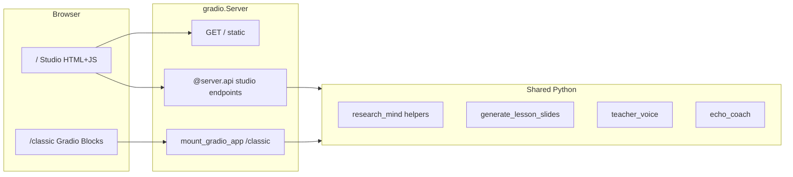
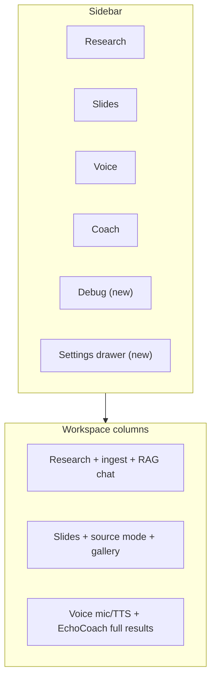

# Studio vs Classic and Parity Roadmap

## Current split (recap)

Both UIs run from the same [`server.py`](apps/gradio-space/src/gradio_space/server.py): Studio at `/`, Classic at `/classic`.



| Dimension | Studio (`/`) | Classic (`/classic`) |
|-----------|--------------|----------------------|
| **UX** | M3 sidebar + 3-column workspace; demo-first guided steps | Tab-per-feature; Settings + Advanced accordions |
| **Navigation** | Sidebar views (Research / Slides / Voice / Coach) | 5 tabs including Chat (debug) |
| **Audience** | Judges, teachers, first-time users | Power users, debugging |

**Feature gaps today** (Classic has, Studio lacks or simplifies):

- Chat (debug) tab
- Full settings (model reload, optional preset switch, voice stack info)
- Lesson **web search** source modes during generation (Studio hardcodes RAG-or-model-only in [`api_generate_slides`](apps/gradio-space/src/gradio_space/api/studio.py))
- Slide **preview image gallery** (Studio sets `skip_preview_images=True`)
- TeacherVoice **audio in + TTS out** (Studio uses `run_teacher_voice_text_turn` only)
- EchoCoach **charts, transcript HTML, VoiceOut playback** (API returns them; [`studio.js`](apps/gradio-space/static/studio/studio.js) ignores them)
- **Server mic recording** (Classic uses [`build_recording_block`](apps/gradio-space/src/gradio_space/ui/components.py); no Studio API yet)
- **Advanced trace JSON** on most actions
- K–12 grade list; language/ASR preset selectors

**Strategy:** Do not duplicate business logic. Every new Studio capability should be a thin wrapper in [`api/studio.py`](apps/gradio-space/src/gradio_space/api/studio.py) calling the same functions Classic tabs already use.

---

## Phase 1 — UI-only (no backend changes)

These are the smoothest wins: data is already returned by existing APIs.

| Add to Studio | Where | Effort |
|---------------|-------|--------|
| EchoCoach transcript + filler/pace chart images + VoiceOut `<audio>` | Extend [`render_echo_coach_panel`](apps/gradio-space/src/gradio_space/ui/studio_html.py) or render in `analyzePitch()` using `transcript_html`, `filler_chart`, `pace_chart`, `voiceout_path` from `analyze_pitch` response | Small |
| Slide thumbnail strip below canvas | Use `gallery` array already returned by `generate_slides` (flip `skip_preview_images=False` in one line) | Small |
| Collapsible **Debug trace** drawer | Show `trace_summary` / `progress_log` / parsed `progress.steps` already wired in [`studio.js`](apps/gradio-space/static/studio/studio.js) | Small |
| Expand grade dropdown to match Classic | [`index.html`](apps/gradio-space/static/studio/index.html) only | Trivial |

Keep Studio visually clean: traces and charts go in collapsed `<details>` panels, not always-visible Gradio-style accordions.

---

## Phase 2 — Thin API wrappers (reuse Classic functions)

Add endpoints in [`register_studio_apis`](apps/gradio-space/src/gradio_space/api/studio.py); wire from [`studio.js`](apps/gradio-space/static/studio/studio.js) via existing `callApi()`.

### 2a. Settings drawer (sidebar link today → real panel)

```python
# New wrappers — same as settings_panel.py
api_reload_model(model_key: str) -> ok(status_markdown=reload_model(key))
api_model_choices() -> ok(choices=..., active=..., allow_switch=...)
```

- UI: slide-over drawer from "Classic / Settings" nav item (keep `/classic` link as escape hatch)
- Show: active model, backend, reload button, voice stack summary (copy strings from [`settings_panel.py`](apps/gradio-space/src/gradio_space/ui/settings_panel.py))
- Only expose preset dropdown when `allow_model_switch` is true (same guard as Classic)

### 2b. Lesson web search source modes

Extend `api_generate_slides` signature to accept Classic's existing params:

- `source_mode`: `"none" | "web" | "rag"` (maps to `SOURCE_MODES` in [`education_pptx.py`](apps/gradio-space/src/gradio_space/tabs/education_pptx.py))
- `search_workflow`: `"two_step" | "auto"`
- `urls_text`, `selected_urls`, `upload_files`

Pass through to `generate_lesson_slides(...)` instead of hardcoded `"RAG (indexed sources)"` / `"Two-step"`.

UI: add a compact "Source mode" control in the Slides column (collapsed by default, mirroring Classic's "Research sources" accordion). When `web` + `two_step`, reuse the discover URL panel pattern already in the Research column.

### 2c. Chat (debug)

```python
api_debug_chat(message, history, use_rag, session_id, doc_ids, model_key=None)
  -> rag_aware_chat(...)  # from research_helpers.py
```

UI: new sidebar nav item **Debug** (or footer link) opening a simple chat column — same pattern as Research chat in [`index.html`](apps/gradio-space/static/studio/index.html). Optional model override only when `allow_model_switch`.

### 2d. TeacherVoice audio turn

```python
api_teacher_voice_audio_turn(audio_path, mode, topic, session_id, use_rag, history, ...)
  -> run_teacher_voice_turn(...)  # same as teacher_voice.send_turn
```

Keep existing `teacher_voice_turn` for text. Return `voiceout_path` in response for `<audio>` playback.

### 2e. Recording control

Wrap [`start_server_recording`](libs/echocoach/src/echocoach/recording.py) / `stop_server_recording` / `recording_backend_status`:

```python
api_recording_status() -> ok(backend, message)
api_recording_start(max_seconds)
api_recording_stop() -> ok(path, warning)
```

**HF Space note:** server-side mic often fails in Docker. Add **browser `MediaRecorder` fallback** in Studio JS (record → `save_upload` → analyze/turn). Classic already documents upload as alternative; Studio should prefer browser mic on Space, server mic locally.

---

## Phase 3 — Studio UI structure for parity

Minimal layout changes to absorb new controls without breaking the demo flow.



Concrete HTML/JS edits:

- [`index.html`](apps/gradio-space/static/studio/index.html): Settings drawer markup; Debug view; source mode controls on Slides; mic buttons on Voice/Coach; `<details>` debug trace blocks
- [`studio.js`](apps/gradio-space/static/studio/studio.js): handlers for new APIs; MediaRecorder helper; render charts/audio/transcript
- [`studio.css`](apps/gradio-space/static/studio/studio.css): drawer, debug chat, chart row, gallery strip
- [`studio_html.py`](apps/gradio-space/src/gradio_space/ui/studio_html.py): richer EchoCoach + optional trace HTML helpers

**Do not rewrite Classic.** Classic stays the full fallback; Studio cross-links remain.

---

## Phase 4 — Polish and Space hardening

| Item | Approach |
|------|----------|
| EchoCoach `speak_rewrite` + language/ASR presets | Add optional params to `analyze_pitch` API (already accepted in Classic's `analyze_pitch`) |
| ResearchMind memory summary | Call `memory_summary(session_id)` in `list_documents` or dedicated `api_session_memory` |
| Per-tab doc filter | Already partially there via workspace checkboxes; add "limit to selected docs" hint in Slides/Voice when subset checked |
| Streaming slide progress | Harder: Classic yields interim updates via Gradio generator; Studio currently waits for final API response. **Defer** unless needed — Phase 1 progress steps from trace JSON may suffice |
| README / demo script | Update [`apps/gradio-space/README.md`](apps/gradio-space/README.md) with new API names and note Studio ≈ Classic parity |

---

## Recommended implementation order

1. **Phase 1** (1–2 hours): EchoCoach full results, gallery, debug drawer, grades — immediate parity feel, zero backend risk
2. **Phase 2a** Settings drawer — unblocks model reload without leaving Studio
3. **Phase 2d + 2e** Voice audio + recording — highest user-visible gap for Voice/Coach columns
4. **Phase 2b** Web search slides — completes Lesson slides parity
5. **Phase 2c** Debug chat — last major Classic-only tab
6. **Phase 4** presets, memory, docs

---

## Files touched (summary)

| File | Changes |
|------|---------|
| [`api/studio.py`](apps/gradio-space/src/gradio_space/api/studio.py) | New APIs; extend `generate_slides`, `analyze_pitch`, `teacher_voice_*` |
| [`static/studio/index.html`](apps/gradio-space/static/studio/index.html) | Settings drawer, Debug view, source mode, mic controls |
| [`static/studio/studio.js`](apps/gradio-space/static/studio/studio.js) | Wire new APIs, MediaRecorder, rich result rendering |
| [`static/studio/studio.css`](apps/gradio-space/static/studio/studio.css) | Drawer, gallery, charts layout |
| [`ui/studio_html.py`](apps/gradio-space/src/gradio_space/ui/studio_html.py) | EchoCoach + trace render helpers |
| [`README.md`](apps/gradio-space/README.md) | Updated API list and parity notes |

No changes to Classic tab logic beyond what Studio wrappers import.
