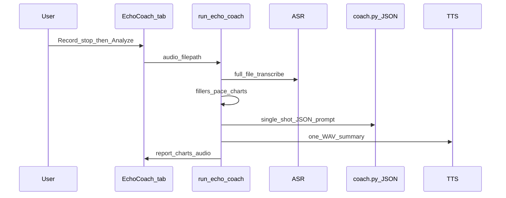
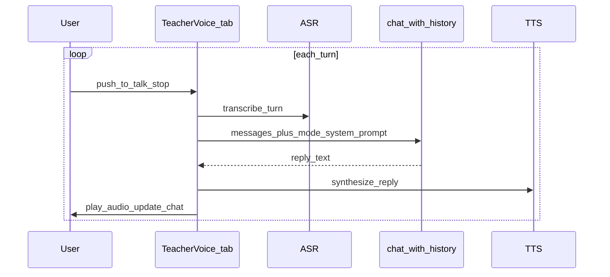

# TeacherVoice — from EchoCoach review to real-time voice teacher

## What “coach help” is today

In this repo, **coach help = EchoCoach** — a separate Gradio tab, not a global assistant.

| What it does | What it does **not** do |
|--------------|-------------------------|
| Records up to 30s of **your** monologue (pitch practice) | Talk back-and-forth in a conversation |
| Transcribes → scores fillers/pace → one LLM **JSON report** | Explain lesson topics on demand |
| Speaks **one** Piper TTS clip (summary or rewrite) | Create slides or pitch decks by voice |
| Runs once per click on **Analyze pitch** | Stream partial audio or interrupt mid-sentence |

Pipeline (batch, sequential):

Key code: [`libs/echocoach/src/echocoach/pipeline.py`](libs/echocoach/src/echocoach/pipeline.py) orchestrates ASR → analysis → [`coach.py`](libs/echocoach/src/echocoach/coach.py) → Piper. UI is [`apps/gradio-space/src/gradio_space/tabs/echo_coach.py`](apps/gradio-space/src/gradio_space/tabs/echo_coach.py).

**Lesson slides** ([`education_pptx.py`](apps/gradio-space/src/gradio_space/tabs/education_pptx.py)) and **Chat (debug)** ([`chat.py`](apps/gradio-space/src/gradio_space/tabs/chat.py)) are unrelated tabs: slides are batch `AgentRunner` jobs; chat is **text-only** multi-turn (optionally RAG via [`rag_aware_chat`](apps/gradio-space/src/gradio_space/research_helpers.py)).

There is **no `TeacherVoice` name, WebSocket, or streaming voice** anywhere in the codebase. The EchoCoach plan explicitly deferred duplex:

> Real-time duplex | Deferred; MVP is record-then-analyze

---

## How TeacherVoice differs (target behavior)

**TeacherVoice** (what you’re describing) is a **conversational voice teacher**:

- You speak a **question or short turn** → teacher **replies in voice** → repeat
- Modes share one chat history but different system prompts:
  - **Explain** — tutor a topic in plain language (optionally grounded in ResearchMind RAG)
  - **Lesson** — discuss/outline a lesson verbally (can hand off topic to Lesson slides tab)
  - **Pitch** — lighter coaching per turn (“try opening with X”) instead of one big JSON report

This is **turn-based pseudo-real-time** (typical latency: ~2–8s per turn on GPU). True **duplex** TeacherVoice (interrupt while speaking, sub-second feel) would need streaming ASR + chunked TTS or an omni speech model — not present today.

---

## Recommended architecture (phased)

### Phase 1 — TeacherVoice tab (MVP, fits current stack)

Add a **TeacherVoice** tab alongside EchoCoach; keep EchoCoach as the deep pitch *analyzer*.

**New module** in `libs/echocoach` (minimal new package surface):

- `teacher_voice.py` — `run_teacher_voice_turn(audio_path, history, mode, language, backend, rag_context?) -> TeacherVoiceTurnResult`
- `prompts.py` — mode system prompts (`explain`, `lesson`, `pitch`) as **plain text** chat (not JSON like EchoCoach)
- Reuse: [`recording.py`](libs/echocoach/src/echocoach/recording.py), ASR factory, Piper TTS, `InferenceBackend.chat()`

**New Gradio tab** `teacher_voice.py`:

- Mode dropdown: Explain | Lesson coach | Pitch practice
- Optional: ResearchMind session/docs (copy pattern from [`chat.py`](apps/gradio-space/src/gradio_space/tabs/chat.py))
- Topic field for Lesson/Explain modes
- **Push-to-talk**: reuse Start/Stop recording from EchoCoach (already works server-side)
- `gr.Chatbot` (text history) + `gr.Audio` auto-play for teacher reply
- “Clear conversation” button

**Turn flow per button press:**

1. Stop recording → WAV path
2. ASR → user text (show in chat)
3. Build messages: `system(mode)` + `history` + optional RAG context block + `user(transcript)`
4. `backend.chat()` — same stack as debug chat ([`inference`](libs/inference/src/inference/base.py) has no streaming today; full response is fine for MVP)
5. Piper TTS → play reply
6. Append `(user, assistant)` to history

**Pitch mode vs EchoCoach:** Pitch mode gives **conversational** tips each turn; EchoCoach remains the **quantitative** tool (WPM, filler charts, rewrite JSON). Link from TeacherVoice: “Deep analysis → open EchoCoach tab with last recording.”

**Lesson mode:** Does not generate `.pptx` by voice in MVP. It verbally outlines and explains; user can copy topic into Lesson slides tab. Phase 2 can add “Generate slides from this conversation” button calling `AgentRunner.run_education_pptx`.

### Phase 2 — Faster “feels live” (still not full duplex)

- **VAD / max 15s turns** — cap turn length for lower latency
- **Sentence-chunked TTS** — split LLM reply on `.!?`, synthesize first sentence while rest generates (reuse Piper in a small loop)
- **Optional streaming ASR** — only if a backend supports partial transcripts (Cohere batch is fine for MVP; whisper stays file-based)
- Latency target: first audio ~3s after stop on GPU

### Phase 3 — True speech-in/speech-out (optional, GPU-heavy)

From [`echocoach_voice_tab` plan](.cursor/plans/echocoach_voice_tab_45e774f7.plan.md), not implemented:

- Add `minicpm-o-4.5` preset to [`voice_models.yaml`](voice_models.yaml) behind `ECHOCOACH_VOICE_PROFILE=omni`
- New omni backend in `libs/echocoach` (or `libs/inference`) with `init_audio=True, init_tts=True`
- TeacherVoice tab switches to omni when profile=omni and GPU available
- EN/ZH only initially; falls back to Phase 1 pipeline otherwise

Skip WebSocket server unless you need browser-native duplex outside Gradio — Gradio turn-based is enough for hackathon demo.

---

## What to reuse vs build new

| Component | Reuse | New work |
|-----------|-------|----------|
| Mic capture | `recording.py`, `gr.Audio` | Wire to per-turn handler |
| ASR | `asr/factory.py` | Call per turn, not once per monologue |
| LLM | `get_backend().chat()` | Mode prompts + multi-turn history (like chat tab) |
| RAG | `run_research_question` / `rag_aware_chat` logic | Inject retrieved context into TeacherVoice system prompt |
| TTS | `tts/piper.py` | Per-turn synthesis; optional chunking in Phase 2 |
| Pitch analytics | `analysis/fillers.py`, `pace.py` | **Not** on every TeacherVoice turn — keep in EchoCoach only |
| Lesson PPTX | `AgentRunner.run_education_pptx` | Phase 2 button, not MVP voice loop |

---

## Files to touch (Phase 1)

| File | Change |
|------|--------|
| [`libs/echocoach/src/echocoach/teacher_voice.py`](libs/echocoach/src/echocoach/teacher_voice.py) | **New** — turn orchestration + result type |
| [`libs/echocoach/src/echocoach/prompts.py`](libs/echocoach/src/echocoach/prompts.py) | **New** — Explain / Lesson / Pitch system prompts |
| [`apps/gradio-space/src/gradio_space/tabs/teacher_voice.py`](apps/gradio-space/src/gradio_space/tabs/teacher_voice.py) | **New** — UI |
| [`apps/gradio-space/src/gradio_space/app.py`](apps/gradio-space/src/gradio_space/app.py) | Register TeacherVoice tab |
| [`apps/gradio-space/src/gradio_space/tabs/__init__.py`](apps/gradio-space/src/gradio_space/tabs/__init__.py) | Export builder |
| [`USAGE.md`](USAGE.md) | Document modes, latency expectations, EchoCoach vs TeacherVoice |
| [`libs/echocoach/tests/test_teacher_voice.py`](libs/echocoach/tests/test_teacher_voice.py) | Mock-backend tests for prompt assembly + history |

EchoCoach files stay unchanged except optional cross-link in UI markdown.

---

## Hardware and UX expectations

- **CPU-only:** Whisper tiny ASR + MiniCPM5 1B + Piper — workable but ~5–15s per turn; set expectations in UI
- **GPU:** Cohere Transcribe + same coach model — better for demo
- **HF Space:** Upload/push-to-talk may be limited; document local-only mic (same as EchoCoach)
- Label honestly: **“Voice conversation (turn-based)”** until Phase 3 omni

---

## Success criteria for MVP

- User can hold a **3+ turn** spoken conversation in Explain mode
- Lesson mode accepts a topic + optional RAG session and answers from ingested docs with citations in chat text
- Pitch mode gives short spoken coaching without requiring Analyze pitch
- EchoCoach tab still works independently for full pitch analysis
- Trace JSON per session under `outputs/traces/` (skill: `teacher-voice`)

---

## Risks

| Risk | Mitigation |
|------|------------|
| Users expect ChatGPT Voice latency | UI copy: turn-based; show “Transcribing / Thinking / Speaking” states |
| RAG + voice doubles latency | Retrieve once per turn; keep `max_tokens` modest (~512) |
| Piper missing voice for language | Existing English fallback in [`voice_models.yaml`](voice_models.yaml) |
| Confusion between EchoCoach and TeacherVoice | Separate tabs; Pitch mode points to EchoCoach for charts |
