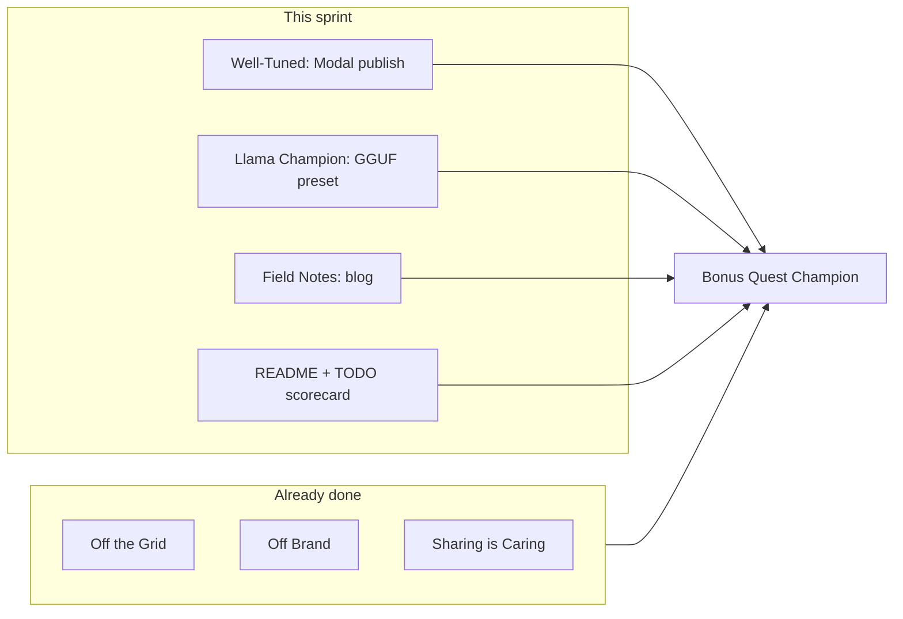

# TODO.md Last Sprint Tracks Plan

Target: **6 merit badges + Bonus Quest Champion** per [TODO.md](TODO.md). Three badges remain open; demo video and core submission are already done per [README.md](README.md).



**Key constraint (your choice):** Main HF Space stays on `ACTIVE_MODEL=minicpm5-1b` (transformers) so the live teacher demo and LoRA adapter story remain intact. Llama Champion is satisfied via a new **local llama.cpp preset + documented demo**, not a Space switch.

---

## Track 1 — Well-Tuned: publish one public adapter

**Status:** Pipeline is complete ([`research/modal/finetune_app.py`](research/modal/finetune_app.py), [`experiments.yaml`](research/modal/experiments.yaml), [`_common.py:render_model_card`](research/modal/_common.py)). Missing piece is an operational GPU run that passes the gate and lands on the Hub.

**Primary job:** `teaching-lora` — aligns with the lesson agent narrative, lowest-friction eval profile (`instructions` / `ifeval`), publishes to `MSGEncrypted/minicpm5-1b-teaching-lora`.

**Run sequence (Modal, not code changes):**

1. Smoke (no publish): `modal run research/modal/finetune_app.py --job teaching-lora --max-steps 20 --no-publish`
2. If gate fails, inspect `gate.checks` output; tune `max_steps` (100 default) or temporarily relax `goals.min_score` / `min_improve` in [`experiments.yaml`](research/modal/experiments.yaml) only if needed for hackathon demo credibility
3. Full publish: `modal run research/modal/finetune_app.py --job teaching-lora` (or `::publish_only` if train/eval artifacts already on Volume)
4. Verify Hub repo is **public**, model card has hackathon tags (already rendered by `render_model_card`), and README links to it

**Optional Space tie-in (after pull):**

```bash
modal volume get slm-finetune teaching-lora ./models/finetuned/minicpm5-1b-lora
# ACTIVE_MODEL=minicpm5-1b-lesson-lora (existing preset in models.yaml)
```

**Acceptance:** At least one adapter with `gate: PASSED` and `published: true` on Hub; update TODO scorecard `[~]` → `[x]`.

---

## Track 2 — Llama Champion: MiniCPM5 GGUF preset + local demo docs

**Confirmed:** Official GGUF exists at [`openbmb/MiniCPM5-1B-GGUF`](https://huggingface.co/openbmb/MiniCPM5-1B-GGUF) (`MiniCPM5-1B-Q4_K_M.gguf`, ~657 MB). No conversion needed. Backend already implemented in [`libs/inference/src/inference/llama_cpp.py`](libs/inference/src/inference/llama_cpp.py).

**Code changes (small, focused):**

1. Add preset to [`models.yaml`](models.yaml):

```yaml
minicpm5-1b-gguf:
  label: MiniCPM5 1B (GGUF, llama.cpp)
  backend: llama_cpp
  model_repo: openbmb/MiniCPM5-1B-GGUF
  model_file: MiniCPM5-1B-Q4_K_M.gguf
  n_ctx: 4096
  n_gpu_layers: 0   # CPU default; document N_GPU_LAYERS for local GPU
```

2. Mirror in [`.env.example`](.env.example) as commented example (alongside existing `qwen3b-gguf` block)
3. Add a short **Llama Champion** subsection to [README.md](README.md) and [USAGE.md](USAGE.md):
   - Set `ACTIVE_MODEL=minicpm5-1b-gguf`
   - Local verify: `uv run --package gradio-space python -m gradio_space.app` → generate slides or Chat tab
   - Optional pre-download: `uv run python scripts/download_model.py --preset minicpm5-1b-gguf`
   - Note: LoRA adapters require transformers; GGUF path uses base MiniCPM5 (still satisfies OpenBMB + Tiny Titan)

**No Space env change** — main Space keeps `minicpm5-1b`. Judges verify llama.cpp via README instructions + optional screenshot or short clip in demo video appendix.

**Acceptance:** Preset loads locally; README documents the path; TODO Llama Champion items checked.

---

## Track 3 — Field Notes: in-repo report + HF blog draft

**Fastest path (in-repo first):** Create [`research/docs/field-notes.md`](research/docs/field-notes.md) with this structure:

| Section | Content source |
|---------|----------------|
| Problem & stack | README + lesson agent narrative |
| Skill-matrix design | [`experiments.yaml`](research/modal/experiments.yaml) jobs (teaching, math, science, …) |
| Pipeline diagram | train → lm-eval baseline → QLoRA → eval → gate → Hub publish |
| Modal ops | Commands from [`research/modal/README.md`](research/modal/README.md) |
| Results | Before/after table from `teaching-lora` gate output (once Track 1 completes) |
| Space integration | Pull adapter → `minicpm5-1b-lesson-lora` preset |
| Repro | `modal run …`, link to Hub adapter + trace repo |

**HF blog (second pass):** Adapt the same markdown into HF blog format (~800–1200 words), add 1–2 screenshots (Modal summary table, Studio slide download). Link from README under a new **Field Notes** badge line.

**Acceptance:** `research/docs/field-notes.md` linked from README; HF blog URL added when published.

---

## Track 4 — README + submission hygiene

Update [`README.md`](README.md) **Badge targets** section (lines 145–153) to add:

- **Llama Champion** — `ACTIVE_MODEL=minicpm5-1b-gguf`, llama.cpp backend, link to Field Notes local demo steps
- **Field Notes** — link to `research/docs/field-notes.md` (+ HF blog when live)
- **Bonus Quest Champion** — note that all 6 merit badges are the qualifying set per TODO

Update [`TODO.md`](TODO.md) checkboxes as each track completes.

**Non-code items (manual):**
- Confirm social post is live (README already claims it; verify URL and add to README if missing)
- Community Choice: share Space link (no repo change)

Demo video is already linked — no action unless you want a 30s llama.cpp appendix clip.

---

## Execution order

| Step | Type | Unblocks |
|------|------|----------|
| 1. Modal `teaching-lora` publish | GPU ops | Well-Tuned badge + Field Notes results section |
| 2. `minicpm5-1b-gguf` preset + docs | Code (~30 min) | Llama Champion badge |
| 3. `research/docs/field-notes.md` | Docs (~2 hr) | Field Notes badge |
| 4. README/TODO scorecard | Docs (~20 min) | Submission completeness |
| 5. HF blog adaptation | Docs (~1 hr) | Stronger judge visibility |

**Estimated total:** ~4–6 hours (Modal GPU time dominates).

---

## Out of scope (explicitly deferred per TODO.md)

- OpenAI / Nemotron / Thousand Token Wood tracks
- Switching main Space to GGUF
- Second HF Space for llama.cpp
- Model verification pipeline ([`.cursor/plans/model_verification_pipeline_ed9d35ab.plan.md`](.cursor/plans/model_verification_pipeline_ed9d35ab.plan.md)) — post-hackathon
- Slides-from-chat / quiz features

---

## Risk mitigations

| Risk | Mitigation |
|------|------------|
| Gate fails on `teaching-lora` | Try `math-lora` (lower `min_score: 0.05`); or increase `max_steps`; inspect Volume results before re-running full train |
| llama.cpp slow on CPU for slides | Document Chat tab as quick verify; slides demo stays on transformers Space |
| HF blog time crunch | In-repo `field-notes.md` satisfies badge narrative; HF blog is polish |
