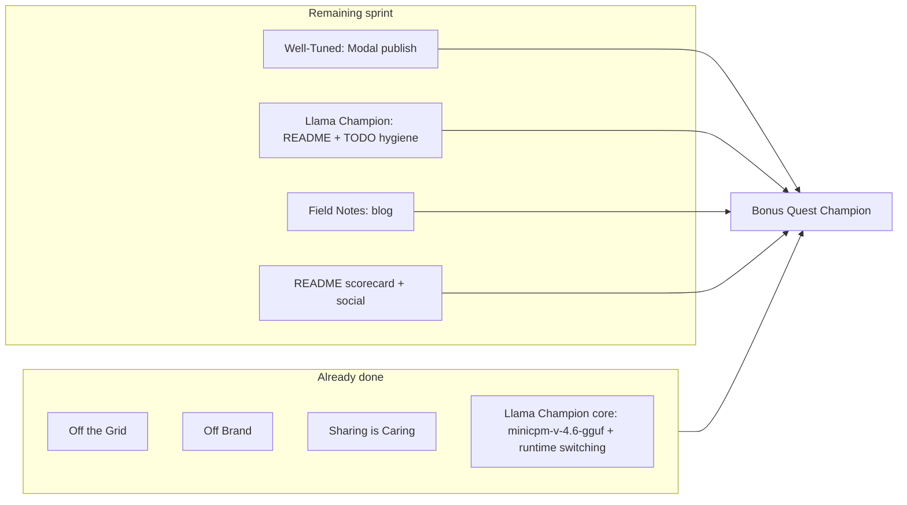

# TODO.md Last Sprint Tracks Plan (updated)

Target: **6 merit badges + Bonus Quest Champion** per [TODO.md](TODO.md).

**Prerequisite completed:** [llama_backend_model_switching plan](llama_backend_model_switching_77de87de.plan.md) — all todos marked done.



**Strategy unchanged:** Main HF Space stays on `ACTIVE_MODEL=minicpm5-1b` (transformers) for the live teacher demo + Well-Tuned LoRA story. Llama Champion is satisfied via **local llama.cpp preset + runtime switching** (already implemented), not a Space switch.

---

## Completed by llama backend sprint (remove from scope)

The original Track 2 assumed `minicpm5-1b-gguf`. The implemented approach uses **`minicpm-v-4.6-gguf`** instead — same OpenBMB / Tiny Titan story, official [`openbmb/MiniCPM-V-4.6-gguf`](https://huggingface.co/openbmb/MiniCPM-V-4.6-gguf), and pairs with the existing transformers VLM preset for A/B comparison.

| Deliverable | Status | Where |
|-------------|--------|-------|
| GGUF preset | Done | [`models.yaml`](models.yaml) `minicpm-v-4.6-gguf` |
| `.env.example` dev block | Done | Commented `ALLOW_MODEL_SWITCH` + preset hint |
| Runtime model switching | Done | [`model_loading.py`](apps/gradio-space/src/gradio_space/model_loading.py) `set_runtime_model_key()` |
| Classic Settings + Chat sync | Done | [`settings_panel.py`](apps/gradio-space/src/gradio_space/ui/settings_panel.py), [`tabs/chat.py`](apps/gradio-space/src/gradio_space/tabs/chat.py) |
| Studio API + JS sync | Done | [`api/studio.py`](apps/gradio-space/src/gradio_space/api/studio.py), [`studio.js`](apps/gradio-space/static/studio/studio.js) |
| Local switching docs | Done | [`USAGE.md`](USAGE.md) "Switching models locally", [`apps/gradio-space/README.md`](apps/gradio-space/README.md) |
| Tests | Done | [`test_config.py`](libs/inference/tests/test_config.py), [`test_model_loading.py`](apps/gradio-space/tests/test_model_loading.py) |
| TODO.md preset item | Done | `[x] Add minicpm-v-4.6-gguf preset` |

**Do not add `minicpm5-1b-gguf`** unless you explicitly want a second GGUF preset for the 1B lesson model — the llama sprint chose V4.6 GGUF deliberately (multimodal family parity, smaller download ~529 MB).

---

## Track 1 — Well-Tuned: publish one public adapter (unchanged)

**Status:** Pipeline complete; needs operational GPU run.

**Primary job:** `teaching-lora` → `MSGEncrypted/minicpm5-1b-teaching-lora`

**Run sequence:**

1. Smoke: `modal run research/modal/finetune_app.py --job teaching-lora --max-steps 20 --no-publish`
2. Full publish: `modal run research/modal/finetune_app.py --job teaching-lora` (or `::publish_only` if artifacts exist)
3. Verify public Hub repo + model card tags from [`render_model_card`](research/modal/_common.py)

**Optional Space tie-in:**

```bash
modal volume get slm-finetune teaching-lora ./models/finetuned/minicpm5-1b-lora
# ACTIVE_MODEL=minicpm5-1b-lesson-lora
```

---

## Track 2 — Llama Champion: finish docs + badge closure (reduced scope)

**What remains** (README + TODO hygiene only — no new preset or switching code):

1. **README.md** — add **Llama Champion** to Badge targets section:
   - Preset: `minicpm-v-4.6-gguf` (llama.cpp backend)
   - Local verify: `ALLOW_MODEL_SWITCH=true`, select preset in Settings — link to [USAGE.md switching section](USAGE.md)
   - Note: LoRA lesson presets remain transformers-only; main Space stays `minicpm5-1b`

2. **TODO.md** — check off completed items, narrow open ones:
   - `[x]` Add preset (already done)
   - `[ ]` Document llama.cpp path in README (USAGE already done; README pending)
   - `[ ]` "Run Space on llama.cpp" — **optional**: either pin `ACTIVE_MODEL=minicpm-v-4.6-gguf` on a dev Space, or document that local runtime switching satisfies the badge (see llama plan out-of-scope note)

3. **Optional polish:** 30s demo clip showing Settings → `minicpm-v-4.6-gguf` → Chat response on llama.cpp

**Acceptance:** README documents Llama Champion; TODO scorecard `[ ]` → `[x]` for Llama Champion.

---

## Track 3 — Field Notes: in-repo report + HF blog draft (unchanged)

Create [`research/docs/field-notes.md`](research/docs/field-notes.md):

| Section | Content source |
|---------|----------------|
| Problem & stack | README + lesson agent narrative |
| Skill-matrix design | [`experiments.yaml`](research/modal/experiments.yaml) |
| Pipeline | train → lm-eval → gate → Hub publish |
| Modal ops | [`research/modal/README.md`](research/modal/README.md) |
| Results | `teaching-lora` gate output (after Track 1) |
| Local inference story | Brief mention of llama.cpp switching (completed sprint) |
| Repro | Modal commands + Hub adapter link |

HF blog: adapt same content (~800–1200 words), link from README.

---

## Track 4 — README + submission hygiene (merged with Track 2)

Update [`README.md`](README.md) Badge targets:

- **Llama Champion** — `minicpm-v-4.6-gguf`, link to USAGE switching docs
- **Field Notes** — link to `research/docs/field-notes.md` (+ HF blog when live)
- **Bonus Quest Champion** — all 6 merit badges qualify

Update [`TODO.md`](TODO.md) checkboxes as tracks complete.

**Manual:** confirm social post URL in README; Community Choice share.

---

## Revised execution order

| Step | Type | Est. | Unblocks |
|------|------|------|----------|
| 1. Modal `teaching-lora` publish | GPU ops | 1–3 hr | Well-Tuned + Field Notes results |
| 2. README Llama Champion + badge table | Docs | ~20 min | Llama Champion closure |
| 3. `research/docs/field-notes.md` | Docs | ~2 hr | Field Notes badge |
| 4. README/TODO full scorecard | Docs | ~15 min | Submission completeness |
| 5. HF blog adaptation | Docs | ~1 hr | Judge visibility |
| 6. Optional Space GGUF pin or demo clip | Ops | ~30 min | Stronger "Run on llama.cpp" checkbox |

**Estimated remaining:** ~3–5 hours (Modal GPU dominates; Llama code work is done).

---

## Out of scope

- `minicpm5-1b-gguf` preset (superseded by `minicpm-v-4.6-gguf` decision)
- New runtime switching code (done)
- OpenAI / Nemotron / Thousand Token Wood tracks
- llama.cpp multimodal image plumbing in `LlamaCppBackend`
- LoRA → GGUF conversion
- Model verification pipeline — post-hackathon

---

## Risk mitigations

| Risk | Mitigation |
|------|------------|
| Gate fails on `teaching-lora` | Try `math-lora`; increase `max_steps`; inspect Volume before re-run |
| Judges expect Space on llama.cpp | README + optional dev Space with `ACTIVE_MODEL=minicpm-v-4.6-gguf`; local switching demo clip |
| HF blog time crunch | In-repo `field-notes.md` first |
