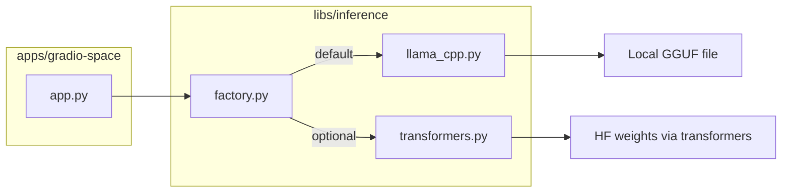

# uv Monorepo + Gradio + Local Llama Inference

## Context

- Repo today: only [`README.md`](README.md) — greenfield setup.
- Your choices: **generic track scaffold**, **abstract inference with llama-cpp default**.
- Hackathon hard rules: Gradio app on HF Space, models **≤ 32B**, demo video + social post by **June 15, 2026**.

## Target layout

```text
small-model-hackathon/
├── pyproject.toml              # workspace root + shared dev tooling
├── uv.lock
├── .python-version             # 3.12
├── .gitignore
├── Dockerfile                  # HF Space (Docker SDK) — builds whole workspace
├── README.md                   # dev + hackathon checklist
├── apps/
│   └── gradio-space/
│       ├── pyproject.toml
│       ├── README.md           # HF Space card YAML (title, sdk, hardware hints)
│       └── src/gradio_space/
│           ├── __init__.py
│           └── app.py          # Gradio UI entrypoint
├── libs/
│   └── inference/
│       ├── pyproject.toml
│       └── src/inference/
│           ├── __init__.py
│           ├── base.py         # Protocol / ABC
│           ├── llama_cpp.py    # default backend (GGUF)
│           ├── transformers.py # optional HF backend
│           └── factory.py      # INFERENCE_BACKEND env switch
└── scripts/
    └── download_model.py       # pull GGUF from Hub to local cache
```



## 1. Initialize uv workspace

Run from repo root:

```bash
uv init --name small-model-hackathon
uv init --package apps/gradio-space
uv init --package libs/inference
```

Configure root [`pyproject.toml`](pyproject.toml):

- `[tool.uv.workspace]` with `members = ["apps/*", "libs/*"]`
- Root depends on both workspace packages so `uv sync` installs everything:
  - `dependencies = ["gradio-space", "inference"]`
  - `[tool.uv.sources]` mapping each to `{ workspace = true }`
- Shared dev deps at root: `ruff`, `pytest` (optional but lightweight)
- `requires-python = ">=3.12"` (matches your installed Python 3.12.9)

Lock and install:

```bash
uv lock
uv sync --all-packages
```

## 2. `libs/inference` — swappable local backends

**Core interface** in `base.py`:

```python
class InferenceBackend(Protocol):
    def load(self) -> None: ...
    def generate(self, prompt: str, *, max_tokens: int = 512, temperature: float = 0.7) -> str: ...
    def chat(self, messages: list[dict[str, str]], **kwargs) -> str: ...
```

**Default backend — `llama_cpp.py`**

- Dependency: `llama-cpp-python` (CPU build by default; GPU variant documented for local/CUDA Spaces)
- Load GGUF via env config:
  - `MODEL_PATH` — local file path, or
  - `MODEL_REPO` + `MODEL_FILE` — download from Hugging Face Hub at startup (`huggingface_hub.hf_hub_download`)
- Suggested default model for dev: `Qwen/Qwen2.5-3B-Instruct-GGUF` with a specific `.gguf` quant (well under 32B; laptop-friendly)

**Optional backend — `transformers.py`**

- Dependencies kept in an optional extra: `inference[transformers]` → `transformers`, `torch`, `accelerate`
- Same public methods; loads `AutoModelForCausalLM` + `AutoTokenizer` from `MODEL_ID`
- Heavier; useful if you later fine-tune and publish on Hub

**Factory — `factory.py`**

- `INFERENCE_BACKEND=llama_cpp|transformers` (default `llama_cpp`)
- Lazy singleton so model loads once on first request (important for Gradio cold start)

## 3. `apps/gradio-space` — minimal chat UI

**Dependencies:** `gradio`, `inference` (workspace)

**`app.py` skeleton:**

- `gr.ChatInterface` or simple `Blocks` with textbox + chat history
- On startup: call `get_backend().load()` with a status message if model missing
- Wire `chat()` to the inference backend
- Expose `demo.launch()` guarded by `if __name__ == "__main__"`

**Run locally:**

```bash
uv run --package gradio-space python -m gradio_space.app
# or: uv run --package gradio-space gradio apps/gradio-space/src/gradio_space/app.py
```

**Env template** (`.env.example` at root):

```bash
INFERENCE_BACKEND=llama_cpp
MODEL_REPO=Qwen/Qwen2.5-3B-Instruct-GGUF
MODEL_FILE=qwen2.5-3b-instruct-q4_k_m.gguf
N_CTX=4096
N_GPU_LAYERS=0
```

## 4. HF Space deployment (monorepo-friendly)

Use **Docker SDK** at repo root ([HF Docker Spaces docs](https://huggingface.co/docs/hub/en/spaces-sdks-docker)) so the whole workspace ships together.

**Root `Dockerfile` (outline):**

- Base: `python:3.12-slim`
- Install `uv` via official installer
- `COPY` monorepo, `uv sync --frozen --no-dev --package gradio-space`
- Run as UID 1000 (HF requirement)
- `EXPOSE 7860`
- `CMD ["uv", "run", "--package", "gradio-space", "python", "-m", "gradio_space.app"]`

**`apps/gradio-space/README.md`** — Space card frontmatter:

```yaml
---
title: <Your App Name>
emoji: ...
colorFrom: ...
colorTo: ...
sdk: docker
app_port: 7860
pinned: false
license: apache-2.0
---
```

When creating the Space under [build-small-hackathon](https://huggingface.co/build-small-hackathon):

1. New Space → SDK: Docker → link this repo
2. Hardware: start **CPU basic** for llama-cpp dev; upgrade to GPU Space if you offload layers
3. Add Space secrets/env vars for `MODEL_REPO`, `MODEL_FILE`, etc.
4. Optionally attach a **Storage Bucket** if you cache large GGUF files persistently

## 5. Repo hygiene

**[`.gitignore`](.gitignore):** `.venv/`, `__pycache__/`, `.env`, `models/`, `*.gguf`, `.ruff_cache/`, `.pytest_cache/`

**[`README.md`](README.md)** sections:

- Prerequisites: `uv`, Python 3.12
- Quick start: sync, download model script, run Gradio locally
- Monorepo commands cheat sheet (`uv add --package ...`, `uv run --package ...`)
- Hackathon checklist: track choice, Space link, demo video, social post, badge targets (Off-the-Grid, Llama Champion, etc.)

**[`scripts/download_model.py`](scripts/download_model.py):** small CLI using `huggingface_hub` to fetch the configured GGUF into `./models/` for offline dev.

## 6. Verification checklist (post-init)

| Step | Command / check |
|------|-----------------|
| Workspace resolves | `uv sync --all-packages` succeeds |
| Import chain | `uv run python -c "from inference.factory import get_backend"` |
| Gradio boots | `uv run --package gradio-space python -m gradio_space.app` → localhost:7860 |
| Backend switch | `INFERENCE_BACKEND=transformers` fails gracefully until extra installed |
| Docker build | `docker build -t hackathon-space .` (optional local smoke test) |

## Out of scope for this init (pick up later)

- Track-specific product logic (Backyard AI vs Thousand Token Wood)
- Fine-tuning pipeline / custom model publish
- Custom UI via `gr.Server` (Off-Brand badge)
- Agent traces dataset upload (Sharing is Caring badge)
- CI/GitHub Actions

## Key design decisions

| Decision | Rationale |
|----------|-----------|
| uv workspace with `apps/` + `libs/` | Clean separation; Gradio app stays thin; inference reusable |
| llama-cpp default | Matches "Off the Grid" + "Llama Champion" badges; runs on laptop CPU |
| transformers as optional extra | Keeps default install light; swap via env when needed |
| Docker Space at repo root | Standard pattern for monorepos on HF (see [eu-ai-act example](https://huggingface.co/spaces/MCP-1st-Birthday/eu-ai-act-compliance-agent/blob/main/Dockerfile)) |
| Qwen2.5-3B-Instruct GGUF default | Small, capable, llama.cpp-compatible, well under 32B cap |
