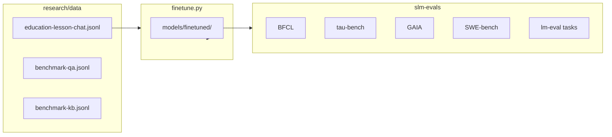

# Research overview

How `research/` relates to the main hackathon repo and what each component does.

## Position in the repo

```text
small-model-hackathon/
├── apps/gradio-space/     ← shipped Lesson Agent UI
├── libs/agent/            ← skill loop, tools, traces
├── libs/inference/        ← transformers + llama.cpp backends
├── models.yaml            ← model presets (shared with finetune)
└── research/              ← experiments (this tree)
    ├── finetune.py
    ├── data/
    └── evals/             ← uv workspace package
```

Research code is a **uv workspace sibling** of `apps/*` and `libs/*`. Root `pyproject.toml` declares optional dependency groups (`finetune`, `evals`, `lm-eval`) so the Docker Space image does not need to install torch-heavy extras unless you opt in locally.

## Two tracks

### Fine-tuning

`research/finetune.py` adapts a small HF causal LM on instruction or chat data. It reuses root `models.yaml` presets and the shared inference config loader, so the same `minicpm5-1b` preset used in the Gradio app can be fine-tuned without duplicating model metadata.

Outputs land in `models/finetuned/` — you can register a new preset in `models.yaml` pointing at merged weights for the **Well-Tuned** hackathon badge.

### Agentic and academic evals

`research/evals/` (`slm-evals` package) scores **whole models** on:

- **Agentic benchmarks** — BFCL, τ-bench, GAIA, SWE-bench (`slm-benchmark`)
- **Academic benchmarks** — GSM8K, ARC, HellaSwag, etc. via lm-evaluation-harness (`slm-lm-eval`)

## Data flow



## When to use which tool

| Goal | Tool |
| ---- | ---- |
| Improve lesson slide quality on your data | `finetune.py` + optional eval before/after |
| Compare base vs LoRA on public agent tasks | `slm-benchmark` |
| Compare base vs LoRA on academic tasks | `slm-lm-eval` |
| Ship in Gradio Space | `apps/gradio-space` only — wire new weights via `models.yaml` |

## Workspace package

`research/evals` is listed in root `[tool.uv.workspace] members` as import name `slm_evals`, CLI `slm-benchmark` and `slm-lm-eval`.

Run with `uv run --package slm-evals ...` from the repo root so uv resolves workspace paths and shared lockfile versions.
