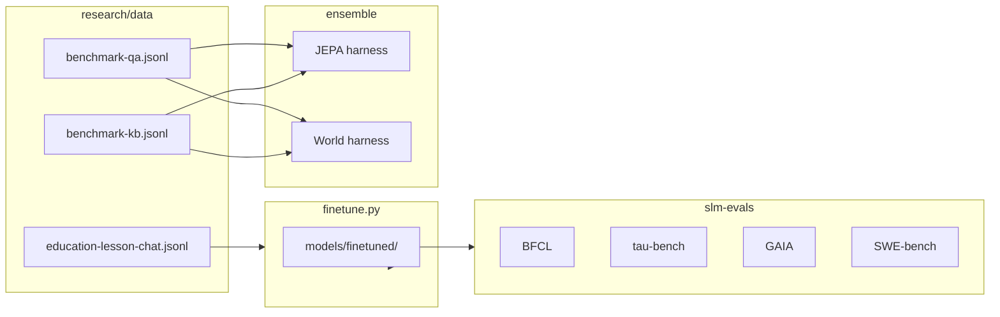

# Research overview

How `research/` relates to the main hackathon repo and what each component does.

## Position in the repo

```text
small-model-hackathon/
├── apps/gradio-space/     ← shipped Lesson Agent UI
├── libs/agent/            ← skill loop, tools, traces
├── libs/inference/        ← transformers + llama.cpp backends
├── models.yaml            ← model presets (shared with finetune)
└── research/              ← experiments (this tree)
    ├── finetune.py
    ├── data/
    ├── ensemble/          ← uv workspace package
    └── evals/             ← uv workspace package
```

Research code is a **uv workspace sibling** of `apps/*` and `libs/*`. Root `pyproject.toml` declares optional dependency groups (`finetune`, `ensemble`, `evals`) so the Docker Space image does not need to install torch-heavy extras unless you opt in locally.

## Three tracks

### Fine-tuning

`research/finetune.py` adapts a small HF causal LM on instruction or chat data. It reuses root `models.yaml` presets and the shared inference config loader, so the same `minicpm5-1b` preset used in the Gradio app can be fine-tuned without duplicating model metadata.

Outputs land in `models/finetuned/` — you can register a new preset in `models.yaml` pointing at merged weights for the **Well-Tuned** hackathon badge.

### Ensemble (JEPA / world model)

`research/ensemble/` explores a modular stack inspired by LeCun-style architectures:

```text
Input ──► Embedder + VectorStore (retrieval memory)
              │
              ▼
         JEPA encoder ──► latent state
              │
              ├──► World model (multi-step latent rollout)
              │
              └──► Energy model (scores LLM draft continuations)
                        │
                        ▼
              Small LLM generates N drafts → pick lowest energy
```

Two entry ensembles:

| Module | File | Critic |
| ------ | ---- | ------ |
| JEPA track | `ensemble.jepa_ensemble` | JEPA latent prediction |
| World track | `ensemble.world_ensemble` | Energy model over world-model rollouts |

`TinyBackend` runs on CPU with random weights for smoke tests. `HFBackend` loads real Hub models via `transformers` + optional `peft` LoRA banks.

Eval harnesses (`ensemble.eval.jepa_harness`, `ensemble.eval.world_harness`) measure draft-selection accuracy on `research/data/benchmark-qa.jsonl` with optional KB retrieval from `benchmark-kb.jsonl`.

### Agentic evals

`research/evals/` (`slm-evals` package) scores **whole models** on public agent benchmarks — function calling, multi-turn tool use, GAIA tasks, and SWE-bench patches. This complements ensemble harnesses: evals test end-to-end model behavior; ensemble harnesses test internal selection mechanisms on a small custom QA set.

## Data flow



## When to use which tool

| Goal | Tool |
| ---- | ---- |
| Improve lesson slide quality on your data | `finetune.py` + optional eval before/after |
| Compare base vs LoRA on public agent tasks | `slm-benchmark` |
| Prototype latent draft selection | `ensemble` smoke → harness |
| Ship in Gradio Space | `apps/gradio-space` only — wire new weights via `models.yaml` |

## Workspace packages

Both subpackages are listed in root `[tool.uv.workspace] members`:

- `research/ensemble` → import name `ensemble`
- `research/evals` → import name `slm_evals`, CLI `slm-benchmark`

Run with `uv run --package <name>` from the repo root so uv resolves workspace paths and shared lockfile versions.
