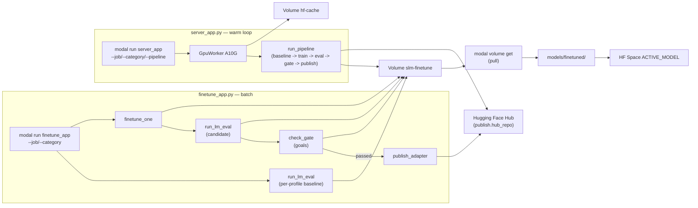

# Modal finetune + benchmark

GPU fine-tuning + benchmarking + Hub publishing on [Modal](https://modal.com/docs/guide) for `openbmb/MiniCPM5-1B`, wrapping existing [`research/finetune.py`](../finetune.py) and `slm-lm-eval`.

Use this when you have no local CUDA but want a hackathon-quality
**train → eval → gate → publish** loop for a whole **skill matrix** of QLoRA
adapters (math, science, coding, reasoning, teaching, instructions).

| Track | What you ship |
| ----- | ------------- |
| **Modal** | `modal run` skill-matrix pipeline, Volume artifacts, optional Modal Notebook |
| **Well-Tuned** | Per-skill before/after `lm-eval` + gated Hub publish for each LoRA |

---

## Layout

```text
research/modal/
├── _common.py         # Shared image, volumes, command builders, gate + publish helpers
├── finetune_app.py    # One-shot batch pipeline (slm-finetune-benchmark): main, publish_only, pull
├── server_app.py      # Long-lived GPU worker (slm-gpu-worker): GpuWorker.run_pipeline
├── experiments.yaml   # Skill matrix: jobs, eval_profile, goals, publish
├── README.md          # Full Modal docs (this file)
└── SERVER.md          # Human + AI agent loop runbook (quick reference)
```

Interactive path: [`research/notebook/minicpm5-modal-finetune.ipynb`](../notebook/minicpm5-modal-finetune.ipynb) (Modal GPU Notebook).

### Which app to use

| App | CLI | Best for |
| --- | --- | --- |
| **`finetune_app.py`** | `modal run research/modal/finetune_app.py` | Full sweep, CI-style batch, parallel jobs |
| **`server_app.py`** | `modal deploy` + `modal run research/modal/server_app.py` | Multi-hour session, iterative human/AI loops on **one warm GPU** |

Both apps share [`_common.py`](_common.py): same image, `hf-cache` / `slm-finetune` volumes, and wrappers around [`research/finetune.py`](../finetune.py) + `slm-lm-eval`.

---

## One-time setup

```bash
# Modal CLI + auth
pip install modal
modal setup

# HF token (downloads + Hub upload). Same token as huggingface-cli login.
modal secret create huggingface HF_TOKEN=<your-hf-token>

# Optional: validate deps before first image build
uv sync --group finetune --group lm-eval --package slm-evals
uv sync --group modal   # local orchestration only
```

`HF_TOKEN` must be a [write token](https://huggingface.co/settings/tokens) if you plan to push adapters to the Hub.

---

## Run training + benchmarks

All commands from **repo root**. `finetune_app.py` runs the full **skill-matrix
pipeline**: per-profile **base-model** baseline lm-eval (no adapter) → finetune each job's QLoRA adapter →
post-train lm-eval vs. that baseline → check `goals` (gate) → publish to the
Hugging Face Hub if the gate passes → pull adapter + results to your laptop.

```bash
# Full sweep: every job in experiments.yaml
modal run research/modal/finetune_app.py

# One skill (cheap smoke run)
modal run research/modal/finetune_app.py --job math-lora --max-steps 20

# One category (e.g. all "science" jobs)
modal run research/modal/finetune_app.py --category science

# Re-run lm-eval (+ gate + publish) only — adapter already on Volume
modal run research/modal/finetune_app.py --eval-only --job math-lora

# Train + eval but skip the Hub push and the local download
modal run research/modal/finetune_app.py --no-publish --no-pull

# Train/eval jobs in parallel (one GPU per job — higher cost)
modal run research/modal/finetune_app.py --parallel

# Re-run just the gate + Hub publish for an already-evaluated job
modal run research/modal/finetune_app.py::publish_only --job math-lora

# Pull adapters + lm-eval results for a category without re-running anything
modal run research/modal/finetune_app.py::pull --category math
```

Jobs live in [`experiments.yaml`](experiments.yaml) — a **skill matrix**, one
QLoRA adapter per category, each evaluated against the matching
`eval_profile` from [`research/evals/configs/eval_profiles.yaml`](../evals/configs/eval_profiles.yaml):

| Job | Category | Dataset (format) | Eval profile | `goals` task | Publish |
| --- | -------- | ----------------- | ------------ | ------------- | ------- |
| `teaching-lora` | teaching | `research/data/education-lesson-chat.jsonl` (`chat`) | `instructions` | `ifeval` | ✅ |
| `science-lora` | science | `research/data/science-tutor-chat.jsonl` (`chat`) | `science` | `sciq` (+ `arc_challenge` guard) | ✅ |
| `math-lora` | math | `TIGER-Lab/MathInstruct` (`alpaca`) | `math` | `gsm8k` (+ `arc_challenge` guard) | ✅ |
| `coding-lora` | coding | `iamtarun/python_code_instructions_18k_alpaca` (`alpaca`) | `code` | `mbpp` | ✅ |
| `reasoning-lora` | reasoning | `HuggingFaceTB/smoltalk` (`chat`) | `reasoning` | `gsm8k` (+ `hellaswag` guard) | ✅ |
| `language-lesson-lora` | language | `language-lesson-fr/ar.jsonl` (`chat`) | `multilingual` | `xnli` (+ `hellaswag` guard) | ✅ |
| `french-lora` | french | `FrancophonIA/english_french` (`prompt`) + FR chat | `french` | `french_bench_xnli` (+ `hellaswag` guard) | ✅ |
| `alpaca-lora` | instructions | `tatsu-lab/alpaca` (`alpaca`) | `instructions` | — (no `goals`) | local-only |

Before publishing, replace `defaults.hub_org` and each job's `publish.hub_repo`
in `experiments.yaml` with your Hugging Face username/org (defaults to the
placeholder `your-hf-username`).

Edit `defaults.max_steps`, per-job `gpu`, or per-job `max_samples` /
`dataset_split` in `experiments.yaml` to balance cost vs quality. See
[Benchmark gate & Hugging Face Hub publish](#benchmark-gate--hugging-face-hub-publish)
for the `goals`/`publish` schema.

### CLI flags (`finetune_app.py`)

`main` (default entrypoint — full pipeline):

| Flag | Default | Meaning |
| ---- | ------- | ------- |
| `--train` / `--no-train` | train on | Run finetune jobs |
| `--eval-only` | off | Skip train; eval existing Volume checkpoints (still runs missing base-model baselines) |
| `--parallel` | off | `finetune_one.spawn()` per job instead of sequential |
| `--job` | all jobs | Run one job name from `experiments.yaml` |
| `--category` | all categories | Run all jobs with this `category` |
| `--max-steps` | from YAML | Override training steps |
| `--publish` / `--no-publish` | publish on | Push to `publish.hub_repo` if the gate passes |
| `--pull` / `--no-pull` | pull on | `modal volume get` the adapter + lm-eval results after each job |

`publish_only` (separate entrypoint — `::publish_only`):

| Flag | Default | Meaning |
| ---- | ------- | ------- |
| `--job` | required | Re-check the gate against existing results and publish if it passes |

`pull` (separate entrypoint — `::pull`):

| Flag | Default | Meaning |
| ---- | ------- | ------- |
| `--job` | — | Pull one job's adapter + results |
| `--category` | — | Pull all jobs in a category |
| `--dest` | `models/finetuned` | Local destination directory |

---

## GPU worker (`server_app.py`) — human + AI agent loops

Use this when you want **one warm A10G container** for several hours and many train/eval commands **without** reinstalling deps or re-downloading HF weights each time.

**Quick runbook:** see [`SERVER.md`](SERVER.md) (copy-paste commands for humans and coding agents).

### Deploy once

```bash
modal deploy research/modal/server_app.py
```

App name: **`slm-gpu-worker`**. Dashboard: `modal app list` or the URL printed after deploy.

`GpuWorker` keeps `min_containers=1` while deployed, mounts `hf-cache` + `slm-finetune`, and reuses the same container for sequential `.remote()` calls when possible.

### Two-terminal loop (recommended)

**Terminal 1 — keep worker alive** (default 4h; blocks unless detached):

```bash
modal run research/modal/server_app.py
# or free your terminal:
modal run -d research/modal/server_app.py --hours 6
```

**Terminal 2 — run experiments on the warm GPU** (repeat as often as you like):

```bash
# Full skill-matrix pipeline for one job on the warm container:
# per-profile baseline → train → eval → gate → publish → pull
modal run research/modal/server_app.py --job math-lora --max-steps 20

# All jobs in a category
modal run research/modal/server_app.py --category science

# Whole matrix, but skip the Hub push
modal run research/modal/server_app.py --pipeline --no-publish

# Re-eval (+ gate + publish) an existing adapter on Volume
modal run research/modal/server_app.py --eval-only --job math-lora

# Re-check the gate and publish using already-computed results
modal run research/modal/server_app.py --publish-only --job math-lora

# Arbitrary command in /repo (same env as finetune.py)
modal run research/modal/server_app.py --cmd "uv run python research/finetune.py --help"

# Health check
modal run research/modal/server_app.py --ping
```

Task flags (`--job`, `--category`, `--cmd`, `--pipeline`, `--eval-only`, `--publish-only`, `--ping`) automatically disable the default keep-alive mode.

### CLI flags (`server_app.py`)

| Flag | Default | Meaning |
| ---- | ------- | ------- |
| *(none)* | `serve=True` | Keep `GpuWorker` alive (`keep_alive`) |
| `--hours` | `4` | Keep-alive duration |
| `--no-serve` | — | Skip keep-alive (auto when any task flag is set) |
| `--job` | — | Run the skill-matrix pipeline for one job |
| `--category` | — | Run the skill-matrix pipeline for all jobs in a category |
| `--pipeline` | off | Run the skill-matrix pipeline for all jobs |
| `--max-steps` | from YAML | Override training steps |
| `--eval-only` | off | Pipeline eval/gate/publish only (skip train; still runs missing base-model baselines) |
| `--publish` / `--no-publish` | publish on | Push to `publish.hub_repo` if the gate passes |
| `--publish-only` | off | Re-check the gate against existing results and publish (requires `--job`) |
| `--pull` / `--no-pull` | pull on | `modal volume get` adapter + results after the pipeline |
| `--cmd` | — | Shell command (parsed with `shlex`) |
| `--ping` | off | Return worker status JSON |

### `GpuWorker` methods (for notebooks / Python callers)

After `modal deploy`, call from Python:

```python
import modal

Worker = modal.Cls.from_name("slm-gpu-worker", "GpuWorker")
w = Worker()

w.ping.remote()
w.finetune.remote({"name": "math-lora", "dataset": "...", "format": "alpaca", "max_steps": 20})
w.lm_eval.remote(experiment_name="math-lora__math", config="research/evals/configs/lm_eval_math.yaml", adapter_path="/vol/finetuned/math-lora")
w.exec_cmd.remote(["uv", "run", "python", "research/finetune.py", "--help"])
w.run_pipeline.remote(job_names=["math-lora"], max_steps=20)

# Gate + publish (only pushes to the Hub if gate_result["passed"])
gate = w.check_gate.remote(
    candidate_results_path="/vol/finetuned/results/lm_eval/math-lora__math/results.json",
    baseline_results_path="/vol/finetuned/results/lm_eval/minicpm5-1b__baseline__math/results.json",
    goals={"task": "gsm8k", "min_score": 0.05, "min_improve": 0.02},
)
w.publish_adapter.remote(job=..., adapter_dir="/vol/finetuned/math-lora", gate_result=gate, ...)
```

Inside the class, `run_pipeline` chains `lm_eval` (baselines) → `finetune` → `lm_eval` (candidate) → `check_gate` → `publish_adapter` via `.local()`, so everything runs in the **same** container without extra cold starts.

### Persistence (what survives between commands)

| Layer | Survives | Notes |
| ----- | -------- | ----- |
| **Image** (`uv sync` baked in) | Across all runs | Rebuilds only when image definition changes |
| **`hf-cache` Volume** | Across runs | Base weights + datasets; committed after each job |
| **`slm-finetune` Volume** | Across runs | Adapters + lm-eval results |
| **Warm container** | While deployed + idle &lt; `scaledown_window` | `min_containers=1`; max idle grace **3600s** (Modal limit) |
| **`keep_alive` loop** | Up to `--hours` | Container stays active; no scale-down during loop |

### Stop / logs

```bash
modal app logs slm-gpu-worker -f          # stream logs
modal app stop slm-gpu-worker             # stop deployed app + warm pool
modal app stop slm-gpu-worker -y          # no confirmation prompt
```

Refs: [`modal app`](https://modal.com/docs/reference/cli/app) · [`modal run`](https://modal.com/docs/reference/cli/run) · [`modal shell`](https://modal.com/docs/reference/cli/shell)

### Agent loop pattern

For an AI agent iterating on finetune hyperparameters or eval configs:

1. Ensure worker is up: `modal run research/modal/server_app.py --ping` → `{"status": "ok"}`.
2. If ping fails, human or agent runs `modal deploy research/modal/server_app.py` then `modal run -d research/modal/server_app.py --hours 6`.
3. Agent runs smoke train+eval+gate (no publish yet): `--job math-lora --max-steps 5 --no-publish`.
4. Agent re-evals without retraining: `--eval-only --job math-lora`.
5. Agent reads results: `modal volume get slm-finetune results/lm_eval/math-lora__math ./results/lm_eval/math-lora__math` or `modal volume ls slm-finetune`.
6. Agent adjusts `experiments.yaml`'s `goals`/`max_steps`/`max_samples`, repeats from step 3.
7. Once the gate passes and `hub_org`/`hub_repo` are real: `--publish-only --job math-lora`, or just drop `--no-publish`.
8. When done: `modal app stop slm-gpu-worker` (optional, stops GPU billing from warm pool).

See [`SERVER.md`](SERVER.md) for a structured checklist and error recovery table.

---

## What gets saved on Modal

Modal persists artifacts on [**Volumes**](https://modal.com/docs/guide/volumes) — a distributed filesystem optimized for write-once, read-many workloads like model checkpoints. Files written only to the container disk (outside the mount path) are **not** saved.

| Volume | Mount in container | Contents |
| ------ | ------------------ | -------- |
| `slm-finetune` | `/vol/finetuned` | LoRA adapters, `training_results.json`, lm-eval `results/` |
| `hf-cache` | `/root/.cache/huggingface` | Cached base weights + datasets |

Volumes are created lazily on first run (`create_if_missing=True` in [`finetune_app.py`](finetune_app.py)).

### Commits and visibility

Per the [Volumes guide](https://modal.com/docs/guide/volumes):

- **`volume.commit()`** — persist writes so other containers and `modal volume get` can see them. Our workers call this after each train/eval job.
- **Background commits** — Modal also snapshots attached Volumes every few seconds and on container shutdown, but explicit `commit()` is safest before download.
- **`volume.reload()`** — needed only if the *same* container must see writes from another container without restarting. Each `finetune_one.remote()` / `run_lm_eval.remote()` starts fresh and mounts the latest committed state.

Training writes under `/vol/finetuned/...` (the mount), not `/repo/models/...`. That matches Modal’s [model checkpointing](https://modal.com/docs/guide/volumes#model-checkpointing) pattern: point `finetune.py --out` at the Volume path.

### Per-job adapter layout

Each finetune job writes to a Volume path named after the job (e.g. `math-lora/`).
lm-eval results live under `results/lm_eval/`, named
`<job_name>__<eval_profile>` for candidates and `<preset>__baseline__<eval_profile>`
for the shared per-profile baselines:

```text
slm-finetune (Volume)
├── math-lora/
│   ├── adapter_config.json
│   ├── adapter_model.safetensors   # or adapter_model.bin
│   ├── tokenizer files…
│   ├── training_results.json
│   └── README.md                   # model card, written by publish_adapter
├── science-lora/
├── coding-lora/
├── reasoning-lora/
├── teaching-lora/
├── alpaca-lora/
└── results/lm_eval/
    ├── minicpm5-1b__baseline__math/        # shared by all "math" profile jobs
    ├── minicpm5-1b__baseline__science/
    ├── minicpm5-1b__baseline__instructions/
    ├── math-lora__math/
    ├── science-lora__science/
    └── ...
```

Because `eval_profile` is shared across jobs (e.g. `teaching-lora` and
`alpaca-lora` both use `instructions`), the `instructions` baseline is computed
once per pipeline run and reused for both jobs' gates.

---

## Volume CLI (browse, download, upload)

Official reference: [Modal Volumes guide](https://modal.com/docs/guide/volumes) · [CLI reference](https://modal.com/docs/reference/cli/volume)

### Create or list volumes

```bash
modal volume list
modal volume create slm-finetune    # optional; app creates on first run
modal volume ls slm-finetune
modal volume ls slm-finetune lesson-lora
```

### Browse in a shell

Volumes are mounted under `/mnt` in an interactive shell:

```bash
modal shell --volume slm-finetune
# inside shell:
ls /mnt/slm-finetune
ls /mnt/slm-finetune/lesson-lora
du -sh /mnt/slm-finetune/lesson-lora
```

Use `du` for size — Volumes do not report accurate `df` / `disk_usage()` values ([docs](https://modal.com/docs/guide/volumes#disk-usage-reporting)).

### Download LoRA to your machine

**Use the CLI for adapter weights.** The Modal web UI only supports downloads up to **16 MB** per file; `adapter_model.safetensors` is usually larger ([docs](https://modal.com/docs/guide/volumes#downloading-a-file-from-a-volume)).

```bash
mkdir -p ./models/finetuned

# One job folder → local path expected by models.yaml
modal volume get slm-finetune lesson-lora ./models/finetuned/minicpm5-1b-lora

# lm-eval artifacts
mkdir -p ./results
modal volume get slm-finetune results/lm_eval ./results/lm_eval

# Entire volume (large)
modal volume get slm-finetune / ./modal-artifacts
```

Job folders use the **job name** from `experiments.yaml` (`lesson-lora`), not `minicpm5-1b-lora`. Root [`models.yaml`](../../models.yaml) preset `minicpm5-1b-lesson-lora` expects `./models/finetuned/minicpm5-1b-lora`.

If you downloaded to a different folder name:

```bash
modal volume get slm-finetune lesson-lora ./models/finetuned/lesson-lora
cp -r ./models/finetuned/lesson-lora ./models/finetuned/minicpm5-1b-lora
```

### Upload to a Volume from local

Push a local adapter or merged checkpoint back to Modal ([`modal volume put`](https://modal.com/docs/reference/cli/volume)):

```bash
modal volume put slm-finetune ./models/finetuned/minicpm5-1b-lora lesson-lora
```

Or from Python ([`batch_upload`](https://modal.com/docs/guide/volumes#using-a-volume-from-local-code)):

```python
import modal

vol = modal.Volume.from_name("slm-finetune")
with vol.batch_upload() as batch:
    batch.put_directory(
        "./models/finetuned/minicpm5-1b-lora",
        "/lesson-lora",
    )
```

### Copy within a Volume

```bash
modal volume cp slm-finetune lesson-lora lesson-lora-backup
```

### Parallel training note

With `--parallel`, multiple jobs write to **different** folders on the same Volume. On Volumes v1, avoid more than ~5 concurrent writers/commits ([docs](https://modal.com/docs/guide/volumes#volume-commits-and-reloads)). Prefer sequential runs unless you use Volumes v2 (`modal volume create --version=2`).

---

## Use downloaded weights locally

```bash
# Gradio / inference preset
export ACTIVE_MODEL=minicpm5-1b-lesson-lora

uv run --package gradio-space python -m gradio_space.app

# lm-eval on downloaded adapter
uv run --package slm-evals slm-lm-eval \
  --config research/evals/configs/lm_eval_smoke.yaml \
  --preset minicpm5-1b-lesson-lora \
  --experiment-name minicpm5-1b-lora__local-check
```

### Optional: merge LoRA into full weights locally

Adapters are small; merged weights are easier for some deploy targets.

```bash
uv run python research/finetune.py \
  --merge ./models/finetuned/minicpm5-1b-lora \
  --out ./models/finetuned/minicpm5-1b-lora-merged
```

Then use preset `minicpm5-1b-lesson-merged` or `--model ./models/finetuned/minicpm5-1b-lora-merged`.

---

## Benchmark gate & Hugging Face Hub publish

`finetune_app.py` / `server_app.py` publish adapters to the Hub **automatically**,
but only when a job's lm-eval results pass its `goals`. This is the
"only ship it if it's actually better" gate.

### `goals` schema (per job in `experiments.yaml`)

```yaml
goals:
  task: gsm8k          # lm-eval task name, scored via primary_metric() (same as summary.md)
  min_score: 0.05      # candidate score must be >= this
  min_improve: 0.02    # candidate - baseline must be >= this (baseline = per-profile baseline run)
  guard_tasks:          # optional regression guards — must NOT regress more than max_regress
    - task: arc_challenge
      max_regress: 0.03
```

Publishable jobs also run a **general** eval (`defaults.general_eval_profile`, default
`compare_study`: arc_easy, arc_challenge, hellaswag, piqa, boolq, gsm8k) and must pass
`defaults.general_goals` regression guards so skill tuning does not wash out general
capability. The publish gate requires **both** skill `goals` and `general_goals` to pass.

A job with no `goals` (e.g. `alpaca-lora`) is never gated and never published —
it's local-only (still trained, evaluated, and pulled to your laptop).

### `publish` schema (per job)

```yaml
publish:
  hub_repo: your-hf-username/minicpm5-1b-math-lora
  private: false  # public so judges can verify the Well-Tuned badge; set true to keep it hidden
```

### What happens on a passing gate

1. `run_lm_eval` writes skill results to `results/lm_eval/<job>__<profile>/results.json`.
2. For publishable jobs, a second run writes general results to
   `results/lm_eval/<job>__<general_eval_profile>/results.json`.
3. `check_gate` compares skill results against `results/lm_eval/<preset>__baseline__<profile>/results.json`
   and general results against `results/lm_eval/<preset>__baseline__<general_eval_profile>/results.json`
   using `goals` + `general_goals` → `{"passed": bool, "skill": {...}, "general": {...}, "checks": [...]}`.
4. If `passed` and `publish` is set, `publish_adapter`:
   - renders a model card (`README.md`) into the adapter directory — base model,
     gate checks table, full lm-eval baseline-vs-candidate-vs-delta table,
     training stats, and a PEFT load snippet
   - `huggingface_hub.HfApi().create_repo(..., exist_ok=True)` +
     `upload_folder(...)` to `publish.hub_repo`

If the gate fails, nothing is pushed — rerun with different `max_steps` /
dataset / `goals`, then `modal run research/modal/finetune_app.py::publish_only --job <name>`
once it passes (re-checks the gate against the latest results before publishing).

### Setup

```bash
huggingface-cli login
# or: export HF_TOKEN=hf_...   (needs write access; same token as `modal secret create huggingface`)
```

Set real values for `defaults.hub_org` and each job's `publish.hub_repo` in
`experiments.yaml` before running with `--publish` (the default). Repos are
created automatically (`exist_ok=True`) — no need to pre-create them on huggingface.co.

---

## Manual Hugging Face Hub publish (fallback)

Use this if you'd rather download an adapter and push it yourself — e.g. for
**merged full weights**, or adapters trained before the gate/publish pipeline
existed.

### Prerequisites

```bash
huggingface-cli login
# or: export HF_TOKEN=hf_...
```

Create an empty model repo on Hugging Face (e.g. `your-user/minicpm5-1b-lesson-lora`).

### Option A — Upload LoRA adapter (recommended)

After `modal volume get`:

```bash
ADAPTER=./models/finetuned/minicpm5-1b-lora
REPO=your-user/minicpm5-1b-lesson-lora

huggingface-cli upload "$REPO" "$ADAPTER" . \
  --repo-type model \
  --commit-message "Lesson LoRA from Modal finetune"
```

Add a minimal `README.md` in the adapter folder before upload (or edit on the Hub) documenting the base model:

```markdown
# MiniCPM5-1B lesson LoRA

- Base model: [openbmb/MiniCPM5-1B](https://huggingface.co/openbmb/MiniCPM5-1B)
- Dataset: education lesson chat (Build Small hackathon)
- Load with PEFT: `PeftModel.from_pretrained(base, "your-user/minicpm5-1b-lesson-lora")`
```

**Load from Hub in Python:**

```python
from peft import PeftModel
from transformers import AutoModelForCausalLM, AutoTokenizer

base = "openbmb/MiniCPM5-1B"
adapter = "your-user/minicpm5-1b-lesson-lora"

tokenizer = AutoTokenizer.from_pretrained(base, trust_remote_code=True)
model = AutoModelForCausalLM.from_pretrained(
    base, torch_dtype="auto", device_map="auto", trust_remote_code=True
)
model = PeftModel.from_pretrained(model, adapter)
```

### Option B — Upload merged weights

```bash
uv run python research/finetune.py \
  --merge ./models/finetuned/minicpm5-1b-lora \
  --out ./models/finetuned/minicpm5-1b-lora-merged

huggingface-cli upload your-user/minicpm5-1b-lesson-merged \
  ./models/finetuned/minicpm5-1b-lora-merged . \
  --repo-type model
```

Consumers set `MODEL_ID=your-user/minicpm5-1b-lesson-merged` with no adapter.

### Option C — Upload from Modal shell (no local download)

Browse the Volume in a shell ([docs](https://modal.com/docs/guide/volumes#using-a-volume-from-outside-of-modal)):

```bash
modal shell --volume slm-finetune
```

Inside the shell (volume at `/mnt/slm-finetune`):

```bash
pip install huggingface_hub
export HF_TOKEN=...   # write token
huggingface-cli upload your-user/minicpm5-1b-lesson-lora \
  /mnt/slm-finetune/lesson-lora . --repo-type model
```

Downloading to your laptop first (Option A) is usually easier to review before publish.

### Use on Hugging Face Space

**LoRA on Space (Gradio SDK):**

1. Upload adapter repo (Option A).
2. In Space **Settings → Repository secrets**, set `HF_TOKEN` if the base model needs it.
3. In Space env vars:

```bash
ACTIVE_MODEL=minicpm5-1b
# Override adapter via custom preset or env — e.g. add to models.yaml on Space:
# adapter_path: your-user/minicpm5-1b-lesson-lora  # Hub id works if peft resolves it
```

For the shipped Space, the reliable path is: download adapter → commit into repo under `models/finetuned/` → `ACTIVE_MODEL=minicpm5-1b-lesson-lora`, or upload **merged** weights and point `MODEL_ID` at your Hub repo.

**Merged on Space:**

```bash
ACTIVE_MODEL=custom
MODEL_ID=your-user/minicpm5-1b-lesson-merged
TRUST_REMOTE_CODE=true
```

---

## Modal Notebooks (interactive GPU)

Official guide: [Modal Notebooks](https://modal.com/docs/guide/notebooks)

Use a hosted Jupyter kernel on Modal for demos, pair programming, and quick experiments. For reproducible sweeps and CI-style runs, prefer `modal run research/modal/finetune_app.py`.

### Getting started

1. Open [modal.com/notebooks](https://modal.com/notebooks) and **upload** [`research/notebook/minicpm5-modal-finetune.ipynb`](../notebook/minicpm5-modal-finetune.ipynb) (or create a notebook and copy the cells).
2. In the **sidebar → Compute profile**, enable a **GPU** (e.g. A10G). Notebooks are serverless: you pay only while the kernel runs; idle shutdown defaults to 10 minutes.
3. Attach resources in the sidebar **Files** panel:
   - **Volume** `slm-finetune` → appears under `/mnt/slm-finetune` (share checkpoints with `modal run` jobs)
   - **Secret** `huggingface` → injects `HF_TOKEN` for Hub downloads
4. Run cells top to bottom.

The default notebook image includes PyTorch, Transformers, and NumPy. Install extras with:

```python
%uv pip install uv peft bitsandbytes datasets
```

### Persist checkpoints on a Volume

The container filesystem is **ephemeral**. Anything under `/root` is lost when the kernel stops. Write adapters to an attached Volume:

```python
OUT = "/mnt/slm-finetune/lesson-lora-notebook"  # survives kernel restarts
```

After training, download from the **Files** panel (⬇) or locally:

```bash
modal volume get slm-finetune lesson-lora-notebook ./models/finetuned/minicpm5-1b-lora
```

### Custom image (optional, full repo deps)

To match the `modal run` environment exactly, deploy the app image once:

```bash
modal deploy research/modal/finetune_app.py
```

Then in the notebook sidebar, search for function `finetune_one` from app `slm-finetune-benchmark` and select that image as the kernel.

Or call deployed functions from a cell with [`%modal` magic](https://modal.com/docs/guide/notebooks#cell-magic):

```python
%modal from slm-finetune-benchmark import finetune_one

finetune_one.remote({
    "name": "lesson-lora",
    "dataset": "research/data/education-lesson-chat.jsonl",
    "format": "chat",
    "max_steps": 20,
})
```

(Requires `modal deploy` and the repo baked into the image.)

### Share for hackathon judges

Use **Share** in the notebook editor → **public unlisted link** → **Can view and run** so reviewers can fork and execute without a Modal account ([docs](https://modal.com/docs/guide/notebooks#access-and-sharing)).

### Notebook vs `modal run`

| | Modal Notebook | `modal run finetune_app.py` |
| --- | --- | --- |
| Best for | Demo video, exploration | Reproducible sweep, Volume + lm-eval pipeline |
| GPU | Sidebar compute profile | `gpu="A10G"` on functions |
| Persistence | Attach Volume in sidebar | `slm-finetune` Volume auto-mounted |
| Cost | Per kernel uptime | Per function invocation |

---

## Architecture



| Resource | Role |
| -------- | ---- |
| App `slm-finetune-benchmark` | One-shot batch pipeline (`finetune_app.py`): `main`, `publish_only`, `pull` |
| App `slm-gpu-worker` | Long-lived GPU worker (`server_app.py`): `GpuWorker.run_pipeline` |
| GPU `A10G` (or per-job `gpu:` override) | Default for train + eval |
| Secret `huggingface` | `HF_TOKEN` for HF downloads + Hub publish |
| [`_common.py`](_common.py) | Shared image, volumes, command builders, gate (`evaluate_gate`/`check_gate_files`), publish (`publish_adapter_files`, `render_model_card`) |
| [`experiments.yaml`](experiments.yaml) | Skill matrix: jobs, `eval_profile`, `goals`, `publish` |
| [`eval_profiles.yaml`](../evals/configs/eval_profiles.yaml) | Maps `eval_profile` → lm-eval config + task list |
| [`finetune.py`](../finetune.py) | Training logic (unchanged) |
| `slm-lm-eval` | Academic benchmarks |

---

## Troubleshooting

| Symptom | Fix |
| ------- | --- |
| `Secret huggingface not found` | `modal secret create huggingface HF_TOKEN=...` |
| Volume empty after run | Job may have failed; `modal volume ls slm-finetune`; ensure writes went to `/vol/finetuned` not `/repo` |
| `modal volume get` missing files | Call `commit()` completed; for same-container reads use `volume.reload()` |
| Large file won't download in UI | Use `modal volume get` CLI (16 MB UI limit) |
| `modal volume get` path wrong | Job name = top-level folder (e.g. `math-lora`, not `minicpm5-1b-lora`) |
| Gate fails / `published: false, reason: "gate failed"` | Check `gate.checks` in the output; adjust `goals` (`min_score`/`min_improve`/`guard_tasks`), `max_steps`, or dataset, then rerun |
| `published: false, reason: "no publish config..."` | Job has no `publish:` block in `experiments.yaml` (intentional for local-only jobs like `alpaca-lora`) |
| `Unknown eval_profile ...` | Check `eval_profile` in `experiments.yaml` matches a key in `research/evals/configs/eval_profiles.yaml` |
| Hub upload 403 | Use a write `HF_TOKEN`; repos are created automatically (`exist_ok=True`), no need to pre-create |
| Still publishing to `your-hf-username/...` | Edit `defaults.hub_org` and each job's `publish.hub_repo` in `experiments.yaml` |
| Space cannot find adapter | Use merged weights or copy adapter into repo `models/finetuned/` |
| Image build slow | `hf-cache` Volume caches weights across runs |
| OOM on GPU | `--mode qlora` in `experiments.yaml`; lower `max_len` in finetune; or set a per-job `gpu:` with more VRAM |
| `scaledown_window` deploy error | Must be 2–3600s (we use 3600); see `_common.py` |
| `server_app` ping fails | `modal deploy research/modal/server_app.py`; start keep-alive: `modal run -d research/modal/server_app.py` |
| Jobs hit different containers | Deploy first; use `server_app.py` not `finetune_app.py` for warm loop |
| Worker still billing after done | `modal app stop slm-gpu-worker` |

---

## Hackathon checklist

1. Link or screenshot of Modal app run (`slm-finetune-benchmark` or `slm-gpu-worker`), including the `--- summary ---` table (skill, category, gate, published, hub_repo).
2. `results/lm_eval/<job>__<profile>/comparison.md` — baseline vs candidate per skill.
3. At least one adapter with `goals` that passed the gate and published to the Hub (model card auto-generated).
4. Adapter on Volume or Hub + `ACTIVE_MODEL=minicpm5-1b-<skill>-lora` on Space.
5. Optional: Notebook recording of smoke train cell.

See also: [`SERVER.md`](SERVER.md) · [research/USAGE.md](../USAGE.md) · [Modal Volumes](https://modal.com/docs/guide/volumes) · [Modal Notebooks](https://modal.com/docs/guide/notebooks) · [Modal CUDA](https://modal.com/docs/guide/cuda)
