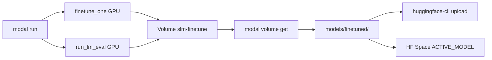

# Modal finetune + benchmark

GPU fine-tuning and lm-eval on [Modal](https://modal.com/docs/guide) for `openbmb/MiniCPM5-1B`, wrapping existing [`research/finetune.py`](../finetune.py) and `slm-lm-eval`.

Use this when you have no local CUDA but want hackathon-quality train → eval → deploy loops.

| Track | What you ship |
| ----- | ------------- |
| **Modal** | `modal run` job, Volume artifacts, optional Modal Notebook |
| **Well-Tuned** | Before/after `lm-eval` on base vs lesson LoRA |

---

## Layout

```text
research/modal/
├── finetune_app.py    # Modal App (slm-finetune-benchmark)
├── experiments.yaml   # Dataset job matrix
└── README.md          # this file
```

Interactive path: [`research/notebook/minicpm5-modal-finetune.ipynb`](../notebook/minicpm5-modal-finetune.ipynb) (Modal GPU Notebook).

---

## One-time setup

```bash
# Modal CLI + auth
pip install modal
modal setup

# HF token (downloads + Hub upload). Same token as huggingface-cli login.
modal secret create huggingface HF_TOKEN=<your-hf-token>

# Optional: validate deps before first image build
uv sync --group finetune --group lm-eval --package slm-evals
uv sync --group modal   # local orchestration only
```

`HF_TOKEN` must be a [write token](https://huggingface.co/settings/tokens) if you plan to push adapters to the Hub.

---

## Run training + benchmarks

All commands from **repo root**.

```bash
# Full sweep: baseline lm-eval → 3 dataset jobs → post-train lm-eval
modal run research/modal/finetune_app.py

# Smoke one job (cheap)
modal run research/modal/finetune_app.py --job lesson-lora --max-steps 20

# Re-run lm-eval only (adapter already on Volume)
modal run research/modal/finetune_app.py --eval-only --job lesson-lora

# Train/eval jobs in parallel (3 GPUs — higher cost)
modal run research/modal/finetune_app.py --parallel
```

Jobs live in [`experiments.yaml`](experiments.yaml):

| Job | Dataset | Format |
| --- | ------- | ------ |
| `lesson-lora` | `research/data/education-lesson-chat.jsonl` | `chat` |
| `alpaca-lora` | `tatsu-lab/alpaca` | `alpaca` |
| `smoltalk-lora` | `HuggingFaceTB/smoltalk` | `chat` |

Edit `defaults.max_steps` or per-job `max_samples` in `experiments.yaml` to balance cost vs quality.

### CLI flags (`finetune_app.py`)

| Flag | Default | Meaning |
| ---- | ------- | ------- |
| `--train` / `--no-train` | train on | Run finetune jobs |
| `--eval-only` | off | Skip train; eval existing Volume checkpoints |
| `--parallel` | off | `finetune_one.map()` instead of sequential |
| `--job` | all jobs | Run one job name from `experiments.yaml` |
| `--max-steps` | from YAML | Override training steps |
| `--lm-eval-config` | smoke YAML | Post-train eval config |
| `--baseline-config` | compare-study YAML | Baseline eval config |

---

## What gets saved on Modal

Modal persists artifacts on **Volumes** (durable object storage), not in the container filesystem.

| Volume | Mount in container | Contents |
| ------ | ------------------ | -------- |
| `slm-finetune` | `/vol/finetuned` | LoRA adapters, `training_results.json`, lm-eval `results/` |
| `hf-cache` | `/root/.cache/huggingface` | Cached base weights + datasets |

After each train/eval job, the app calls `volume.commit()` so files are durable.

### Per-job adapter layout

Training job `lesson-lora` writes to Volume path `lesson-lora/`:

```text
slm-finetune (Volume)
├── lesson-lora/
│   ├── adapter_config.json
│   ├── adapter_model.safetensors   # or adapter_model.bin
│   ├── tokenizer files…
│   └── training_results.json
├── alpaca-lora/
├── smoltalk-lora/
└── results/lm_eval/
    ├── minicpm5-1b__modal-baseline/
    └── lesson-lora__modal-lm-eval/
```

---

## Download LoRA to your machine

### 1. List what is on the Volume

```bash
modal volume ls slm-finetune
modal volume ls slm-finetune lesson-lora
```

### 2. Download one adapter

```bash
mkdir -p ./models/finetuned
modal volume get slm-finetune lesson-lora ./models/finetuned/minicpm5-1b-lora
```

Use the path your app expects. Root [`models.yaml`](../../models.yaml) preset `minicpm5-1b-lesson-lora` points at `./models/finetuned/minicpm5-1b-lora`.

If you used a different job name (e.g. `lesson-lora` on Volume), either copy or symlink:

```bash
modal volume get slm-finetune lesson-lora ./models/finetuned/lesson-lora
cp -r ./models/finetuned/lesson-lora ./models/finetuned/minicpm5-1b-lora
```

### 3. Download lm-eval results

```bash
mkdir -p ./results
modal volume get slm-finetune results/lm_eval ./results/lm_eval
```

### 4. Download everything (large)

```bash
modal volume get slm-finetune / ./modal-artifacts
```

### 5. Use locally

```bash
# Gradio / inference preset
export ACTIVE_MODEL=minicpm5-1b-lesson-lora

uv run --package gradio-space python -m gradio_space.app

# lm-eval on downloaded adapter
uv run --package slm-evals slm-lm-eval \
  --config research/evals/configs/lm_eval_smoke.yaml \
  --preset minicpm5-1b-lesson-lora \
  --experiment-name minicpm5-1b-lora__local-check
```

### 6. Optional: merge LoRA into full weights locally

Adapters are small; merged weights are easier for some deploy targets.

```bash
uv run python research/finetune.py \
  --merge ./models/finetuned/minicpm5-1b-lora \
  --out ./models/finetuned/minicpm5-1b-lora-merged
```

Then use preset `minicpm5-1b-lesson-merged` or `--model ./models/finetuned/minicpm5-1b-lora-merged`.

---

## Deploy to Hugging Face Hub

You can publish **LoRA adapter only** (small, loads on top of `openbmb/MiniCPM5-1B`) or **merged full weights** (larger, self-contained).

### Prerequisites

```bash
huggingface-cli login
# or: export HF_TOKEN=hf_...
```

Create an empty model repo on Hugging Face (e.g. `your-user/minicpm5-1b-lesson-lora`).

### Option A — Upload LoRA adapter (recommended)

After `modal volume get`:

```bash
ADAPTER=./models/finetuned/minicpm5-1b-lora
REPO=your-user/minicpm5-1b-lesson-lora

huggingface-cli upload "$REPO" "$ADAPTER" . \
  --repo-type model \
  --commit-message "Lesson LoRA from Modal finetune"
```

Add a minimal `README.md` in the adapter folder before upload (or edit on the Hub) documenting the base model:

```markdown
# MiniCPM5-1B lesson LoRA

- Base model: [openbmb/MiniCPM5-1B](https://huggingface.co/openbmb/MiniCPM5-1B)
- Dataset: education lesson chat (Build Small hackathon)
- Load with PEFT: `PeftModel.from_pretrained(base, "your-user/minicpm5-1b-lesson-lora")`
```

**Load from Hub in Python:**

```python
from peft import PeftModel
from transformers import AutoModelForCausalLM, AutoTokenizer

base = "openbmb/MiniCPM5-1B"
adapter = "your-user/minicpm5-1b-lesson-lora"

tokenizer = AutoTokenizer.from_pretrained(base, trust_remote_code=True)
model = AutoModelForCausalLM.from_pretrained(
    base, torch_dtype="auto", device_map="auto", trust_remote_code=True
)
model = PeftModel.from_pretrained(model, adapter)
```

### Option B — Upload merged weights

```bash
uv run python research/finetune.py \
  --merge ./models/finetuned/minicpm5-1b-lora \
  --out ./models/finetuned/minicpm5-1b-lora-merged

huggingface-cli upload your-user/minicpm5-1b-lesson-merged \
  ./models/finetuned/minicpm5-1b-lora-merged . \
  --repo-type model
```

Consumers set `MODEL_ID=your-user/minicpm5-1b-lesson-merged` with no adapter.

### Option C — Upload from Modal (no local download)

Run a one-off shell on Modal with the Volume mounted, then push from inside the container:

```bash
modal shell research/modal/finetune_app.py::finetune_one
```

Inside the shell (paths are illustrative — adjust if your Modal version differs):

```bash
pip install huggingface_hub
export HF_TOKEN=...   # or rely on huggingface secret if wired
huggingface-cli upload your-user/minicpm5-1b-lesson-lora \
  /vol/finetuned/lesson-lora . --repo-type model
```

Or download to laptop first (Option A) — usually simpler for review before publish.

### Use on Hugging Face Space

**LoRA on Space (Gradio SDK):**

1. Upload adapter repo (Option A).
2. In Space **Settings → Repository secrets**, set `HF_TOKEN` if the base model needs it.
3. In Space env vars:

```bash
ACTIVE_MODEL=minicpm5-1b
# Override adapter via custom preset or env — e.g. add to models.yaml on Space:
# adapter_path: your-user/minicpm5-1b-lesson-lora  # Hub id works if peft resolves it
```

For the shipped Space, the reliable path is: download adapter → commit into repo under `models/finetuned/` → `ACTIVE_MODEL=minicpm5-1b-lesson-lora`, or upload **merged** weights and point `MODEL_ID` at your Hub repo.

**Merged on Space:**

```bash
ACTIVE_MODEL=custom
MODEL_ID=your-user/minicpm5-1b-lesson-merged
TRUST_REMOTE_CODE=true
```

---

## Modal GPU Notebook

For demo videos or manual tweaking:

1. Create a [Modal GPU Notebook](https://modal.com/docs/guide/notebooks-modal).
2. Open [`research/notebook/minicpm5-modal-finetune.ipynb`](../notebook/minicpm5-modal-finetune.ipynb).
3. Clone this repo, `uv sync`, run smoke train + lm-eval cells.

The scripted app (`modal run research/modal/finetune_app.py`) is what judges can reproduce; the notebook is for exploration.

---

## Architecture



| Resource | Role |
| -------- | ---- |
| App `slm-finetune-benchmark` | Modal app name |
| GPU `A10G` | Default for train + eval |
| Secret `huggingface` | `HF_TOKEN` in workers |
| [`finetune.py`](../finetune.py) | Training logic (unchanged) |
| `slm-lm-eval` | Academic benchmarks |

---

## Troubleshooting

| Symptom | Fix |
| ------- | --- |
| `Secret huggingface not found` | `modal secret create huggingface HF_TOKEN=...` |
| Volume empty after run | Wait for job success; run `modal volume ls slm-finetune` |
| `modal volume get` path wrong | Job name = top-level folder (`lesson-lora`, not `minicpm5-1b-lora`) |
| Hub upload 403 | Use a write token; create the repo first on huggingface.co |
| Space cannot find adapter | Use merged weights or copy adapter into repo `models/finetuned/` |
| Image build slow | `hf-cache` Volume caches weights across runs |
| OOM on GPU | `--mode qlora` in `experiments.yaml`; lower `max_len` in finetune |

---

## Hackathon checklist

1. Link or screenshot of Modal app run (`slm-finetune-benchmark`).
2. `results/lm_eval/*/comparison.md` — base vs lesson LoRA (same YAML config).
3. Adapter on Volume or Hub + `ACTIVE_MODEL=minicpm5-1b-lesson-lora` on Space.
4. Optional: Notebook recording of smoke train cell.

See also: [research/USAGE.md](../USAGE.md) (local finetune/eval) and [Modal CUDA guide](https://modal.com/docs/guide/cuda).
